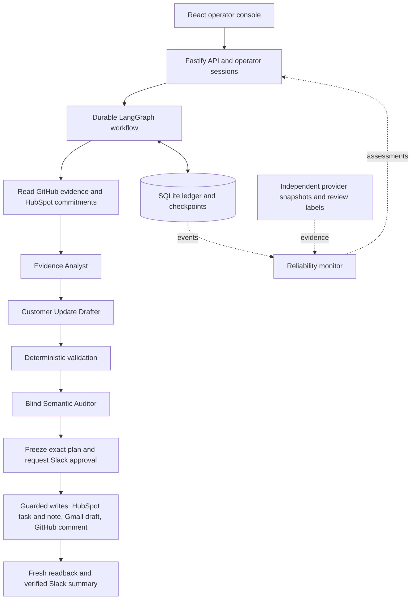

# PromiseGuard

**Turn a GitHub incident into approved, assigned customer follow-up across four apps.**

When an engineering incident puts a customer promise at risk, teams have to connect technical evidence, CRM records, internal approvals, and customer communication. PromiseGuard brings that work into one controlled workflow: identify affected commitments, prepare a recovery plan, get approval, create the follow-up artifacts, and verify the results.

**Demo video:** [Watch the demo](https://example.com/promiseguard-demo) — **dummy link; recording to be added.**

[Apps used](#apps-used) · [What we built](#what-we-built) · [Install and try it](#install-and-try-it) · [Architecture](#architecture) · [Reliability](#how-reliability-is-handled) · [Current status](#current-status-and-limitations)

## What it does

Give PromiseGuard a GitHub incident URL. For an affected customer commitment, the workflow:

1. Reads the incident evidence and relevant HubSpot commitments, contacts, and owners.
2. Uses three AI roles to analyze the evidence, draft the customer update, and audit its claims.
3. Freezes the proposed actions and exact content, then requests approval in Slack.
4. Creates an assigned HubSpot task and note, a Gmail draft, and a GitHub impact comment.
5. Reads the created artifacts back, checks them against the approved plan, and posts a verified Slack summary.

**The customer email remains a draft for human review.** The Gmail adapter exposes no send operation. If complete source checks find no affected commitments, the workflow can finish without creating follow-up artifacts.

## Apps used

- **GitHub — engineering context:** reads incident and change evidence; adds the approved impact comment to the incident.
- **HubSpot — customer context and ownership:** reads customer commitments, companies, contacts, and owners; creates an assigned recovery task and associated note.
- **Slack — human approval and coordination:** presents the plan, checks the authorized approver's reply, and publishes the final summary.
- **Gmail — customer communication:** creates and verifies the approved draft, including its recipient and content.

The backend includes typed REST adapters for all four apps. OpenAI powers the model roles through LangChain; LangGraph coordinates the workflow. MCP is an optional future transport, not required for the current implementation.

## What we built

- **A composed workflow:** source selection, three bounded model roles, deterministic validation, plan freezing, Slack approval, guarded execution, and readback verification.
- **An operator console and API:** React screens and Fastify endpoints for incident intake, run status, plans, timelines, created artifacts, and separate reliability assessments.
- **Durable execution:** SQLite storage for the business ledger, checkpoints, events, and measurement jobs, with approval waiting, restart/resume, and replay handling.
- **Reliability tooling:** an independent evidence collector, a local monitor, an offline evidence checker, and optional sanitized trace export.
- **A runnable simulated demo:** the real workflow and model runtime with mock model responses and stateful fake providers. It exercises approval wait, restart, completion, and replay without credentials.

These components are implemented on `main`. The [current status](#current-status-and-limitations) distinguishes demonstrated behavior from live integration and evaluation work still outstanding.

## Install and try it

### 1. Install dependencies

Use **Node.js 24.21.0**, matching [.node-version](.node-version), and npm. The package supports Node `>=24.15.0 <25`; Node 18 cannot run the application.

```bash
git clone https://github.com/janmenjayap/multi-app_ai-agent_hackathon.git
cd multi-app_ai-agent_hackathon
node --version
npm ci
```

### 2. Run the workflow demo — no credentials needed

Run these commands from the repository root:

```bash
npm exec -- tsc -p tools/demo/tsconfig.json
node .local/demo-build/tools/demo/run.js
```

The demo creates temporary databases, pauses for a simulated Slack decision, restarts, executes the approved plan, and replays the same incident. It prints a JSON report and removes its temporary databases on exit.

**What to look for:** `evidenceMode: "synthetic_fixture"`, `waiting: "awaiting_approval"`, `completed: "completed"`, `modelCalls: 3`, five entries in `verifiedEffects`, and `replay.excessWrites: 0`. The five effects are the HubSpot task and note, Gmail draft, GitHub comment, and Slack summary thread. They exist in fake provider state for this demo.

Add `--review` to the final command for an optional interactive review of the original outputs. Simulated approval alone is not a human quality evaluation.

### 3. Explore the console preview

```bash
npm run dev:web -- --port 5173
```

Open **http://127.0.0.1:5173/?preview** and use the scenario selector to explore the console. This is an explicitly labeled synthetic preview with illustrative records and assessments. It does not require a backend or app credentials and does not display the temporary CLI demo run.

### 4. Configure the connected HTTP application

The connected application needs account configuration and a trusted local workflow/authentication module. **That account-specific module is not bundled**, so copying the environment file alone is not enough to run `npm start`.

```bash
cp .env.example .env
```

Configure the following in `.env`:

- **Workflow and sessions:** set `PG_WORKFLOW_MODULE` to a trusted local `.mjs` file exporting `createCompositionOptions(config)`. It must supply `buildWorkflow(services)` and `auth.resolveSession`, including the graph, frozen evaluation setup, selection/approval policies, and trusted operator sessions. See [CompositionOptions](src/server/composition.ts) and the [integration receipt](ideation/implementation-plan/commits/R01.md).
- **Model mode:** `PG_MODEL_MODE=live` requires `OPENAI_API_KEY` and `OPENAI_MODEL`. Optional role-specific model names and bounded call settings are listed in [.env.example](.env.example).
- **Provider mode:** `PG_ADAPTER_MODE=rest` requires the GitHub repository/token, HubSpot portal/token, Slack workspace/channel/tokens/approver IDs, and Gmail OAuth/mailbox settings in `.env.example`. HubSpot also needs portal-specific `PG_HUBSPOT_MAPPING_JSON`, or a mapping supplied by the trusted module, matching [HubSpotMappingSchema](src/server/adapters/hubspot.ts).
- **Simulation:** model and provider modes are independent. Any `mock`/`fake` combination requires `PG_FIXTURE_ID` and the corresponding injected mock model or fake provider clients.

After configuring the module and environment:

```bash
npm run build
npm start
```

Open **http://127.0.0.1:3000**. Fastify serves the browser and authenticated `/api/runs` routes from the same origin. Missing `PG_WORKFLOW_MODULE` stops startup with a configuration error. See the [app integration guide](ideation/implementation-plan/08-mcp-api-and-external-app-integration.md) for account access and adapter details.

## Architecture



The three AI roles run as bounded calls within the backend process. They receive scoped evidence and return structured outputs; application code owns tool dispatch and credentials. The auditor receives a separate review context. Approval, retry decisions, persistence, and completion checks are enforced by code.

**Stack:** TypeScript, React + Vite, Fastify, LangGraph/LangChain, OpenAI, SQLite, and Zod. Tests use Node's test runner, Vitest, and Playwright.

## How reliability is handled

Reliability is assessed across **output quality, execution behavior, and actual app state**. A workflow reaching its final step does not, by itself, establish all three.

1. **Ground answers in source evidence.** Source selection checks completeness and ambiguity. Structured role contracts, deterministic checks, and the semantic auditor inspect the proposal. Original outputs are retained so retries cannot erase an earlier bad answer.
2. **Approve the exact proposed work.** The plan freezes content and target records. Slack approval is tied to that plan and an authorized user; approval validity and source freshness are rechecked before protected writes. Changed or expired authorization blocks dispatch.
3. **Control retries and duplicates.** Calls have time and attempt budgets. Durable effect identities, execution claims, and checkpoints track what was attempted. When a write's result is uncertain, reconciliation checks provider state before any further action; uncertainty is not permission to create again.
4. **Verify the destination.** Fresh reads check recipients, content, ownership, associations, and expected artifacts against the approved plan. The final Slack summary is also read back before whole-run completion. Partial results remain visible when later work fails.
5. **Measure independently.** The collector and monitor compare recorded events and app observations with expectations frozen before execution. Trace, outcome, first-proposal quality, and selected-plan quality remain separate. Missing evidence or review labels stays **unverified**.

The measurement design tracks contract success, tool-call success, verification coverage, recovery, duplicate effects, latency, and first-proposal quality. See the [reliability implementation guide](ideation/implementation-plan/06-agent-reliability-implementation.md) and [scenario plan](ideation/demo-scenarios-and-reliability.md) for definitions and acceptance criteria.

## Current status and limitations

**As of September 14, 2026:** the simulated workflow is runnable, and the four REST adapters and connected application components are implemented. The following evidence gaps remain:

- **Live validation:** the initial live workflow and its replay with OpenAI and all four real apps have not been run. A synthetic demo does not establish live-provider success.
- **Outcome evaluation:** the frozen expected-outcome manifest and generated plan still differ in effect/content bindings. Independent collection exists, but the demo reports that comparison as unverified.
- **AI quality:** original-output quality remains unverified without independent human review labels. An auditor pass or Slack approval does not establish quality on its own.
- **Evaluation coverage:** the full 18-family scenario suite and final measured reliability scorecard are not complete; no production reliability percentage is claimed.
- **Connected setup:** account-specific workflow bootstrap and operator authentication still need to be supplied as described above.

## Tests and reliability tools

After installing dependencies, use the existing checks:

```bash
npm run typecheck
npm run build
npm run test:checker
npm run test:monitor
npm run test:app
npm run test:web
```

`npm test` also includes the Playwright browser suite. Install Chromium with `npx playwright install chromium` first. The current [browser harness](playwright.config.ts) still assumes the earlier bootstrap server; it needs alignment with the required workflow module before the aggregate command can serve as an end-to-end setup check.

To inspect a standalone synthetic monitor report after building:

```bash
npm run monitor -- demo
npm run monitor -- report
```

The [monitor guide](tools/monitoring/README.md) documents CLI inputs and metrics. The [original checker](tools/reliability/README.md) is also available:

```bash
node tools/reliability/check-evidence.mjs tools/reliability/examples/happy-path.synthetic.json
```

These examples demonstrate the tooling with synthetic evidence. Passing them is not a live product reliability result.

## Repository and further reading

- [`src/web/`](src/web/) — operator console, components, and API client.
- [`src/server/`](src/server/) — workflow, agents, policies, adapters, persistence, verification, and monitoring.
- [`src/shared/`](src/shared/) — shared schemas and contracts.
- [`tests/`](tests/) — component, integration, scenario, and browser tests, plus fake providers and fixtures.
- [`tools/`](tools/) — demo, provider/model smoke tools, evidence collection, and reliability utilities.
- [Project proposal](ideation/final-project-promiseguard.md), [detailed architecture](ideation/promiseguard-architecture.md), and [implementation plan](ideation/implementation-plan/README.md).
- [Integration verification receipt](ideation/implementation-plan/commits/R01.md) and [completion register](ideation/implementation-plan/Global%20Scale.md) — recorded implementation checks and outstanding gates. Earlier planning documents may describe older baselines or future work.

**Local data:** credentials stay server-side in ignored `.env` files. The business database, checkpoints, and restricted evidence use separate paths under ignored `.local/`. Keep real customer records and raw provider evidence private; use reviewed, redacted summaries when sharing results.
