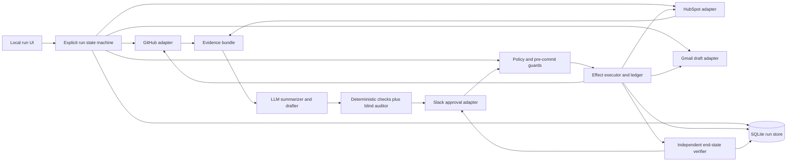

# PromiseGuard: Final Hackathon Project Proposal

**Status — September 14, 2026 (IST):** proposed application, with a runnable
offline checker and standalone TypeScript/SQLite
[reliability monitor](../tools/monitoring/README.md). The monitor assesses supplied
synthetic/imported observations; its generated label fixtures are not real human
review. The app, agents, adapters, authentic approval flow, provider collector,
and durable business recovery remain unimplemented and undemonstrated.
See the [demo and reliability plan](demo-scenarios-and-reliability.md) for current
evidence, acceptance criteria, and the canonical evaluation suite.
The [detailed reliability implementation plan](implementation-plan/06-agent-reliability-implementation.md)
now maps the audit gaps to the existing commit/branch backlog, with concrete
producer, collector, evaluation, and release acceptance. Those tasks are proposed
implementation work, not new evidence that the application has shipped.

**Decision:** Combine the customer-commitment reasoning from Customer Promise
Guardian with the incident evidence, deduplication, and verification model from
Verified Incident Commander. Do not combine all of their integrations.

The planned executable version uses four external apps in its critical path:

- **GitHub** for the incident and engineering evidence
- **HubSpot** for customer commitments, account ownership, and follow-up work
- **Slack** for review, approval, and incident coordination
- **Gmail** for an approval-bound customer update draft that is independently
  verified but never sent by the agent

This document is intentionally narrower than the original ideas. It is designed
for the 390-minute build window described in
[requirements-and-timeline.md](requirements-and-timeline.md), while preserving a
credible path to production.

## 1. One-Sentence Pitch

> PromiseGuard turns a production incident into verified customer follow-up: it
> reconciles GitHub evidence with active promises in HubSpot, asks for approval
> in Slack, creates owned recovery work and a Gmail draft, and verifies the
> intended records while checking for duplicates and unsupported customer claims.

## 2. The Product

### Primary user

A customer-success lead or incident commander at a B2B software company.

### Problem

Engineering incidents and customer commitments live in separate systems. During
an incident, engineering may coordinate correctly while customer-facing teams
discover too late that a promised launch, migration, or fix is now at risk.
Generic incident bots stop at an engineering ticket. Generic CRM agents do not
have enough technical evidence to know whether a promise is still credible.

### Outcome

For one incident, PromiseGuard should:

1. identify only the active customer promises tied to the affected service;
2. distinguish supported technical facts from guesses;
3. show an exact cross-app action plan to a human in Slack;
4. after approval, create verified HubSpot follow-up work, a GitHub impact record,
  and an exact Gmail draft for the designated customer contact;
5. avoid duplicate work when the same incident is replayed; and
6. stop safely if identity, service mapping, state, or approval is ambiguous.

The immediate business measures are time from incident creation to an assigned
account owner, percentage of affected promises with verified follow-up, and
duplicate or unsupported communications prevented. PromiseGuard must not claim
that it reduces churn or incident resolution time based on a hackathon demo.

## 3. Why This Hybrid Is Better

PromiseGuard keeps the strongest parts of the two leading ideas:

- From **Customer Promise Guardian**: customer context, contradictory evidence,
  accountable ownership, approval-bound drafts, and protection against false
  promises.
- From **Verified Incident Commander**: immutable incident fingerprints,
  bounded technical evidence, explicit abstention, duplicate suppression,
  partial-failure recovery, and end-state verification.
- From the reliability-layer ideas: propose-before-execute, prompt-injection
  resistance, deterministic assertions, adversarial fixtures, and a blind
  semantic auditor.

The combination is useful because it closes a gap between engineering response
and customer response. It is more novel than another alert-to-ticket bot. Gmail
is used at one bounded, visible draft boundary, while Datadog telemetry, a fourth
task tracker, and autonomous customer sending remain out of scope.

The novelty is not "an LLM uses three tools." The differentiator is the
**two-sided evidence contract**: a customer action is allowed only when technical
state and CRM commitment state can be joined through explicit identifiers and
the resulting action remains valid at execution time.

## 4. External Apps and Access Plan

The required implementation uses GitHub, HubSpot, Slack and Gmail test
environments through server-owned credentials and typed REST adapters. Account
access, required operations and live readbacks are pending gates; a provider's
available API or a connected assistant plugin does not establish that this
backend is authenticated. See the
[MCP/API/external-app integration guide](implementation-plan/08-mcp-api-and-external-app-integration.md)
for exact adapter ownership, capability mapping and access checks.

- **GitHub / I02:** R01's source-read nodes obtain incident/technical snapshots
  through `src/server/adapters/github.ts` for B02's pure policy;
  B06 creates/updates the approved engineering
  impact comment; B07 reads it back.
- **HubSpot / I03:** R01's source-read nodes obtain complete commitments,
  companies, contacts and owners through `src/server/adapters/hubspot.ts`, then
  B02 validates/selects; B06 creates a task and note per selected
  commitment; B07 verifies fields and actual associations.
- **Slack / I04:** B05 uses `src/server/adapters/slack.ts` for review posting,
  review readback and trusted approval replies; B07 posts/reconciles and reads
  the final summary. This is the human coordination boundary.
- **Gmail / I05:** B06 uses `src/server/adapters/gmail.ts` and `gmail-mime.ts`
  to create/reconcile an approval-bound draft; B07 retrieves its actual content.
  OAuth access must work for the configured test mailbox. No worker send or
  delete operation is exposed.

Q02 independently reads all four apps for evaluation snapshots and provenance.
R01's `src/server/composition.ts` supplies read, coordination and protected-write
capabilities to their owners; model roles receive none of those capabilities.

### Recommended API choice

- Use direct REST APIs behind typed adapters for all writes.
- Use Gmail REST `users.drafts.create` and `users.drafts.get` as the required
  implementation. Do not make required draft creation depend on MCP access.
- Keep MCP disabled in the REST MVP. For the optional extension, qualify reads
  first against the same adapter contract tests. Later protected-write mappings
  require explicit adapter conformance and retain the same approval, effect-ledger
  and verification gates. Enable no mapping until the chosen server and exact
  allowed tool/schema map are approved and tested; do not discover tools
  dynamically inside a running workflow.
- Do not route consequential writes directly from unconstrained model tool calls.
- Do not mix MCP and REST implementations inside one adapter during the event.

REST and MCP are transports behind the same F02/I01 capability contract; choosing
one does not change approval, retries, reconciliation or verification. F01 owns
backend secret configuration; installed Codex/assistant plugins are development
tools and are not runtime authentication. The four-app path still needs real
writes and live proof. MCP is not an additional external app or an additional
agent, and the project contract does not require it for the MVP.

### Minimum permissions

- GitHub: read repository metadata, issues, commits, deployments or workflow
  runs; write issue comments. No contents write, merge, release, or admin scope.
- HubSpot: read companies and commitment tickets; create/read tasks and notes;
  read owners. No delete or broad account-management scope.
- Slack: post and update messages in one channel and read replies in that channel.
  The bot is installed only in the demo channel.
- Gmail: request the narrowest scope accepted by `users.drafts.create` and
  `users.drafts.get`, currently `gmail.compose`. That provider scope can also send
  mail, so the prototype uses a disposable test user and an adapter that exposes
  only find/list/create/get-draft operations. Draft deletion belongs to a separate
  operator-only fixture cleanup utility. The planned agent tool surface must have
  no send, delete, or generic Gmail request method.

### Forty-minute integration gate

Before implementing orchestration, prove all of the following and save the
created object IDs:

1. Read the seeded GitHub incident and create/read/delete one test comment.
2. Read one HubSpot company and commitment ticket, then create/read one test task.
3. Post a Slack message and retrieve its thread replies.
4. Complete Gmail OAuth for a disposable test user, create a uniquely marked
  draft, retrieve and verify it, then delete it.

Use I01's planned `tools/smoke/providers.ts` and the I02–I05 per-provider smoke
files with an explicitly scoped disposable fixture manifest. Cleanup/delete
operations above belong only to the operator's fixture utility, never the
workflow adapter. Also require F01/A01's real structured-output compatibility
smoke for the configured model and each role schema. Record model-live and
provider-live receipts separately: independent smoke successes do not prove one
integrated four-app agent run. R01 must join those paths; R02 records its proof.

Gmail authentication should be prepared before the build window if the rules
allow credential setup. If any required integration is still unauthenticated at
minute 40, stop. The fallback is the original Verified Incident Commander using
GitHub, Linear, and Slack; it is a different submission, not "PromiseGuard without
Gmail." Do not spend the middle of the event debugging OAuth, and do not replace
a failed external app with a local mock while claiming a four-app live workflow.

## 5. Deliberate Exclusions

The following are not part of the prototype:

- **Datadog:** it would improve the trigger, but seeded telemetry and preview APM
  tools create avoidable setup risk. In the prototype, an existing GitHub
  incident issue is the trusted trigger. Datadog is the first production
  connector to add later.
- **Linear:** GitHub Issues already provides the engineering system of record for
  this prototype. A fourth task tracker adds little to the proof.
- **Gmail sending:** Gmail is a required integration, but only draft creation is
  exposed. The agent cannot call a send endpoint, and the demo uses synthetic
  recipients in a disposable account.
- Autonomous rollback, paging, ticket closure, refunds, discounts, or customer
  messaging.
- Fuzzy customer matching, inferred account identity, or LLM-generated impact
  scope.
- A general-purpose agent builder, multi-tenant administration, or a large
  dashboard.

These exclusions are part of the safety and delivery strategy, not a roadmap
failure.

## 6. Seeded Demo World

The [demo plan's shared fixture](demo-scenarios-and-reliability.md#3-shared-demo-world-and-input-conventions)
defines the canonical seed and policy clock. The examples below are illustrative;
no listed account, issue, deployment, or contact is claimed to exist. Map logical
IDs to real test-account IDs and use current valid timestamps for live runs.

### GitHub

Repository `acme/payments` contains incident issue `#42` created from a fixed
issue template:

```yaml
incident_id: inc_42
service_id: billing-api
environment: production
started_at: 2026-09-13T18:10:00Z
suspected_deployment_sha: abc1234
customer_impact: true
```

The repository also contains a recent deployment for `abc1234`. The evidence is
strong enough to call it a candidate change, but not necessarily a proven root
cause.

### HubSpot

Use standard company and ticket records. Do not depend on an enterprise-only
custom object.

- Acme Corp has active commitment `promise_101`, service `billing-api`, an owner,
  a designated incident-contact ID, and a due date three days away.
- Beta Corp has active commitment `promise_102`, service `analytics-api`, and is
  not affected.
- Each commitment has an immutable external ID, explicit service ID, due date,
  status, associated company and owner, and exactly one designated contact whose
  email is read from a HubSpot contact record.

If the required custom ticket properties cannot be created in the test account,
store the same typed fields in a pre-seeded standard ticket description and
parse only a fenced JSON block. Do not infer them from prose.

### Slack

Channel `#incident-customer-impact` starts empty. The bot posts one review thread,
then polls that thread for `approve <runId> <hashPrefix>` or
`reject <runId> <hashPrefix>`. Polling avoids building a public Events API
callback during the hackathon.

### Gmail

A disposable OAuth test user contains no draft with the PromiseGuard effect
marker. The designated HubSpot contact uses a synthetic recipient address. After
approval, the agent creates one RFC 2822 draft whose `To`, subject, incident and
commitment references, and body are bound to the approved plan. The deterministic
effect marker appears in the subject so a retry can find a draft created just
before a local crash.

## 7. Exact Agent Workflow

1. **Receive the goal.** The operator supplies one GitHub incident URL through a
   minimal local UI or CLI.
2. **Normalize the incident.** Fetch the issue by immutable repository and issue
   ID in an allowlisted repository. Validate the issue-template fields and pin
   incident ID, service ID, and environment to that immutable source identity.
   Reject malformed, closed, unsupported-environment, future-dated, or explicitly
   non-customer-impacting incidents before consequential writes. Replays look up
   the original source identity first; edited identity fields must block rather
   than create a new run or effect namespace.
3. **Snapshot technical state.** Read current issue state, referenced deployment,
   commit metadata, and a bounded set of workflow results. Save source IDs,
   timestamps, and canonical hashes.
4. **Snapshot customer state.** Query active HubSpot commitments using exact
  `service_id`, then validate company association, owner, designated contact,
  recipient email, status, and due date. Zero matches is a valid no-action
  result only after complete paginated retrieval. Missing or conflicting
  identifiers produce `safely_blocked`; an incomplete query or failed page is
  `failed` before protected writes, or `failed_partial` when effects are already
  applied or uncertain, never evidence that no commitments are affected.
5. **Apply deterministic policy.** A commitment is at risk only if the service ID
   matches exactly, its status is active, it has one owner, and its due date falls
   within the configured impact horizon, with boundary/timezone behavior defined
   by the versioned policy. Validate every candidate before excluding it; do not
   silently drop malformed billing commitments to produce a clean selected set.
   The model cannot add accounts to this set.
6. **Prepare evidence and drafts.** The model summarizes the bounded GitHub
  evidence and drafts a customer-update email for each eligible account. Every
  factual statement must cite a source field. If causal evidence is below
  threshold, the structured cause is `unknown` and the draft says the team is
  investigating. Deterministic code supplies the recipient and subject marker.
7. **Audit before action.** Mandatory deterministic checks validate IDs, dates,
  allowed effects, and mechanically checkable claims. The target prototype also
  adds a blind semantic auditor that sees the source snapshots and draft, but
  not the worker's reasoning, and flags unsupported or contradictory language.
  It can block or escalate; it cannot authorize a write. All three roles are
  required in the contracted build. An unavailable/invalid auditor exhausts
  its bounded retries and stops the attempt; omitting it requires an explicit
  revised release scope and evaluation.
8. **Request approval in Slack.** Post the evidence, selected commitments,
   proposed HubSpot, GitHub, and Gmail effects, and human-readable draft. The
   approval hash binds the incident fingerprint, source versions, selected record
   IDs, policy version, exact recipient, subject, body, and planned effects. Read
   back the proposal before accepting a decision. Accept only an authorized human
   in the configured workspace/channel/thread, with a unique prefix resolving to
   the current full hash. Ignore bot, unrelated, superseded, and malformed replies.
   An explicit rejection invalidates that revision; a later approval of the same
   revision cannot revive it.
9. **Revalidate at the commit boundary.** After approval, re-read the GitHub issue,
  full eligible HubSpot commitment set, owners, and designated contacts. Any
  changed status, owner, recipient, due date, selected set, or draft invalidates
  approval and returns to review. Check approval expiry and rejection before
  every remaining mutation;
  refresh source reads when the configured freshness window expires. Retain
  already-applied effects and follow the partial-replan rule below.
10. **Execute through an effect ledger.** Create or reuse one HubSpot follow-up
  task and one internal note per selected commitment, create or reuse the exact
  Gmail draft, then create or update one GitHub impact comment. Each effect has
  a deterministic key and explicit `planned`, `inflight`, `applied`, or
  `verified` state.
11. **Verify independently.** Re-read every created object and compare required
  fields and cross-links with the approved plan. For Gmail, verify draft state,
  recipient, subject, body hash, and the absence of a sent-message effect. Do
  not trust an HTTP success response or the worker's self-report.
12. **Close the coordination run.** Update the Slack thread with verified record
    links and the verifier verdict. Replaying the incident must reuse the same
    thread, tasks, notes, Gmail draft, and GitHub comment rather than create
    duplicates.

The run coordinates follow-up; it does not declare the production incident or
customer issue resolved.

### Where the three agents and LLM calls run

B04's `src/server/workflow/driver.ts` starts/resumes one R01 graph invocation
per incident. In `src/server/workflow/graph.ts` and `nodes.ts`, selected complete
source snapshots flow through A02 `agents/analyst/index.ts`, A03
`agents/drafter/index.ts`, deterministic B03 checks and A04
`agents/auditor/index.ts` under `src/server/`. Every role uses A01
`src/server/agents/runtime.ts`; the only model-client construction is
`src/server/agents/model.ts`, using planned `@langchain/openai` `ChatOpenAI`
structured calls with OpenAI Responses transport. F01 pins/smoke-tests the
compatible packages/model/configuration, F02 freezes role and artifact schemas,
and R01 composes these modules with injected persistence and budgets.

Here “spawn” means a bounded backend role invocation with a separate prompt,
schema, context and trace span. No new process, autonomous debate, provider-tool
binding or extra server is needed. The normal selected path runs the three roles
sequentially; blocked/no-affected input can exit before LLM dispatch. Persist
first raw outputs and attempt evidence before corrections. Resume an unchanged
approved plan from stored artifacts instead of asking the model to rewrite it.
The [agent spawning and LLM guide](implementation-plan/07-agent-spawning-and-llm-integration.md)
and A01–A04/B04/R01 commit briefs define the exact implementation and handoffs.

## 8. What the LLM May and May Not Do

### The LLM may

- extract a typed summary from the bounded incident evidence;
- explain why an already-selected commitment is at risk;
- draft concise customer-update email language from cited facts; and
- act as a second, semantic auditor for unsupported claims.

### The LLM may not

- resolve customer identity, designated recipients, or join records by names;
- invent or broaden the affected service or account set;
- decide permissions, approval validity, freshness, dates, or idempotency;
- choose arbitrary tools or construct unrestricted API requests;
- mark an incident resolved, send a Gmail message, or perform engineering
  changes; or
- override a deterministic verifier failure.

This constrained role is intentional. The product is still an AI agent because
semantic evidence synthesis and grounded drafting are material parts of the
workflow, but authority stays in code.

## 9. Reliability Contract

For this hackathon, **AI agent reliability is a P0 product deliverable** combining:

1. **Original AI quality:** source-grounded first analyst/drafter outputs, complete
   and honest uncertainty, and independently labeled auditor behavior. Preserve
   defective first results when retries or human correction improve the final plan.
2. **Execution correctness:** real model/tool traces plus code that enforces exact
   approval, scope, request binding, bounded retries, unknown-write reconciliation,
   and verification before claims. Trace monitoring measures these controls; it
   cannot replace enforcement.
3. **Outcome correctness:** independently collected scoped S0/S1 and operation
   history match expectations frozen before execution, including exact records,
   recipients, links, no duplicates/sends, and unchanged unrelated commitments.

The existing checker and monitor implement parts of measurement over supplied
observations. Real event production, independent collection, actual model review,
and connected-app evaluation remain open. A trace pass or final response alone
does not establish the contract below.

A run is `completed` only when:

- one immutable GitHub incident maps to one incident fingerprint;
- every selected HubSpot commitment matches the exact affected service and has
  one company, owner, and designated contact;
- every factual draft claim is supported or explicitly marked unknown;
- each HubSpot/GitHub/Gmail mutation was covered at dispatch by a valid approval for its exact plan
  revision, source versions, records, recipient, and Gmail draft;
- all HubSpot tasks and notes, the Gmail draft, and the GitHub impact comment are
  independently read back and match the approved plan;
- the Slack thread links to every verified destination record;
- the final Slack summary itself has passed fresh readback; and
- no forbidden or duplicate effect appears in the event ledger.

Allowed terminal outcomes are:

- `completed`
- `completed_no_affected_commitments`
- `safely_blocked`
- `failed_partial`
- `failed`

`completed_no_affected_commitments` uses claim scope `no_affected` and no
`planRef`: complete source reads, deterministic selection finding zero eligible
commitments, and no protected effects support this outcome. It needs no plan,
approval, or Slack artifact. Final Slack readback is required for artifact-producing
`completed` runs.

`awaiting_approval` is a persisted, resumable checkpoint, not a completed task or
terminal success. A run can remain there until its human-response deadline;
expiry/rejection must produce an explicit outcome without further consequential
writes; preserve and report any effects already applied in a partial run.

`failed_partial` is more honest than pretending distributed external writes are
atomic. On retry, the reconciler reads actual provider state and repairs only the
missing effect under a valid current approval. If source drift changes the
required payload of an already-applied task, note, or draft, preserve it and
report `failed_partial` for manual review. A new approval alone must not silently
overwrite or duplicate old work. Retain each effect's original plan revision;
completion must validate the selected active plan and any compatible adopted
effects, without presenting superseded effects as current-plan success.

### Critical invariants

1. No HubSpot, GitHub, or Gmail mutation occurs without a valid approval for that
  exact state and plan.
2. No commitment or Gmail recipient is selected through fuzzy identity or
  semantic similarity.
3. One incident-commitment-action tuple creates at most one logical external
   effect.
4. No draft states a root cause or recovery that the evidence does not support.
5. No run reports `completed` until all intended effects pass read-after-write
   verification.
6. A changed relevant source field or eligible set invalidates prior approval.
7. Prompt content cannot change recipients, permissions, tools, or policy.
8. The agent never sends customer communication or changes production code.
9. Every Gmail effect remains a draft, and each incident-commitment pair has at
  most one active PromiseGuard draft.

### Honest idempotency claim

GitHub, HubSpot, Slack, Gmail, and the local database cannot share one atomic
transaction. PromiseGuard therefore must not claim exactly-once delivery.
Its intended contract is **idempotent logical effects with reconciliation**:

```text
effectKey = SHA256(incidentFingerprint | app | targetRecordId | actionType)
```

Before writing, the executor checks the local effect ledger and searches the
provider for the same marker. Gmail drafts include that marker in the subject.
After writing, it stores the provider ID and reads the object back. A crash
between provider write and local persistence is repaired by provider lookup, not
by blindly repeating the write. An empty search after an uncertain write is not
proof of absence: perform bounded settling reads and require manual review if
the outcome remains unknown. Adopt only one exact field/association match; block
on multiple or conflicting candidates. Local serialization prevents competing
local executors, but cannot eliminate races with external humans or other apps.
Describe observed duplicate-free runs with their evidence scope, not universal
exactly-once delivery.

## 10. Minimal Production-Shaped Architecture



### Suggested prototype stack

- TypeScript on Node.js 24, matching the [architecture](promiseguard-architecture.md)
- Zod for every model, adapter, and persisted payload boundary
- LangGraph `StateGraph` for the same bounded workflow, with LangChain structured
  calls for the analyst, drafter, and auditor; see the
  [fine-grained architecture](promiseguard-architecture.md)
- SQLite for runs, approvals, source snapshots, effects, and verifier results
- Native `fetch` or small official SDKs behind `GitHubAdapter`,
  `HubSpotAdapter`, `SlackAdapter`, and `GmailAdapter`
- Durable local events with a shared `runId`, masked LangSmith trace inspection,
  and a separate read-only reliability monitor joining traces with app evidence
- A minimal web page or CLI showing evidence, planned effects, run state, and
  verifier results

Keep this as one deployable service. LangGraph expresses the existing state
machine; LangChain supplies the scoped model interfaces. A message broker,
microservices, or additional orchestration frameworks remain outside the demo.
The application frameworks remain proposed. A smaller standalone monitor now
implements local observation storage, assessment jobs, and metric reports using
Node 24's `node:sqlite`; it does not implement this application's run/effect ledger.

### Core persisted records

- `Run`: source incident, policy/model/prompt versions, terminal status
- `Snapshot`: provider, source ID, version/timestamp, canonical hash, redacted data
- `Approval`: approver, plan hash, scope, created time, expiry, decision
- `Effect`: deterministic key, provider, operation, target, status, provider ID
- `Verification`: assertion ID, expected value, actual value, verdict, evidence
- `Event`: append-only tool request/result metadata with secrets and bodies redacted

This data model can migrate from SQLite to PostgreSQL without changing the
workflow contract.

## 11. Evaluation Suite

The [canonical suite and scoring rules](demo-scenarios-and-reliability.md#9-repeatable-evaluation-set-and-improvement-loop)
define named case families, variants, repetitions, modes, and denominators. Keep
that suite authoritative instead of treating the overview below as a second test
count. No product evaluation result is available yet.

Freeze the suite census before execution so every family, variant, repetition,
and repair leg has an identity, expected checkpoint, mode, seed, budgets, and
versions. Register actual runs against it; report not-run cases beside failures
and unverified evidence. The current monitor only sees supplied registered
attempts, so Q04/Q05 must add this coverage ledger. The 18-family/42-attempt
baseline remains a target until executed; variants and repair legs are separate.

Seed all scenarios from known state, run the agent, settle only for declared
eventual-consistency conditions, query each external app independently, and grade
the resulting state. The worker's `done` message is never the oracle.

Separate B07's inline readback, which gates product completion, from Q02's
independent evaluation collector. The collector records provider request scope,
pagination/completeness, observed timestamps/versions, raw-response references,
and normalization; it cannot copy approved fields into observed values. Mode
labels alone do not prove live provenance. Independent human reviews inspect
original outputs and their source evidence, record reasons/corrections, and keep
missing or uncertain labels unverified. Product completion and pending assessment
remain separate on the result surface.

Q01 freezes source facts and semantic invariants before execution. Generated
content uses typed `ApprovedContentRef`: B03 freezes exact bytes in the immutable
approved plan before dispatch, and B07/Q02 resolve expected bytes only from that
receipt. Provider output cannot define expected content; approval does not prove
quality or change the independent semantic oracle. Future destination IDs use
separate `EffectIdRef` bindings.

| Scenario | Expected result |
|---|---|
| One matching active promise | One approved task, note, Gmail draft, GitHub comment, and Slack thread are verified |
| Unrelated service promise | Unrelated company receives no task, note, or Gmail draft |
| No affected commitments | `completed_no_affected_commitments`; no HubSpot, GitHub, or Gmail mutation |
| Missing, duplicate, or invalid recipient mapping | `safely_blocked`; no consequential mutation |
| Weak deployment evidence | Cause remains `unknown`; draft contains no blame claim |
| Incident closes before approval | Approval is invalidated; no execution |
| Commitment owner/date changes before approval | Approval is invalidated and a new review is required |
| Duplicate run or delivery | Existing records and Gmail draft are reused; duplicate count remains zero |
| Human creates equivalent task or draft before reconciliation | Adopt one exact match; block conflicting/multiple matches; disclose the remaining read/write race |
| HubSpot succeeds and Gmail or GitHub fails | `failed_partial`; retry repairs only missing effects |
| Gmail draft is altered after creation | Verification fails; run cannot report `completed` |
| Slack returns success but message is absent | Read-back fails; run cannot report `completed` |
| Prompt injection in issue or CRM text | Data instruction is ignored; allowed effects remain unchanged |
| Permission denial | No retries beyond the bound; clear failed state and preserved evidence |

Run all fixtures locally with fake adapters. Run at least the happy path,
duplicate replay, stale approval, Gmail draft verification, and one safe block
against real test accounts.
If Arga credits are available, replay one high-value race against a twin, but do
not make the demo depend on multi-twin access.

### Release gates for the prototype

- Critical invariant pass rate: **100%** with raw count shown
- Forbidden side effects: **0**
- Approval bypasses: **0**
- Duplicate logical effects: **0**
- Successful mutation acknowledgements independently verified: **100%**
- False completion statuses or premature success messages: **0**
- Required trace fields present: **100%**
- Unsupported factual claims in labeled first proposals: **0**
- First proposals pass required grounding/completeness/handoff labels; human
  corrections and regenerations are recorded separately from eventual success
- Gmail messages sent by the agent: **0**
- Approved Gmail drafts with exact recipient, subject, and body: **100%**

These targets require complete evidence and actual nonempty samples; an empty
denominator displays N/A. Implement observation schema v2 and `monitor-v2` before
claiming zero false completion. Current `monitor-v1` `falseCompletion` is only
the legacy premature-claim counter and can remain zero despite failed outcome
checks. The new report separates `prematureSuccessClaims` from
`outcomeContradictedCompletionClaims`; `falseCompletion` counts their union once
per unique `claimId`, with affected runs separate. Each claim is `confirmed`,
`contradicted`, or `unverified` against independently supported state at emission,
using frozen timing and causal evidence rules. Later drift cannot retroactively
prove the original claim false. Missing temporal evidence remains unverified and
prevents closing the release gate. Preserve v1 receipts and separate evaluator
versions. M3 must corroborate acknowledged writes with actual provider fields;
a declared `matches: true` alone cannot establish independent verification.

Passing the declared fixtures does not prove production reliability. Results
apply only to the frozen version, actual attempts, and declared test distribution.
The brief and demo must say that plainly.

## 12. Two-Minute Demo

Use the [canonical recording script](demo-scenarios-and-reliability.md#11-two-minute-video-and-extended-evidence)
for the final cut. The outline below is the product story; show only behavior
actually executed, and label live, prerecorded real, and synthetic evidence.

### Demo story

A billing incident threatens one near-term Acme commitment. An unrelated Beta
commitment must remain untouched. Technical evidence points to a recent deploy
but does not prove root cause, so PromiseGuard uses cautious wording.

### Script

- **0:00-0:15:** Show GitHub incident `#42` and the two HubSpot commitments.
- **0:15-0:40:** Start the run. Show exact service matching and the evidence
  bundle; Acme is selected and Beta is excluded.
- **0:40-1:00:** Show the Slack proposal. It says the cause is still under
  investigation and displays the exact effects plus approval hash.
- **1:00-1:25:** Approve in the Slack thread. Show the verified HubSpot task/note,
  Gmail draft, and GitHub impact comment with cross-links.
- **1:25-1:42:** Replay the same incident. Show that all provider IDs are reused
  and no duplicate effect appears.
- **1:42-1:55:** Show the evaluation scorecard, including stale approval and
  prompt-injection cases.
- **1:55-2:00:** Close with the measured result: one affected promise assigned,
  one verified Gmail draft, one unrelated account untouched, and every intended
  effect verified.

Record the first working end-to-end run as a backup before adding visual polish.

## 13. 390-Minute Build Plan

This is the original full-window estimate, not a fresh allocation of time. Use
the [current demo-plan priorities](demo-scenarios-and-reliability.md#12-remaining-build-decisions-and-prioritized-checklist)
and actual remaining time. Recording and submission time are reserved.
Use the [detailed reliability implementation plan](implementation-plan/06-agent-reliability-implementation.md)
for the current work sequence and commit acceptance; the clock blocks below
remain the original estimate rather than a second active schedule.

### 0-40 minutes: integration gate

- Create and seed one GitHub repository, HubSpot developer test account, Slack
  channel, and disposable Gmail OAuth test user.
- Complete the read/write/read-back smoke tests.
- Freeze the exact custom fields, permissions, and demo IDs.

### 40-90 minutes: contracts and adapters

- Define Zod schemas, terminal states, adapter interfaces, and SQLite records.
- Version the event/claim/provenance contracts and freeze scenario expectations,
  suite census, rubric, and budgets before execution.
- Implement the four narrow adapters and structured event logging.
- Build resettable fake-adapter fixtures alongside the live adapters.

### 90-145 minutes: evidence and selection

- Implement issue normalization, incident fingerprinting, bounded GitHub evidence,
  exact HubSpot service matching, and deterministic at-risk policy.
- Return `safely_blocked` on ambiguous data before adding any model call.

### 145-195 minutes: drafting and pre-commit checks

- Generate cited summaries and Gmail-ready drafts through the architecture's
  separate bounded analyst and drafter calls.
- Add deterministic claim checks and the blind semantic auditor.
- Persist original outputs and actual model attempt, validation, retry and timing
  evidence before any corrected result replaces them in the working plan.
- Build the approval-plan hash and expiry rules.

### 195-245 minutes: approval and execution

- Post and poll the Slack approval thread.
- Implement the effect ledger, HubSpot task/note writes, Gmail draft write,
  GitHub comment write, bounded retry behavior, and provider markers.
- Commit each application transition, canonical event, and measurement job in one
  application transaction, then feed the reusable monitor through a durable path.

### 245-290 minutes: independent verification

- Read back all effects, including exact Gmail draft content, and cross-links.
- Implement duplicate replay, stale-state invalidation, and partial-run repair.
- Gate completion on independent readbacks and instrument every success claim;
  test and measure premature claims and outcome contradictions explicitly.
- Add independent scoped S0/S1 collection with completeness/provenance and exact
  MIME, association, cross-link, duplicate, and unrelated-record checks.

### 290-335 minutes: evaluations

- Run the canonical local suite and five required live-account cases: golden
  path, replay, stale approval, draft verification, and a safe block.
- Fix only critical invariant failures.
- Save a machine-readable scorecard with raw counts.
- Grade original model outputs with independent human labels and retain reasons,
  failures, corrections, unverified evidence, and unrun census entries.

### 335-365 minutes: demo and brief

- Make the evidence, approval, effects, and verdict readable.
- Finish README and reliability limitations.
- Record a clean two-minute backup demo.

### 365-390 minutes: freeze and submit

- Reset seed data and run the golden path and suite once.
- Verify all links from a clean browser session.
- Submit with buffer. Add no new feature in this period.

## 14. Scope Priorities

### Must ship

- Four live external apps
- One end-to-end approved workflow
- Exact customer/service matching
- Exact HubSpot-contact-to-Gmail-recipient mapping
- State-bound approval
- Idempotent effect ledger
- Read-after-write verification
- Actual stage/model/tool traces and atomic application event/measurement jobs
- Independent before/after provider evidence and original-output semantic review
- Duplicate replay
- The canonical evaluation suite and an actual-results scorecard with failed and
  unrun cases visible
- One safe block or unsupported-claim demonstration

### Add only if the must-ship path is green

- Blind semantic auditor as a supplementary sensor; it is not a safety dependency
- A polished local run timeline
- One Arga race-condition replay
- GitHub deployment scoring beyond an explicit SHA

### Do not add during the event

- Datadog, Linear, another CRM, or any fifth external app
- Autonomous customer sends
- General natural-language workflow creation
- Multiple incident types or broad impact inference
- Multi-tenant OAuth, billing, role administration, or production deployment

If schedule slips, cut visual polish and the blind auditor before cutting Gmail,
deterministic verification, approval freshness, or duplicate handling.

## 15. Production Path

The prototype is production-shaped, not production-ready. Scaling it requires:

1. Replace SQLite with PostgreSQL and a durable queue/outbox worker.
2. Replace polling with signed GitHub, HubSpot, and Slack webhooks and a durable
  Gmail OAuth token lifecycle.
3. Add multi-tenant OAuth, encrypted secret storage, tenant isolation, RBAC, and
   per-tenant policy configuration.
4. Isolate Gmail draft creation in a least-authority worker. Because Google's
  compose scope can send mail, production needs strict egress controls, audited
  credentials, and a separate human-owned send path.
5. Add Datadog or another monitoring source while preserving the same normalized
   incident contract.
6. Build an onboarding mapper for each customer's service catalog and CRM schema.
7. Add distributed locking or compare-and-set claims around each effect key.
8. Add rate-limit handling, dead-letter repair, retention controls, PII redaction,
   audit export, and deletion workflows.
9. Calibrate semantic auditing on labeled production examples; never promote it
   above deterministic safety controls.
10. Measure downstream outcomes such as owner acknowledgment and promise recovery
   against a holdout, rather than attributing every improvement to the agent.

The adapter, state-machine, approval, effect-ledger, and verifier boundaries can
survive that transition. The local auth and persistence choices cannot.

## 16. Fit With the Hackathon

- **Technical execution:** the apps form one necessary stateful workflow, and all
  four receive visible, verified actions.
- **Reliability and evaluation:** safety policy, approval, freshness,
  idempotency, partial recovery, independent verification, adversarial fixtures,
  and raw metrics are the center of the product.
- **Usefulness:** it connects incident response to customer commitments and
  accountable follow-up, a costly gap for B2B companies.
- **Originality:** it is neither a generic incident bot nor an inbox/CRM
  assistant. The two-sided evidence contract and cautious abstention are the
  product hook.
- **Demo clarity:** one incident, two customer records, one approval, four apps,
  one duplicate replay, and one scorecard fit into two minutes.

The company alignment is substantive rather than decorative:

- Arga Labs' perspective appears in resettable state-transition fixtures and
  before/after assertions.
- Lemma AI's perspective appears in detecting false completion and preserving
  traces that can become regression tests.
- Userlens' perspective appears in account context, human approval, and measuring
  downstream ownership rather than message generation.
- Clera's perspective appears in hard-constraint filtering and useful handoff to
  a human owner.
- Comma Capital's likely lens is addressed by a focused user, painful workflow,
  clear wedge, and credible expansion path.

Do not name-drop these companies in the demo. Demonstrate the principles.

## 17. Brutally Honest Assessment

### Why this can place

- It has a clear buyer and an expensive failure mode.
- Reliability is visible in product behavior, not relegated to a test slide.
- The integration path is materially safer than either original four-app plan.
- The duplicate replay and unsupported-cause abstention are memorable proof
  moments.
- It is narrow enough to finish while retaining a credible production design.

### Why it may not place

- The prototype does not discover incidents from live observability; a GitHub
  issue is a controlled proxy. Judges may see this as less operationally complete.
- Gmail OAuth is a required setup gate. The planned REST scope can send as well
  as compose. Removing the send
  method from our adapter prevents agent access, but it does not make the OAuth
  credential itself least-privileged.
- The hardest real-world problem is clean service-to-account and
  service-to-commitment mapping. The demo uses structured seeded fields. Many
  companies do not have those fields, and an LLM cannot safely repair that data
  problem on its own.
- A Gmail draft is visually persuasive but is not delivered customer
  communication. The demo must say "drafted and verified," never "customer
  notified." That restraint is the right safety decision.
- A blind LLM auditor is not independent ground truth. It may share the worker's
  bias or block valid drafts. It is a supplementary sensor, not the reliability
  foundation.
- Four integrations still involve permissions, API semantics, and seed data. The
  build is only defensible if Gmail is authenticated before coding or all four
  pass the minute-40 gate.
- Incident and customer-success agents are both familiar categories. Weak
  execution will look like two standard workflows glued together. The exact
  evidence join, state-bound approval, and end-state proof must be visible.

### Feasibility estimate

- **Two capable builders with credentials prepared:** 60-75% chance of a stable,
  demo-ready MVP.
- **Solo builder with credentials prepared:** 35-50%.
- **Starting account setup at 9:30 with no prior access:** subtract roughly 20-25
  percentage points.

These are planning estimates, not statistical forecasts. Requiring Gmail improves
the product story and demo, but materially reduces execution confidence.

### Kill criteria

Abandon or reduce scope when any of these is true:

- Any of the four required live integrations, including Gmail draft creation and
  retrieval, has not passed read/write/read-back by minute 40.
- The team cannot represent customer-to-service mapping with explicit IDs.
- The approved happy path is not complete by minute 245.
- Critical duplicate, stale-approval, or false-completion tests still fail at
  minute 335.

Do not hide a failed integration behind fixture data in the final demo. Switch to
the documented GitHub-Linear-Slack incident fallback and state the reduced scope
honestly.

## 18. Final Recommendation

Build **PromiseGuard** as defined here: GitHub, HubSpot, Slack, and Gmail; one
incident type; exact service and recipient mappings; proposed customer follow-up;
human approval; a verified Gmail draft; idempotent writes; and independent
end-state verification.

Making Gmail mandatory does not justify the naive union of Customer Promise
Guardian and Verified Incident Commander. Datadog and Linear remain excluded;
six apps in one 390-minute prototype would maximize logos while reducing the
chance that the reliability claims are true.

PromiseGuard is not guaranteed to win. It is, however, a defensible balance of
novelty, usefulness, integration availability, visible reliability, and actual
finishability under the published constraints.
