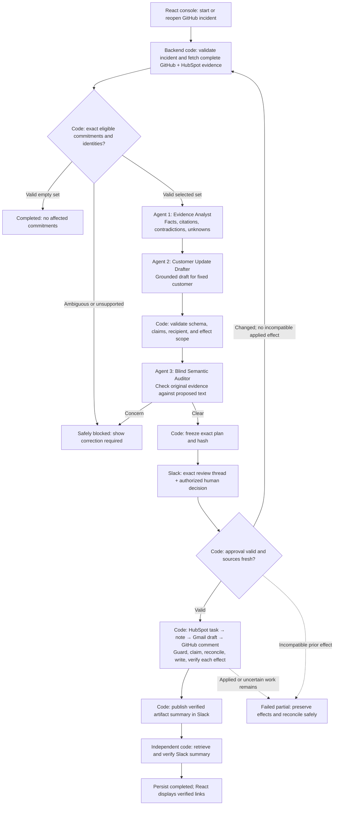
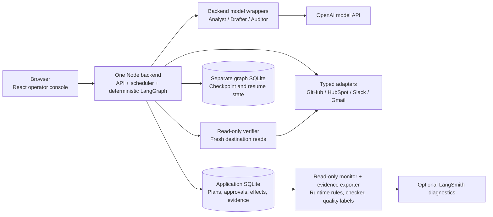
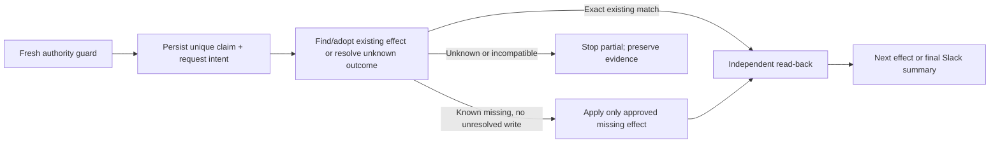

# Agent responsibilities and simple workflow

**Status:** target implementation, not a diagram of running code. Only the
[offline checker](../../tools/reliability/README.md) currently runs. This schematic
implements the [architecture](../promiseguard-architecture.md) and keeps the
[proposal](../final-project-promiseguard.md)'s GitHub + HubSpot + Slack + Gmail scope.

## 1. End-to-end view

Every stage also has error handling omitted from the picture for readability.
Transport failure or exhausted required-model retries before protected work yield
`failed`. Policy/identity ambiguity yields `safely_blocked`. Applied or uncertain
protected effects require `failed_partial`. An undecided, unexpired Slack plan is
`awaiting_approval`, a resumable checkpoint; a rejected revision cannot execute.

“Clear” from the auditor means no concern was flagged. It is neither human approval
nor proof of truth. The final Slack summary lists only independently verified
artifacts; before its own read-back it must not claim the entire run completed.

## 2. Where each component runs

The model API performs the three language tasks. Their wrappers, policies, prompts,
validation, and artifact persistence run inside the Node backend. No agent needs
its own deployment. The browser has no provider credentials or approval bypass.
The monitor writes local assessment records and sanitized telemetry only; it
cannot approve, execute, or repair business effects.

The intended stack remains React/TypeScript/Vite, Fastify, Zod, LangGraph,
LangChain structured model calls, SQLite, and optional LangSmith trace inspection.
Resolve and smoke-test compatible dependency versions during scaffolding; the
repository has not installed or validated this application stack.

## 3. Agent 1 — Incident Evidence Analyst

**Proposed home:** `src/server/agents/analyst/`.
**Implementation:** A02, using the A01 call wrapper and F02 contracts.

- **Input:** immutable, bounded GitHub snapshots: incident fields, referenced
  deployment/commit, workflow evidence, and stable citation IDs. Selection has
  already fixed the affected customer set; private contact data is unnecessary.
- **Does:** separates supported technical facts, candidate changes, contradictory
  observations, and unknowns. A recent deploy alone does not establish causality.
- **Output:** a versioned `IncidentAssessment` with claim/source references and
  uncertainty. The backend validates shape, source IDs, and mechanically testable
  facts before passing the artifact onward.
- **Tools/authority:** one structured model call with bounded retries; no app
  mutation tool, generic HTTP tool, email selection, or approval capability.
- **Handoff:** the validated assessment plus original source references go to
  the drafter. Save the original model output and each retry as separate evidence.
- **Own acceptance:** weak evidence remains uncertain; nonexistent citations and
  malformed required output fail; source instructions cannot alter policy.

The analyst developer can build prompts, schema validation, and fixture tests
while the GitHub adapter developer implements collection against the same frozen
snapshot contract.

## 4. Agent 2 — Customer Update Drafter

**Proposed home:** `src/server/agents/drafter/`.
**Implementation:** A03, using the A01 call wrapper and F02 contracts.

- **Input:** validated assessment, supporting facts, and exact commitments already
  selected by code. The initial seed has one eligible commitment and one draft.
- **Does:** proposes cautious customer language and claim-to-source references.
  It describes impact and next steps without inventing cause or recovery dates.
- **Output:** versioned `DraftProposal`; proposed body/claims and rationale for
  review. Code supplies the exact designated recipient, empty Cc/Bcc, subject
  marker, owner IDs, dates, and permitted action types.
- **Tools/authority:** structured model call only. The agent never creates Gmail
  drafts, changes recipients/owners, adds affected customers, or sends mail.
- **Handoff:** deterministic proposal validation, then the blind auditor, then
  frozen-plan construction. Once approved, the body is immutable for that revision.
- **Own acceptance:** no unsupported certainty, expanded impact, invented dates,
  recipient changes, or forbidden effects; preserve and label the first proposal.

The drafter developer can implement against analyst fixtures without waiting for
the analyst branch to run live. Runtime drafting depends on a validated analyst
result; development parallelism does not change that dependency.

## 5. Agent 3 — Blind Semantic Auditor

**Proposed home:** `src/server/agents/auditor/`.
**Implementation:** A04, using the A01 call wrapper and F02 contracts.

- **Input:** original GitHub/HubSpot source projections, proposed customer text,
  claim references, and the supported task contract. Exclude other agents'
  reasoning, self-confidence, and shared chat history.
- **Does:** flags unsupported claims, contradictions, and missing required content.
- **Output:** versioned `AuditFindings` with the concern, affected claim, relevant
  source references, and structured verdict. Code routes findings to review/block.
- **Tools/authority:** structured model call only. The auditor cannot approve a
  plan, repair artifacts, override policy failures, or invoke the executor.
- **Handoff:** no concern permits deterministic plan freezing; concern stops this
  plan. Required-stage timeout/refusal/invalid output after the fixed retry budget
  yields failure, never an implicit pass.
- **Own acceptance:** seeded false claims are detected; supported cautious drafts
  are not unnecessarily blocked; labeled evaluation reports missed claims and
  false blocks. A clean audit is still fallible.

The target build includes this agent. The original proposal allows a consciously
reduced two-agent release; that requires an explicit release configuration,
updated diagram/claims, and rerun evaluations. Runtime failure must never silently
remove an enabled auditor.

## 6. Deterministic components are not extra agents

- **API and scheduler — `src/server/api/`, `workflow/`:** authenticate operator,
  validate incident identity, create or reopen one run, schedule graph invocations,
  and expose saved state. Browser closure does not stop the run.
- **Collector and selector — `adapters/`, `policy/`:** gather complete bounded
  snapshots; validate service, status, dates, company, owner, and designated contact;
  publish selected IDs/exclusion reasons. No model chooses the customer join.
- **Plan builder and approval guard — `policy/`, `workflow/`:** construct exact
  permitted payloads; freeze/hash the revision; retrieve Slack proposal and human
  decision; validate identity, thread, hash, rejection, expiry, and source freshness.
- **Effect executor — `execution/`:** claim one stable effect key, reconcile
  existing/uncertain outcomes, then create only approved missing work. HubSpot
  task/note, Gmail draft, and GitHub impact comment are protected effects.
- **Independent verifier — `verification/`:** freshly retrieve provider objects
  and compare fields, associations, recipient/body/draft status, and links with the
  approved plan. It returns assertions; it does not trust a writer's success text.
- **State and events — `storage/`, `observability/`:** persist source/artifact
  references, immutable plans, approvals, attempt intent, effects, verification,
  and canonical redacted events. Retain uncertainty across restart.
- **Monitor and evaluation — `monitoring/`, `evaluations/`:** join frozen scenario
  expectations, independent snapshots, runtime rules, the existing checker, and
  first-proposal labels. Report actual M1–M7 observations and missing evidence.
- **Operator UI — `src/web/`:** start/reopen, show evidence/selection, show the
  exact approval plan and Slack link, render stage/status/verified results, and
  distinguish product verification from pending evaluation. It cannot authorize
  through an `approved: true` field.

## 7. App responsibility and permissions

- **GitHub:** read the incident and bounded engineering evidence. After approval,
  create/reuse/update the marked impact comment and read it back. No code changes,
  incident closure, or raw customer-email body in the engineering comment.
- **HubSpot:** read commitments, company, owner, and designated contact. After
  approval, create/reuse one task and one note per selected commitment; retrieve
  them and verify associations. No source-record identity repair by an agent.
- **Slack:** post/reconcile/read the review thread before protected approval;
  read authorized human decisions; publish and verify the final artifact summary.
  Coordination permission is distinct from protected mutation permission.
- **Gmail:** find/create/get a draft and inspect decoded MIME content. Exactly one
  approved To mailbox and no Cc/Bcc. The runtime exposes no send/delete capability;
  disposable-fixture cleanup is a separate operator tool.

All model roles see narrow data projections, never tokens. Separate adapter read,
Slack coordination, and protected mutation interfaces; only deterministic
execution code receives protected mutation capabilities.

## 8. Sequential and parallel execution

For the first integrated path, follow the order in the end-to-end diagram. The
three agents execute in sequence because each checks or uses earlier artifacts.
Keep one effect in flight per incident, using this repeated unit:

Finding an exact existing object goes directly to verification; conflicting,
multiple, or unresolved matches stop further writes. The picture's apply box
never means “retry a timed-out create immediately.” Revalidate approval on every
remaining mutation, including after a resume.

Source reads may later overlap after incident identity/service validation, with
an explicit complete-input join. Status polling and queued measurement/export
jobs may run concurrently within bounded resources. Multi-person implementation
can parallelize much more widely: each agent, each app adapter, UI, storage,
policy, and the harness can develop against the shared contracts before the final
graph is wired. Preserve that distinction when implementing the branch plan.
