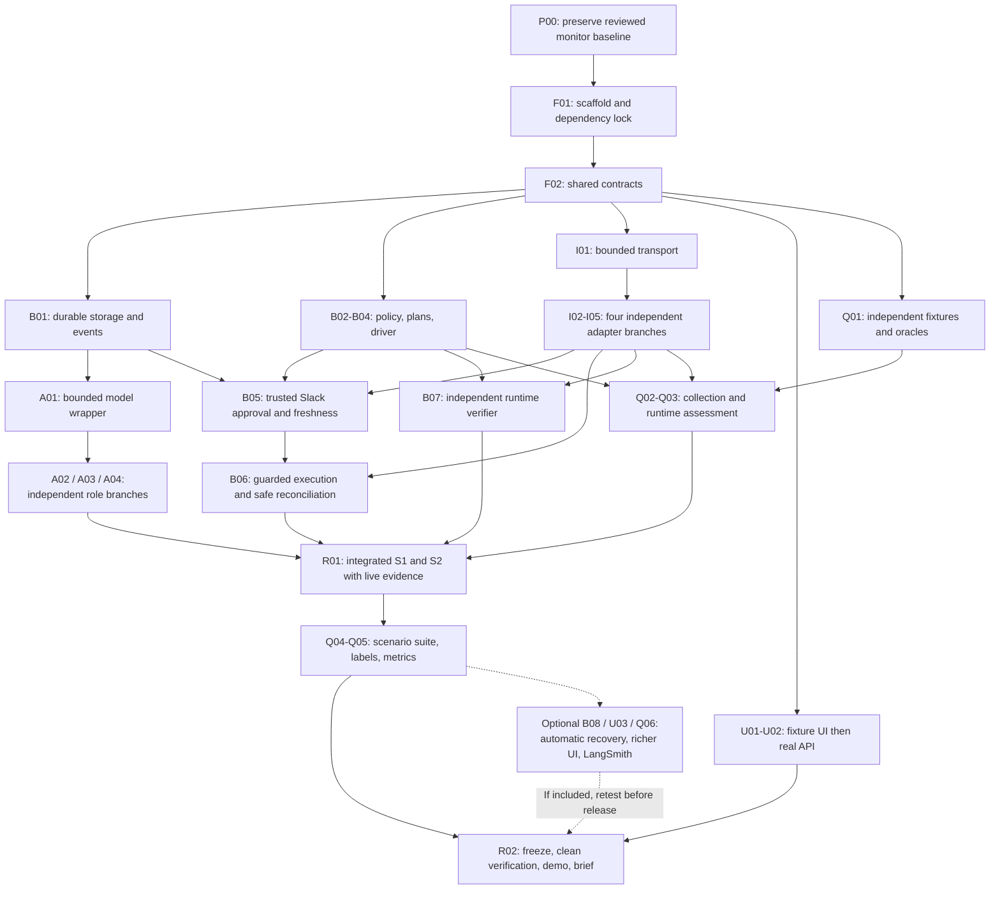

# Parallel delivery, branches, and merge order

**Planning assumption:** up to four contributors, using the existing React /
TypeScript / Fastify / LangGraph / SQLite design. Work packages are roles, not
additional deployed services. Use the smaller-team allocations below if needed.
All branches and commit IDs here are proposed; this documentation task does not
create implementation branches or commits.

Use the [per-branch index](branches/README.md) for exact dependency layers and
one dedicated file per branch. The [individual commit files](commits/README.md)
add ordered implementation steps and handoffs to this staffing overview. Start
with P00 to preserve the existing monitor, then F01/F02 for application foundations.

Read [the numbered commit tasks](04-commit-plan.md) for exact dependencies,
allowed files, exclusions, and verification. Read [contracts](05-contracts-and-handoffs.md)
before splitting work. The current base is `main`; preserve the existing dirty
working tree when preparing a shared starting commit.

The [detailed reliability plan](06-agent-reliability-implementation.md) now adds
the audit's concrete work inside the existing commit/branch graph. Reliability is
one required delivery track spanning original AI outputs, actual execution, and
independent app state; it is not postponed until an optional dashboard is built.

## LLM and external-app implementation joins

Use the [LLM guide](07-agent-spawning-and-llm-integration.md) and
[MCP/API guide](08-mcp-api-and-external-app-integration.md) as the call-site and
configuration references alongside F02. P1 owns config/contracts and R01
composition; P3 owns A01 model runtime plus A02–A04 role functions; P2 owns I01
transport and I02–I05 app adapters; P4 owns stateful fakes, independent reads and
model/app provenance checks. This allocates work within the existing lanes.

During Wave 0, verify the model account and the four app accounts separately and
record unready permissions. After F02, role prompts and per-app transports can be
built in parallel against the same fixtures. A01 needs B01 before its persistence
handoff; R01 joins real roles, adapters, guard/verifier and collector only after
its existing prerequisites merge. Three runtime role calls stay sequential.

REST is the required MVP transport. Optional MCP transport work must first have
an explicit supported server/tool map and tested read/write/readback contract;
keep it outside the critical release path. No agent branch privately changes
dependencies, obtains broad mutation tools or bypasses app credential setup.

## 1. Three different kinds of parallelism

- **Development:** independent files can be built concurrently against F02 types
  and Q01 fixtures. A frontend developer does not wait for working OAuth; a
  drafter developer does not wait for a live analyst implementation.
- **Merge:** a consumer merges only after its hard prerequisites are present and
  its tests pass. All merges land sequentially into `main` through small PRs.
- **Runtime:** bounded independent reads may overlap after incident identity is
  validated; they must join before selection or plan freeze. The model stages
  and protected effects retain their causal order. Adding developers does not
  authorize concurrent writes to the same incident.

Keep these distinctions in task assignments: “can start coding” does not mean
“can merge,” “can call live providers,” or “is complete.”

## 2. Dependency schematic



This is a grouped overview, not permission to wait for a whole track. For example,
B05 needs I04 Slack, not every adapter; B02 can merge once Q01 is available;
A01 needs B01; U02 needs B04. The individual prerequisites in the commit plan
are authoritative. The groups intentionally avoid drawing every edge.

## 3. Four-person ownership

Assign actual names at kickoff. Each person owns one active implementation PR at
a time; a finished author can help a different directory while waiting for review.

- **P1 — backend and integration owner:** F01/F02, B01/B04/B05/B06, graph/API
  composition in R01, and final merge/evidence register in R02. Sole editor of
  dependency locks, shared schemas, migrations and composition files.
- **P2 — provider adapter owner:** I01 and provider branches I02-I05. Start Slack
  thread retrieval and Gmail access early. Once adapters pass, pair on Q02's
  live collection without making worker responses the evaluation oracle.
- **P3 — agents and policy owner:** B02/B03, A01-A04 and B07. Keep each model
  role in a separate directory/PR. An available teammate can take one role
  branch or the verifier; owning a track does not require serial authorship.
- **P4 — interface and evaluation owner:** Q01, U01/U02, Q02-Q05, demo evidence
  and first-proposal labels. Build only the small UI before evidence is ready;
  delegate isolated collector/tests to P2 after adapters finish. Reserve time
  for independent review instead of leaving all evaluation until the end.

Review across boundaries: P4 reviews selection and recipient assertions, P1
reviews provider write/retry behavior, P2 reviews collection coverage, and P3
reviews the original model output against sources. A reviewer must not simply
approve expectations generated from the worker's observed output.

## 4. Execution waves and handoffs

### Wave 0 — shared starting point and access gate

1. Inventory the current dirty tree and preserve it. Select the intended existing
   changes explicitly for a reviewed baseline PR; do not use a broad `git add .`
   or a reset to manufacture a clean starting point.
2. P1 delivers P00, F01, then F02. P2 verifies available account/token configuration
   and the exact sandbox app capabilities. P3 freezes selection and role examples;
   P4 freezes independent expected artifacts and labels. These preparations can
   run concurrently, but shared schema edits funnel through P1.
3. Record the shared base SHA. Create feature branches/worktrees from that base.
   Credentials stay in local/server secret configuration, outside commits.

**Exit:** shared contracts are reviewable, checker baseline is preserved, and
real access blockers are known. Only adapter smoke tasks perform their explicit
sandbox test effects; they are not product S1 evidence or authority to run the
workflow. Treat access as unverified until actual write/read-back proof exists.

### Wave 1 — independent foundations

- P1: B01 storage/events, then B04 driver/checkpoints and API shell.
- P2: I01 transport, then I04 Slack and I05 Gmail to retire approval/OAuth risk.
- P3: B02/B03 selection and plan freeze as soon as Q01 merges; then A01 wrapper.
- P4: Q01 fixtures/fakes first, then U01 console against those fixtures.

**Overlap inside this wave:** after Q01, P4 can review B02 boundary tests while
P3 codes; an available contributor can own I02 GitHub independently of I04.
Give HubSpot enough early time to validate associations and ticket schema access.

**Exit:** stores persist, interfaces compile, fake console renders, and each
adapter has a tracked conformance/access result. A fake UI is still labeled fake.

### Wave 2 — modules that meet at approval and execution

- P1: B05 once B03/B04/I04 merge; B06 once the protected adapters also merge.
- P2: finish I02/I03 and remaining provider gaps; hand provider IDs and normalized
  parsing fixtures to Q02, then help with independent collection.
- P3: A02/A03/A04 role branches and B07 verifier. Role modules can be assigned
  separately because their contracts are frozen; their real runtime remains ordered.
- P4: U02 real API wiring plus Q02/Q03 collection and assessment. If overloaded,
  transfer a collector module to P2 and defer richer UI rather than evidence.

**Exit:** every merge prerequisite of R01 is green. Protected mutation methods are
reachable only through B06; approval, persistence and read-back cannot be bypassed
by the UI or models. R01 composition may be drafted against fakes earlier, but
its live run waits for these gates.

### Wave 3 — integration and measured release

- P1: R01 graph wiring and controlled S1/S2 live runs with independent capture;
  fix integration defects in the owning branch/module.
- P2: assist Q02/Q04 with provider-specific faults and completeness checks.
- P3: review first proposals, diagnose semantic defects, and assist Q04 with
  malformed-model, injection, and partial-progress cases.
- P4: Q04 scenario automation and Q05 labels/metrics; present actual counts in
  U02 and assemble the recording/brief evidence.

**Exit:** [Global Scale.md](Global%20Scale.md) links actual evidence for each
claimed capability. Failed, incomplete, unavailable, and unrun cases remain
visible. R02 freezes the release, reruns required checks, records the two-minute
demo, checks submission artifacts, and records submission status separately.

### Wave 4 — optional increments, only inside remaining time

B08 adds bounded automatic accepted-write recovery; B06 already must reconcile
or stop safely. U03 adds a richer scorecard; U02 already must expose raw results.
Q06 adds sanitized LangSmith diagnostics; local evidence is already required.
These tasks can run concurrently in separate files. Any included change must
return through affected regressions and R02's final freeze; a failed optional
feature is disabled and disclosed, never counted as passed.

## 5. Branch mechanics

### Reliability integration joins

Reserve these joins explicitly in the staffing queue:

1. **F02 contract review:** P1 freezes v2 events, evidence timing/provenance,
   logical artifact/content bindings, normal and no-affected claims, labels,
   and census with P2/P3/P4. Provider
   readers and model wrappers then implement those same contracts independently.
2. **B01/Q03 storage handoff:** P1 completes a transaction-aware application store
   before P4 integrates worker scheduling. There is one state/event/job commit,
   not app persistence followed by a second monitor append.
3. **B07/Q02 independent-read review:** P3 proves inline readback blocks false
   success; P4 collects separate S0/S1/claim receipts through P2's restricted
   readers. Both preserve actual fields, timing, and observed identity bindings.
4. **Q03/Q05 measurement handoff:** P4 assesses scoped time-linked claims in Q03
   and aggregates unique claim IDs in Q05. Another available contributor computes
   expected counts independently. Later drift, contradiction, premature success,
   and missing evidence require different test cases.
5. **Q04/Q05/R02 proof join:** assign scenario execution and original-output human
   review as concrete work. Retain not-run census entries and failed attempts;
   publish the existing seven metrics plus complete critical-claim evidence.

These joins retain the current hard dependency DAG. Q03 accepts the F02/Q01
collected-evidence interface before Q02's implementation exists and marks absent
evidence unverified; R01 joins both. Q05 can prepare its review path early while
its merge still waits for Q04. P4 is a shared UI/evaluation owner: delegate a ready
provider collector or human-label task to freed P2/P3 instead of scheduling those
responsibilities as simultaneous work for one person.

### Branch procedure

Use short-lived branches from the latest reviewed `main`, named by the commit
plan, for example `feat/agent-analyst` or `feat/gmail-adapter`.

1. Start a branch only after its coding seam is frozen. If a prerequisite is not
   merged, work against F02/Q01 contracts; do not privately fork their meaning.
2. Open a draft PR early naming hard prerequisite IDs and owned paths. A blocked
   PR may contain isolated code and fixtures; it must not be merged while its
   imported dependencies are absent.
3. Once prerequisites land, update from `main`, rerun the relevant checks, and
   review the complete diff. P1 integrates PRs in topological order, not in
   author-completion order.
4. Keep the commit IDs in subjects or PR bodies. If squashing, preserve their
   mapping to the resulting SHA in the global evidence register.
5. Keep `main` buildable at each merge. If a defect appears, fix it in the owning
   module or revert that isolated code change. Reverting code does not undo
   remote artifacts; remote partial effects follow the reconciliation policy.

For local collaborators, separate worktrees prevent one developer's checkout
from changing another's branch. The commands below are examples for later use,
not commands executed by this plan:

```bash
git worktree add -b feat/agent-analyst ../promiseguard-analyst main
git worktree add -b feat/gmail-adapter ../promiseguard-gmail main
```

Only create these after the intended shared baseline is committed; uncommitted
checker/docs will otherwise be missing from new worktrees. Never force-push a
shared branch or discard a teammate's dirty files to resolve a conflict.

## 6. Parallelize within each chunk

- **Frontend:** fixture-driven evidence view, plan view, and timeline can be
  separate component tasks. One owner handles API client/root layout; keep live
  wiring and stage semantics centralized.
- **Backend:** source-selection policy, storage, and authenticated API handlers
  are separate files. Migration numbering and graph composition have one owner.
  Storage must merge before durability claims or protected dispatch.
- **Each agent:** prompt preparation, schema/reference validation, and independent
  fixture review can be separate tasks. One role owner merges the role folder;
  another person reviews expected factual claims from original sources.
- **Adapters:** one provider per branch; within a provider split parsing/read
  conformance from mutation/reconciliation behavior. Coordinate through the
  provider's single owner so transport/retry rules do not diverge.
- **Verification:** assign provider collectors separately after I01/F02; assign
  scenario families to different reviewers using frozen manifests. Live tests
  sharing a mailbox or incident run sequentially; parallel test worlds need
  separate namespaces, credentials where necessary, and separate resets.
- **Documentation/demo:** evidence inventory, one-page brief, and demo storyboard
  can proceed while tests run. Record only capabilities the frozen release proves.

## 7. Smaller teams and time pressure

**Three people:** P1 keeps backend; P2 combines adapters with agent modules after
access is established; P3 combines UI/evaluation. P1 takes deterministic policy,
and P3 reviews verifier assertions. Prioritize a basic console over U03/Q06.

**Two people:** one owns F/B/A integration; the other owns I/Q/U. The second person
starts with contracts/fixtures and adapter access, then evidence and the minimal
UI. Exchange reviews on approval, recipients, and expected outcomes. This is a
longer critical path; parallel branch count does not manufacture extra capacity.

**One person:** follow hard dependencies: F01/F02; Q01/B01/I01; provider access,
policy and driver; agent modules; approval/executor/verifier; Q02/Q03 and R01;
U02/Q04/Q05; R02. Use a minimal operator surface and omit optional enhancements.

At kickoff record the actual deadline, usable time, and evidence/recording reserve
from the [existing remaining-time plan](../demo-scenarios-and-reliability.md#12-remaining-build-decisions-and-prioritized-checklist).
The old 390-minute schedule is not a new budget. Assign gate deadlines only after
this calculation. The likely bottlenecks are app access, shared storage/approval,
and integration/evidence; splitting the UI into many branches will not shorten them.

If time shrinks, cut hosting, rich trace UI, optional LangSmith, and automatic S4
recovery before cutting exact selection, approval, ledger safety, independent
read-back, or honest evaluation. Disclose reduced coverage and unimplemented
recovery. Changing four-app scope or removing a model role requires a documented
release-scope decision and rerun criteria; it must not happen silently.
