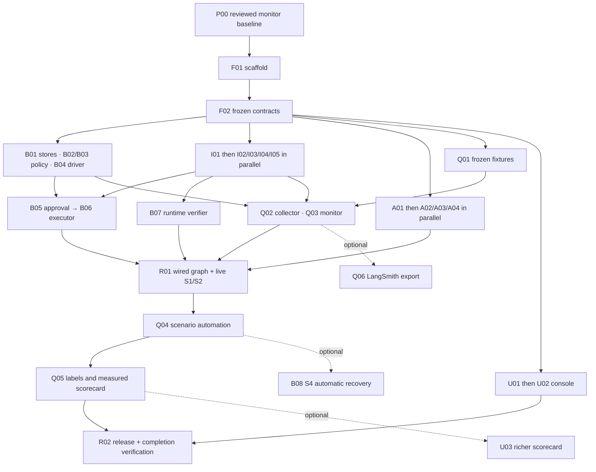

# Commit-by-commit implementation plan

This is an implementation backlog, not a record of completed implementation.
At its **September 13, 2026 historical baseline**, only the offline checker and
its tests were runnable. **September 14 update (IST):** the Node 24/TypeScript/SQLite
[standalone monitor](../../tools/monitoring/README.md) now provides schemas,
observation/job persistence, supplied-evidence assessment, metrics, and CLI commands.
The product application is still missing; F01/F02 and Q02–Q05 remain partial.
Reuse these existing modules when implementing the backlog. Branches, commit IDs,
and the full application layout below remain **proposed**; some monitor paths and
commands now exist, as recorded in [Global Scale](Global%20Scale.md).
No branches or commits are created by this document. The [canonical demo
contract](../demo-scenarios-and-reliability.md) controls expected outcomes.

**September 14 working-tree review for this frontend update:** no unstaged or
untracked frontend, HTTP API, browser-test, application-contract, or related
configuration implementation was present. Only implementation-plan Markdown was
dirty. F01 remains the first application/frontend implementation commit; `dist/`
and `node_modules/` do not count as authored implementation or completed gates.

Use the [parallel delivery plan](03-parallel-delivery.md) for staffing and
the [contracts and handoffs](05-contracts-and-handoffs.md) for shared interfaces.
GitHub, HubSpot, Slack, and Gmail all remain required. Gmail is draft-only.
The [detailed reliability implementation](06-agent-reliability-implementation.md)
expands each existing brief with concrete steps, negative tests, and handoffs for
the audit findings. Trace/process correctness, independently verified outcomes,
and original AI quality are separate P0 obligations throughout this backlog.
The [frontend pipeline and reliability guide](09-frontend-pipeline-and-reliability.md)
is the canonical screen, browser-contract, state, accessibility, E2E, and UI
parallel-work specification for F01/F02/B04/Q01/U01-U03/Q05/R02.

**Dedicated execution files:** [one plan per branch](branches/README.md) and
[one plan per commit](commits/README.md). Each entry below links its detailed
brief. The original 30 implementation IDs remain stable; P00 is an added
preparation commit that preserves the existing monitor before F01. No other
hard dependency is changed. F01/F02 share a branch, as do U01/U02; each pair can
land through incremental PRs without waiting for the later commit's gates.

## Concrete LLM and external-app delivery map

The [LLM integration guide](07-agent-spawning-and-llm-integration.md) and
[MCP/API integration guide](08-mcp-api-and-external-app-integration.md) refine
these existing IDs. Every affected individual brief includes its integration
steps; the guides define shared configuration and call paths.

- **F01/F02:** server-only model/app configuration, tested packages, fixed role
  signatures, complete reads/unknown writes and capability-separated app contracts.
- **B01/A01/A02–A04:** durable role claims/output records; the single recorded
  Gemini REST call boundary; analyst, drafter and auditor prompt/input/output functions.
- **B04/R01:** schedule graph work outside HTTP; construct clients in
  `src/server/composition.ts`; call role functions from `workflow/nodes.ts` and
  enforce ordering in `workflow/graph.ts`. B02/B03 remain deterministic policy.
- **I01–I05:** narrow REST adapters, exact operations/scopes and real account smoke.
  MCP is an optional I01 transport plus per-app mappings, enabled only after
  reviewed conformance; it grants models no tools and adds no required MVP commit.
- **B05/B06/B07:** authentic Slack review/decision; approved sequential HubSpot
  task/note, Gmail draft and GitHub comment; independent artifact reads followed
  by Slack summary/readback. B08 reuses the same clients and durable results.
- **Q01–Q05/R02:** stateful model/app fakes, independent provider collection,
  actual model/tool attempt checks, separate live model/app configuration evidence,
  original-output labels and release proof. Q06 adds only optional diagnostics.
- **U01–U03:** backend commands/status/evidence views. No browser model, app or MCP
  clients and no UI approval bypass. P00 preserves the supplied-evidence baseline.

No merge gate changes: adapters and roles can develop against F02 fixtures;
their real dependency injection joins at R01. Account/model access checks can run
early, but protected workflow writes require the merged approval/execution gates.

## How to use this backlog

- **P1:** backend and foundation integrator. Owns shared contracts, package and
  lockfile changes, database migrations, and final graph assembly.
- **P2:** app integrations. Each provider branch can be delegated independently.
- **P3:** bounded agents and deterministic policy; then runtime verification.
- **P4:** frontend and independent evaluation. Protect evidence collection time
  before spending time on optional UI polish.
- These are four responsibility lanes, not a requirement for four additional
  specialists. With three people, P1 also owns policy, P2 owns adapters then
  agents, and P3 owns UI/evaluation with another person reviewing the frozen
  expectations and runtime verification. With two, one owns backend/agents and the other owns
  adapters/UI/evaluation. Solo, execute dependency-ready commits sequentially;
  write scenario expectations before the corresponding implementation.
- The dependencies listed on each commit are **hard merge gates**. After F02,
  dependent implementations may be written and checked against the frozen
  interfaces and Q01 fixtures before upstream branches merge. A fixture check
  does not establish runtime integration or live success.
- Create each branch from integration `main` after its listed gates land. If
  coding starts earlier, keep interface-compatible work on its own branch and
  rebase when dependencies land. Open draft PRs early; merge a passing commit or
  a small cohesive PR. Do not merge placeholder production success paths.
- One person owns each file. Within a commit, another person can author its
  named tests or review fixtures while the owner writes production files. They
  hand their changes to that branch's owner; they do not edit a second branch's
  shared files. Only P1 changes `package.json`, `package-lock.json`, shared
  contracts, and migrations. Request a foundation follow-up if these must change.
- F01 extends the existing monitor's `npm run typecheck`, `npm run build`, and
  `npm run test:checker` scripts to cover the application and adds the proposed
  `npm run test:app -- <test-file>`. Later commits add scripts through the foundation
  owner. Provider smoke, app fixture seeding, and workflow evaluation commands
  remain I01/Q01/Q04 handoff requirements; the current monitor's synthetic
  export/demo commands do not implement them. Every command must label its mode.
- Every handoff contains its commit ID, touched paths, passing commands, failed
  or unrun checks, fixture/version, and the consuming commit. Real provider
  snapshots and credentials stay in ignored local evidence storage.

P0 means needed for the claimed four-app workflow and its honest validation.
B08, Q06, and the richer presentation in U03 are P1. Cutting them means explicitly
omitting their claims. In particular, B06's uncertainty handling is mandatory
even when B08's automatic recovery demonstration is deferred.
Priority P1 means optional enhancement here; contributor P1 in an owner field
means the backend integrator. They are separate labels.

## Reliability work incorporated into the existing commits

This is the acceptance map for the audit update, not another set of commits:

- **P00/F01:** preserve the tested offline baseline and distinguish currently
  runnable commands from proposed application/evaluation commands.
- **F02:** freeze observation-schema-v2 and `monitor-v2` contracts, original
  output/label provenance, logical `EffectIdRef` and `ApprovedContentRef` binding,
  temporal claims including valid `no_affected` outcomes, suite
  census, and old-v1 compatibility. Keep checker-v1 unchanged.
- **B01/B04:** one application transaction for state/event/job, durable stage
  start/end and completion emission, recovery-safe identities, and v1/v2 storage.
- **B02/B03/B05/B06:** evidence-backed exact selection, immutable expectations
  and allowed ID substitutions, authentic per-dispatch approval, guarded writes,
  and unresolved-write reconciliation or safe stopping.
- **I01–I05/A01–A04:** actual tool/model attempts with stage/span/parent IDs,
  transport-versus-provider outcomes, error/retry timing, original output/source
  digests, and no unrecorded retry or fabricated successful model stage.
- **B07:** fresh inline provider readback, actual field/association/MIME checks,
  receipt-backed verification and scoped claims, final Slack readback. Keep its
  enforcement path separate from Q02's post-run measurement collector.
- **Q01/Q02:** independently frozen oracle and suite census; paginated S0/S1,
  claim-related time windows, provider provenance, exact observed identity
  bindings, and compatible checker exports that never invent missing evidence.
- **Q03:** scheduled versioned assessments; corroborated M3 verification;
  `prematureSuccessClaims`, outcome-at-emission verdicts, and unique-claim union
  `falseCompletion`. Distinguish later drift and missing timing from proven
  historical contradiction. Preserve monitor-v1's narrower counter meaning.
- **Q04/Q05:** actual graph execution, full planned/attempted/unrun census,
  original-output human review with reasons and per-claim support, corrected-plan
  versus first-proposal quality, and reproducible M1–M7/raw critical counts.
- **U01/U02/U03:** truthful fixture labels and pending states, expected/observed
  comparisons, evidence gaps and claim classifications. U02 is the required
  minimal report path; U03 remains optional richer inspection.
- **R01/R02:** actual four-app S1/S2 and safety evidence, frozen versions, short
  brief/demo, and capability gates supported by observed results.
- **B08/Q06:** optional recovery and export must preserve the same event/evidence
  identities, guards, counts, and independent truth requirements if included.

Q03 can develop/merge against frozen Q01 collector-receipt fixtures without a
Q02 implementation dependency; absent evidence is unverified. Q02 and Q03 must
join in R01 before live outcome claims. Q05 consumes Q03 claim verdicts and does
not implement a competing classifier. Shared schema changes land through F02,
storage/migrations through B01, and full report integration after Q04.

Freeze the sampling boundary too: preflight and S0 are setup by `suiteEntryId`
before registration, with setup failures visible in census; register and bind S0
hashes immediately before graph dispatch. All post-registration failures remain
attempts. Q01 freezes semantic facts/invariants before model execution; B03 binds
exact generated text from the immutable approved plan before protected writes.
Neither expected IDs nor text is copied from observed destination artifacts.
R01's planned `tools/demo/run.ts` supplies minimal actual human-review receipts
through F02/B01 before Q05's richer review workflow, avoiding a dependency cycle.

## Dependency waves and merge order

This diagram shows merge gates, not additional runtime agents. Detailed entries
below remain authoritative when a node has several dependencies.

1. **Foundation/access gate:** P00 → F01 → F02. In parallel, P2 validates test-account
   access and scopes using provider tools; P4 reviews fixture expectations.
   No team member builds a second API/schema design while waiting.
2. **Contract-based construction:** B01/B02, I01 then the four provider branches,
   A01 then the three role branches, Q01, and U01. With four people these are a
   rotating queue of work, not nine simultaneous staffed lanes. Get the Slack
   thread-read and Gmail draft-read smoke results early because they can block
   the whole story.
3. **Guarded integration:** B03/B04 → B05; B06/B07, Q02/Q03, and U02. Review
   adverse fixtures while implementation proceeds. No protected live workflow
   runs until the full approval, execution, and verification gates are present.
4. **Working vertical slice:** R01. Start with sequential source reads; optional
   bounded independent read fanout can come after the slice works. Runtime
   analyst → drafter → auditor is sequential. Protected
   writes remain ordered: HubSpot task → HubSpot note → Gmail draft → GitHub
   comment, each independently verified, then Slack summary and its readback.
5. **Proof and submission:** Q04 → Q05 → R02. Add B08/Q06/U03 only if P0 evidence
   is already secure and actual remaining time permits. B08 changes require the
   affected Q04 cases and Q05 report to run again before R02.

Recompute time available to the actual cutoff. Reserve recording, regression,
and submission time before scheduling this backlog; the earlier 390-minute plan
is not a new allowance. If a gate cannot be reached, report the unmet capability
in the global verification document. Do not quietly remove an app, bypass a
guard, label a simulation live, or fill a missed measurement with a target.

## Shared baseline preparation

### P00 — Preserve the reviewed monitoring baseline

**Detailed plan:** [P00](commits/P00.md) · [branch `chore/monitor-baseline`](branches/chore-monitor-baseline.md).

- **Branch / owner:** `chore/monitor-baseline` / P1. **Merge dependencies:** none.
- **Paths:** existing monitor source/configuration/tests/guide and explicitly
  reviewed associated documentation; preserve user-owned changes and relocations.
- **Do:** record the exact implemented monitor baseline, check its saved receipt
  against current inputs, and make its reviewed commit available on `main` before
  new feature worktrees are created. Its current verified scope is offline only.
- **Do not:** discard user edits, stage every dirty file, commit private data or
  generated dependencies, or treat the monitor as a completed application.
- **Parallel inside this chunk:** P1 reviews source/configuration while P4 reviews
  tests/report evidence; P2/P3 prepare account and policy prerequisites.
- **Verify / handoff:** selected baseline files and links exist in the committed
  checkout; its actual test receipt and real SHA are handed to F01 and recorded
  in Global Scale. See the dedicated file for exact scope and execution steps.

## Foundation

### F01 — Establish the tested application skeleton

**Detailed plan:** [F01](commits/F01.md) · [branch `feat/foundation`](branches/feat-foundation.md).

- **Branch / owner:** `feat/foundation` / P1. **Merge dependencies:** P00.
- **Paths:** `package.json`, `package-lock.json`, `.node-version`, `tsconfig.json`,
  `vite.config.ts`, `vitest.config.ts`, `playwright.config.ts`, `index.html`,
  `.env.example`, `.gitignore`, `src/server/config.ts`, `src/server/index.ts`,
  `src/web/main.tsx`, `tests/app/bootstrap.test.ts`,
  `tests/app/web-bootstrap.test.tsx`,
  `tests/e2e/bootstrap.spec.ts`.
- **Do:** pin a tested Node 24 toolchain; establish React/Vite, Fastify/Zod,
  LangGraph/LangChain plus direct Gemini REST, SQLite/checkpointer, component/accessibility and
  Playwright dependencies. Add explicit server/web build and app/web/E2E scripts,
  same-origin static serving, and a no-secret browser-bundle smoke. Verify actual
  APIs and native SQLite compatibility; keep checker/monitor commands intact.
- **Do not:** add hosting, generic tool registries, credentials, or mocked
  production completion. Do not upgrade packages independently on feature branches.
- **Parallel inside this chunk:** P1 owns dependencies/config/bootstrap; P4 owns
  disjoint server, component/accessibility and browser bootstrap tests; P2 checks
  runtime/API prerequisites without editing root files.
- **Verify / handoff:** clean install, typecheck, server/web builds, health/static
  bootstrap, component/accessibility/browser smokes, both SQLite stores opening,
  and existing checker/monitor tests. Record versions, scripts, browser install
  and viewport caveats for all lanes.

### F02 — Freeze shared contracts before concurrent implementation

**Detailed plan:** [F02](commits/F02.md) · [branch `feat/foundation`](branches/feat-foundation.md).

- **Branch / owner:** `feat/foundation` / P1. **Merge dependencies:** F01.
- **Paths:** `src/shared/domain.ts`, `src/shared/agents.ts`,
  `src/shared/adapters.ts`, `src/shared/api.ts`, `src/shared/events.ts`,
  `src/shared/evaluation.ts`, `tests/app/contracts.test.ts`; narrowly reviewed
  compatibility changes in `src/shared/reliability.ts` and
  `tests/monitoring/contracts.test.mjs` belong to this foundation owner.
- **Do:** define Zod contracts for identities, complete/incomplete reads, immutable
  plan payloads, effect/attempt states including unknown outcomes, API projections,
  three role inputs/outputs, events, and evidence/metric modes. Freeze versioned
  `RunView`, event page, command/error, redacted reference, assessment summary and
  optional evaluation summary schemas with monotonic revision/cursor semantics.
  Freeze method signatures and state meanings with consumers before merge.
- **Do not:** conflate a graph checkpoint with the ledger, `awaiting_approval`
  with completion, or a missing assessment with a pass. Do not change checker v1.
- **Parallel inside this chunk:** adapter, agent, frontend, and evaluator owners
  each review their boundary and supply one valid and one rejected payload.
- **Verify / handoff:** contract tests reject malformed IDs/statuses, undeclared
  mutations, incomplete reads masquerading as empty results, and invalid agent
  outputs. Also reject unversioned/stale browser DTOs, authority-bearing client
  commands and secret/private fields. Publish accepted/rejected examples and the
  same state vocabulary for B04, Q01, U01/U02, Q05 and R02.

## Backend, policy, approval, and execution

### B01 — Persist authoritative application state and evidence atomically

**Detailed plan:** [B01](commits/B01.md) · [branch `feat/durable-core`](branches/feat-durable-core.md).

- **Branch / owner:** `feat/durable-core` / P1. **Merge dependencies:** F02.
- **Paths:** `src/server/storage/database.ts`,
  `src/server/migrations/001-initial.sql`,
  `src/server/storage/repositories.ts`, `src/server/observability/events.ts`,
  `src/server/observability/redaction.ts`, `tests/app/storage.test.ts`;
  the reviewed transaction-aware refactor of existing
  `src/server/storage/monitor-store.ts` and its storage compatibility tests.
- **Do:** create the architecture's run/snapshot/plan/approval/effect/attempt,
  verification/evaluation, event/job/assessment/metric/label records; enforce
  unique identities, foreign keys, short transactions, and restricted payload
  storage. Persist transition + event + measurement job together.
- **Do not:** hold transactions across API calls or discard raw attempt history.
- **Parallel inside this chunk:** implementation and crash/transaction fixtures
  can proceed separately against F02; P4 reviews metric deduplication keys.
- **Verify / handoff:** duplicate submissions share one business run; interrupted
  transactions commit all required local records or none; reopen a real file and
  recover records; failures to persist audit/ledger data prevent dispatch.

### B02 — Select incidents and commitments with deterministic policy

**Detailed plan:** [B02](commits/B02.md) · [branch `feat/selection-policy`](branches/feat-selection-policy.md).

- **Branch / owner:** `feat/selection-policy` / P3. **Merge dependencies:** F02, Q01.
- **Paths:** `src/server/policy/incident.ts`, `src/server/policy/selection.ts`,
  `src/server/policy/identity.ts`, `tests/app/selection.test.ts`.
- **Do:** parse allowlisted issue identifiers; validate typed impact/service/
  environment; use exact commitment, company, owner, and designated-contact IDs.
  Apply complete-query and inclusive UTC horizon rules from the frozen policy.
- **Do not:** fetch an arbitrary pasted URL, use fuzzy identity matching, filter
  malformed affected rows out silently, or turn a failed read into no impact.
- **Parallel inside this chunk:** P3 implements selection; P4 independently
  labels horizon, missing-owner, ambiguity, and changed-identity fixtures.
- **Verify / handoff:** S3 and families 2/13/14 produce their fixed outcomes;
  unchanged issue identity never opens a second run after a service edit.

### B03 — Freeze immutable plans, claims, and effect identities

**Detailed plan:** [B03](commits/B03.md) · [branch `feat/plan-policy`](branches/feat-plan-policy.md).

- **Branch / owner:** `feat/plan-policy` / P3. **Merge dependencies:** B02.
- **Paths:** `src/server/policy/claims.ts`, `src/server/policy/plan.ts`,
  `src/server/policy/canonical.ts`, `src/server/policy/effect-keys.ts`,
  `tests/app/plan.test.ts`.
- **Do:** validate citations and permitted claims; construct exact server-owned
  recipients/owners/dates/actions; canonicalize every approved field, source
  version, and permitted future-ID substitution. Preserve first proposals and
  produce immutable plan revisions with full hashes and stable effect keys.
- **Do not:** put plan revision or destination-created IDs in effect identity,
  let models choose recipients, or regenerate approved text after approval.
- **Parallel inside this chunk:** hashing/template code and adversarial
  recipient/body/source-drift fixtures can be authored independently.
- **Verify / handoff:** equivalent canonical inputs hash identically; changed
  payload/source/selection changes plan hash; revisions retain logical effect
  keys; multiple To addresses and any Cc/Bcc fail before review publication.

### B04 — Drive one durable graph invocation per incident

**Detailed plan:** [B04](commits/B04.md) · [branch `feat/workflow-driver`](branches/feat-workflow-driver.md).

- **Branch / owner:** `feat/workflow-driver` / P1. **Merge dependencies:** B01.
- **Paths:** `src/server/workflow/state.ts`, `src/server/workflow/driver.ts`,
  `src/server/storage/checkpoints.ts`, `src/server/api/runs.ts`,
  `src/server/api/auth.ts`, `src/server/api/health.ts`, `src/server/app.ts`,
  `tests/app/driver.test.ts`, `tests/app/api.test.ts`.
- **Do:** persist command acceptance before response; schedule work outside HTTP;
  initialize separate application/checkpointer files; enforce the single-process
  deployment and one active invocation per incident. Expose versioned run/event/
  assessment/report projections with monotonic revisions, opaque cursors, stable
  event IDs/errors, redacted authorized links, explicit availability,
  authentication and command-route CSRF protection.
- **Do not:** allow clients to choose graph nodes, submit approvals, or edit state.
- **Parallel inside this chunk:** P1 handles scheduling/storage; P4 tests public
  API projections and cursor behavior from fixtures without touching driver files.
- **Verify / handoff:** concurrent POSTs attach to one run; browser disconnect
  does not cancel it; restart restores waiting jobs; readiness waits for stores;
  unauthorized/CSRF-invalid/session-expired requests fail. Test stale revisions,
  reconnect pagination, monitor/report absence, failed partial and completed-but-
  unverified projections. Graph nodes remain injected until R01; fake runs stay
  labeled simulated.

### B05 — Bind Slack approval to the current plan and source state

**Detailed plan:** [B05](commits/B05.md) · [branch `feat/slack-approval`](branches/feat-slack-approval.md).

- **Branch / owner:** `feat/slack-approval` / P1. **Merge dependencies:** B01, B03,
  B04, I04.
- **Paths:** `src/server/policy/approval.ts`, `src/server/policy/freshness.ts`,
  `src/server/workflow/review.ts`, `src/server/workflow/approval-wait.ts`,
  `tests/app/approval.test.ts`.
- **Do:** separate post/reconcile-review from the pure interrupt node; independently
  read the review and human decision; bind workspace/channel/thread/user, unique
  hash prefix/full hash, revision, expiry, and message integrity. Persist waits
  and release the worker. Refresh the complete source selection on approval/resume.
- **Do not:** trust a UI boolean or resume payload as approval; revive a rejected
  revision with a delayed reply; authorize writes when a source/decision read fails.
- **Parallel inside this chunk:** wait/poll behavior and approval adversarial
  fixtures can be built independently after the Slack interface is frozen.
- **Verify / handoff:** families 6/7/15, edited/deleted/bot replies, duplicate wakeups,
  and restart during wait produce no unauthorized protected writes. S3 source
  correction triggers fresh review on the existing run.

### B06 — Guard and reconcile every protected effect before dispatch

**Detailed plan:** [B06](commits/B06.md) · [branch `feat/guarded-execution`](branches/feat-guarded-execution.md).

- **Branch / owner:** `feat/guarded-execution` / P1. **Merge dependencies:** B01,
  B03, B05, I02, I03, I05.
- **Paths:** `src/server/execution/claim.ts`, `src/server/execution/reconcile.ts`,
  `src/server/execution/executor.ts`, `src/server/execution/ordering.ts`,
  `tests/app/execution.test.ts`.
- **Do:** recheck approval/expiry and source freshness before each remaining
  mutation; atomically claim an effect; search exact markers/content/associations;
  preserve every attempt; dispatch approved payloads only. Unknown write outcomes
  require bounded settling reads, exact adoption, or `failed_partial` and review.
- **Do not:** apply generic POST retries, release an inflight claim on timeout,
  infer nonexistence from one empty search, or replace incompatible effects under
  a fresh key. Keep successful work and its original plan/approval reference.
- **Parallel inside this chunk:** claim/order implementation and named crash/race
  fixtures run independently. Runtime verifier is injected until B07/R01 merge.
- **Verify / handoff:** concurrent replay produces one writer; accepted-write
  timeout cannot cause a second create; conflicting/multiple/human-edited matches
  stop partial; persistence failure blocks dispatch. Automatic S4 completion is
  optional B08; all these safe-stop controls are required here.

### B07 — Verify remote artifacts independently and finalize cautiously

**Detailed plan:** [B07](commits/B07.md) · [branch `feat/readback-verifier`](branches/feat-readback-verifier.md).

- **Branch / owner:** `feat/readback-verifier` / P3. **Merge dependencies:** B01,
  I02, I03, I04, I05.
- **Paths:** `src/server/verification/readback.ts`,
  `src/server/verification/assertions.ts`,
  `src/server/verification/finalize.ts`, `tests/app/verification.test.ts`.
- **Do:** use fresh read capabilities to compare all five required artifact kinds,
  owners/associations, actual cross-links, and decoded Gmail fields/body against
  the frozen plan. Build Slack summary from verified effects; read that summary
  back before allowing final API completion.
- **Do not:** trust executor return payloads, model confidence, or a successful
  HTTP status as evidence. A pre-readback Slack summary must describe coordination
  finalization as pending, not claim the whole run has completed.
- **Parallel inside this chunk:** provider-specific assertions are independent;
  P4 supplies independently tampered recipient/body/association/Slack fixtures.
- **Verify / handoff:** family 11 catches wrong/missing results; an early Slack
  success and a failed Slack readback prevent completion. Every verified effect
  records its observation time and independent source evidence.

### B08 — Demonstrate bounded automatic recovery after restart [P1]

**Detailed plan:** [B08](commits/B08.md) · [branch `feat/durable-recovery`](branches/feat-durable-recovery.md).

- **Branch / owner:** `feat/durable-recovery` / P1. **Merge dependencies:** R01, Q04.
- **Paths:** `src/server/execution/recovery.ts`,
  `src/server/workflow/recovery-node.ts`,
  `src/server/workflow/graph.ts`,
  `tests/scenarios/recovery.test.ts`.
- **Do:** extend the existing reconciliation seam to recover an actually accepted
  write after process termination, retain IDs, and complete only compatible
  remaining work under revalidated approval. Register the node through P1's graph
  integration seam; keep scheduling changes with the driver owner.
- **Do not:** confuse read retry with accepted-write recovery; recreate a missing
  human-edited draft; erase history; or claim graph checkpoints alone solve it.
- **Parallel inside this chunk:** recovery implementation and crash-window
  fixtures; P2 prepares an isolated live accepted-write interruption exercise.
- **Verify / handoff:** S4 meets its frozen recovery budget and preserves IDs;
  unresolved marker visibility and incompatible post-partial source changes stop
  partial without another create. Rerun affected Q04 cases and Q05 measurements;
  record this capability unimplemented/unproven if the commit or live proof is cut.

## Four isolated integration branches

### I01 — Share bounded transport, normalization, and smoke-test plumbing

**Detailed plan:** [I01](commits/I01.md) · [branch `feat/adapter-core`](branches/feat-adapter-core.md).

- **Branch / owner:** `feat/adapter-core` / P2. **Merge dependencies:** F02.
- **Paths:** `src/server/adapters/common/transport.ts`,
  `src/server/adapters/common/pagination.ts`,
  `src/server/adapters/common/errors.ts`,
  `tools/smoke/providers.ts`, `tests/adapters/common.test.ts`.
- **Do:** provide explicit read retry classification, timeout/page/record/size
  budgets, Retry-After handling, complete-read metadata, and attempt hooks. Define
  the disposable sandbox smoke runner and local manifest input. Keep raw clients
  server-private and mutation retry disabled by default.
- **Do not:** multiply SDK/adapter/graph retries, swallow provider errors into
  empty arrays, or expose a generic request method to agents.
- **Parallel inside this chunk:** helpers and fault contract tests can be written
  separately; all four provider owners review signatures before branching.
- **Verify / handoff:** page-two failure is incomplete, permanent denial is not
  retried, and Retry-After cannot overrun the run budget. Missing credentials make
  a smoke test unrun/failed, never passed. Remaining I branches may now run in parallel.

### I02 — Implement GitHub incident evidence and one marked impact comment

**Detailed plan:** [I02](commits/I02.md) · [branch `feat/github-adapter`](branches/feat-github-adapter.md).

- **Branch / owner:** `feat/github-adapter` / P2. **Merge dependencies:** I01.
- **Paths:** `src/server/adapters/github.ts`,
  `tests/adapters/github.test.ts`, `tools/smoke/github.ts`.
- **Do:** read immutable repository/issue IDs, bounded technical references and
  source versions; find/create/get/update the one approved impact comment using
  deterministic markers and exact normalized fields.
- **Do not:** modify code, close issues, crawl arbitrary URLs, or publish the
  customer's email body in engineering records.
- **Parallel inside this chunk:** evidence normalization and comment fixtures can
  be developed independently; a teammate can run scoped sandbox smoke checks.
- **Verify / handoff:** paginated/malformed/denied source tests plus real authorized
  create/readback/update/find on the disposable incident. Supply normalized
  snapshots and actual immutable IDs privately to B02/B06/B07/Q02.

### I03 — Implement HubSpot commitments, task, and note

**Detailed plan:** [I03](commits/I03.md) · [branch `feat/hubspot-adapter`](branches/feat-hubspot-adapter.md).

- **Branch / owner:** `feat/hubspot-adapter` / P2. **Merge dependencies:** I01.
- **Paths:** `src/server/adapters/hubspot.ts`,
  `tests/adapters/hubspot.test.ts`, `tools/smoke/hubspot.ts`.
- **Do:** enumerate the complete scoped candidate set; normalize companies,
  commitment tickets, owners, and designated contacts. Find/create/get task and
  internal note with marker and commitment/company associations preserved.
- **Do not:** silently repair CRM identity, select the first contact, or add an
  update/delete capability to the protected HubSpot executor.
- **Parallel inside this chunk:** read normalization and task/note association
  tests; validate actual test-account property names before freezing the mapping.
- **Verify / handoff:** second-page failure, conflicting associations, and missing
  owner stay explicit; sandbox task/note readback verifies IDs and associations.
  Give B02/B06/B07/Q02 the tested mapping and seeded logical-to-provider IDs.

### I04 — Implement Slack review, thread reads, and summary updates

**Detailed plan:** [I04](commits/I04.md) · [branch `feat/slack-adapter`](branches/feat-slack-adapter.md).

- **Branch / owner:** `feat/slack-adapter` / P2. **Merge dependencies:** I01.
- **Paths:** `src/server/adapters/slack.ts`,
  `tests/adapters/slack.test.ts`, `tools/smoke/slack.ts`.
- **Do:** post/find/get/update one marked review thread; paginate replies; retain
  actor/workspace/channel/thread/message edit metadata and check Slack's `ok`
  field. Expose observations to B05; let policy interpret approval syntax.
- **Do not:** grant approval from transport success or assume thread permissions
  from successful posting. Keep coordination attempts in the effect/event history.
- **Parallel inside this chunk:** thread/reply fixtures and message rendering
  normalization; a teammate verifies the actual installation's read permissions.
- **Verify / handoff:** a real human reply is independently retrievable in the
  configured sandbox thread; `ok: false`, pagination, bot/edited replies, rate
  limits, and duplicate marker matches survive normalization accurately.

### I05 — Implement Gmail drafts and complete MIME readback

**Detailed plan:** [I05](commits/I05.md) · [branch `feat/gmail-adapter`](branches/feat-gmail-adapter.md).

- **Branch / owner:** `feat/gmail-adapter` / P2. **Merge dependencies:** I01.
- **Paths:** `src/server/adapters/gmail.ts`,
  `src/server/adapters/gmail-mime.ts`,
  `tests/adapters/gmail.test.ts`, `tools/smoke/gmail.ts`.
- **Do:** create/get drafts; paginate draft listing and retrieve full records for
  marker searches. Normalize every actual To/Cc/Bcc mailbox, subject, decoded body,
  draft status, and stable IDs without losing evidence. Use the approved byte
  normalization when deriving body hashes.
- **Do not:** include send methods, generic Gmail requests, cleanup deletion, or
  logic that discards unexpected recipients to make a comparison pass.
- **Parallel inside this chunk:** MIME fixtures and draft lookup/create code;
  run OAuth/create/full-readback smoke early on a disposable mailbox.
- **Verify / handoff:** detect extra recipients, changed body/subject, missing
  draft status, and multiple marker matches. Prove a real draft can be found and
  fully read back; do not claim draft-only OAuth permissions when the granted
  provider scope also permits sending.

## Three bounded model roles

### A01 — Share a bounded, recorded structured-call wrapper

**Detailed plan:** [A01](commits/A01.md) · [branch `feat/agent-runtime`](branches/feat-agent-runtime.md).

- **Branch / owner:** `feat/agent-runtime` / P3. **Merge dependencies:** F02, B01.
- **Paths:** `src/server/agents/runtime.ts`, `src/server/agents/model.ts`,
  `tests/app/agent-runtime.test.ts`, `tools/smoke/model.ts`.
  The model smoke entrypoint is an explicit A01 scope refinement; F01 owns its
  registered `smoke:model` package script and TypeScript execution setup.
- **Do:** wire direct Gemini `models.generateContent` with tested structured
  outputs, explicit timeout/token/schema retry budgets, role-specific prompt/model
  versions, immutable first outputs, per-attempt events, and validated references.
- **Do not:** give agents provider write tools, shared chat history, generic URL
  access, or invisible SDK retry multiplication. Never replace a failed role with
  a success placeholder.
- **Parallel inside this chunk:** wrapper implementation and malformed/refused/
  timeout fixtures; a teammate verifies actual model/schema compatibility.
- **Verify / handoff:** an actual structured-output smoke call and deterministic
  fault tests terminate within budget, retain the first proposal, redact secrets,
  and distinguish refusal/invalid output/transport failure.

### A02 — Add the Incident Evidence Analyst

**Detailed plan:** [A02](commits/A02.md) · [branch `feat/agent-analyst`](branches/feat-agent-analyst.md).

- **Branch / owner:** `feat/agent-analyst` / P3. **Merge dependencies:** A01.
- **Paths:** `src/server/agents/analyst/index.ts`,
  `src/server/agents/analyst/prompt.ts`,
  `src/server/agents/analyst/validate.ts`, `tests/app/analyst.test.ts`.
- **Do:** accept only the scoped GitHub evidence projection and emit cited facts,
  contradictions, unknowns, and a candidate-change explanation. Refine validation
  inside this role directory without modifying the shared F02 schema unilaterally.
- **Do not:** equate a recent deployment with proven root cause or select customer
  identities. Preserve the unedited logical invocation output.
- **Parallel inside this chunk:** prompt/context projection and independently
  labeled weak-evidence/injection fixtures. A03/A04 code can proceed concurrently.
- **Verify / handoff:** validate source-reference membership; human-label actual
  first outputs for causal overclaiming and missing uncertainty. Hand the typed
  assessment to R01; model-quality defects remain counted even after correction.

### A03 — Add the Customer Update Drafter

**Detailed plan:** [A03](commits/A03.md) · [branch `feat/agent-drafter`](branches/feat-agent-drafter.md).

- **Branch / owner:** `feat/agent-drafter` / P3. **Merge dependencies:** A01.
- **Paths:** `src/server/agents/drafter/index.ts`,
  `src/server/agents/drafter/prompt.ts`,
  `src/server/agents/drafter/validate.ts`, `tests/app/drafter.test.ts`.
- **Do:** consume a validated assessment, original source facts, and deterministically
  selected commitments; return customer-facing text and claim-to-source references.
  Use an F02 assessment fixture while the analyst branch is unmerged.
- **Do not:** choose recipient/owner/action types, widen impact, invent recovery
  dates, or rewrite approved text. Runtime execution must wait for A02's output.
- **Parallel inside this chunk:** scoped prompt and independently labeled draft
  tests; coordinate with B03 on server-owned fields without sharing ownership.
- **Verify / handoff:** labeled drafts include required supported content and
  uncertainty; unsupported dates, changed identities, and false claims are flagged.
  Hand preserved first drafts and correction records to Q05 and R01.

### A04 — Add the Blind Semantic Auditor

**Detailed plan:** [A04](commits/A04.md) · [branch `feat/agent-auditor`](branches/feat-agent-auditor.md).

- **Branch / owner:** `feat/agent-auditor` / P3. **Merge dependencies:** A01.
- **Paths:** `src/server/agents/auditor/index.ts`,
  `src/server/agents/auditor/prompt.ts`,
  `src/server/agents/auditor/validate.ts`, `tests/app/auditor.test.ts`.
- **Do:** give it original sources, proposed text, claim references, and the task
  contract; return unsupported/contradictory/omitted-claim findings. Use fixture
  drafts to build independently from A03; runtime waits for that draft.
- **Do not:** include analyst/drafter rationale or confidence; grant approval;
  override deterministic guards; or silently skip an unavailable enabled auditor.
- **Parallel inside this chunk:** context-exclusion tests and independently
  labeled bad/good draft fixtures; keep auditor inputs genuinely separate.
- **Verify / handoff:** context tests prove excluded rationale is absent; measure
  false blocks and missed defects using labels. A concern blocks review progression;
  exhausted role failures terminate without protected writes. A clean audit alone
  is never reported as factual proof.

## Frontend

### U01 — Build one fixture-backed operator screen

**Detailed plan:** [U01](commits/U01.md) · [branch `feat/operator-console`](branches/feat-operator-console.md).

- **Branch / owner:** `feat/operator-console` / P4. **Merge dependencies:** F02.
- **Paths:** `src/web/App.tsx`, `src/web/styles.css`,
  `src/web/components/IncidentInput.tsx`, `src/web/components/EvidencePanel.tsx`,
  `src/web/components/PlanPanel.tsx`, `src/web/components/RunTimeline.tsx`,
  `src/web/fixtures/demo.ts`, `tests/app/console.test.tsx`.
- **Do:** show incident input, evidence/selection/exclusions, exact planned draft,
  three named role stages, deterministic control stages, effects/readbacks, and
  separate product/process/outcome/first-proposal states. Build the stable
  one-screen hierarchy against frozen API objects and mark all local examples
  synthetic.
- **Do not:** add general chat, a fake approval button, fabricated success
  percentages, or credential-bearing browser configuration.
- **Parallel inside this chunk:** evidence/plan, pipeline/effects, and state/
  accessibility tests can be assigned to disjoint files; P4 alone joins root
  layout, status semantics, and styles.
- **Verify / handoff:** render waiting/blocked/partial/failed/completed states;
  exact text and required IDs are legible; missing data is pending/unknown rather
  than green. Check keyboard/accessibility behavior and 375x812, 768x1024, and
  1440x900 views, including completed-but-unverified and failed-partial states.

### U02 — Connect durable status, Slack review, and partial-run controls

**Detailed plan:** [U02](commits/U02.md) · [branch `feat/operator-console`](branches/feat-operator-console.md).

- **Branch / owner:** `feat/operator-console` / P4. **Merge dependencies:** U01, B04.
- **Paths:** `src/web/App.tsx`, `src/web/api/client.ts`, `src/web/hooks/useRun.ts`,
  `src/web/components/RunControls.tsx`,
  `src/web/components/EvaluationSummary.tsx`, `tests/app/live-console.test.tsx`.
- **Do:** use authenticated same-origin API commands and cursor polling; show
  actual backend approval state and link to the Slack thread; explain partial
  stops and expose the guarded reconcile request. Render saved raw evaluation
  counts, M1-M7 numerator/denominator or N/A, census/gaps, mode/version/cutoff,
  and report link when available. Show pending assessments explicitly and never
  use U01 fixtures as a live fallback.
- **Do not:** authorize from browser state, restart work just because polling
  reconnects, or claim a run is complete before the server verdict.
- **Parallel inside this chunk:** API/polling, result presentation, and browser
  contract tests use disjoint files; P1 checks command/revision semantics while
  P4 owns browser integration and final joins.
- **Verify / handoff:** reload/reconnect preserves the same run; duplicate clicks
  do not create new work; stale/out-of-order poll responses cannot overwrite a
  newer revision; link/status states remain useful during API errors and waits.
  Exercise S1/S2/S3 through controllable HTTP fixtures and compare every displayed
  report number with the saved server projection.

### U03 — Add richer inspection of the measured scorecard [P1]

**Detailed plan:** [U03](commits/U03.md) · [branch `feat/evaluation-view`](branches/feat-evaluation-view.md).

- **Branch / owner:** `feat/evaluation-view` / P4. **Merge dependencies:** U02, Q05.
- **Paths:** `src/web/components/EvaluationSummary.tsx`,
  `src/web/components/Scorecard.tsx`,
  `src/web/components/EvidenceDetails.tsx`, `tests/app/scorecard.test.tsx`.
- **Do:** show live/simulated/checker cohorts separately, raw numerators and
  denominators, failed/unrun cases, first-proposal defects/corrections, and
  product status separately from assessment status. Drill from M1-M7 and critical
  counts to exact attempts, claims, field comparisons, labels, and evidence gaps.
- **Do not:** average incomparable modes, display targets as observations, or
  convert `0/0` into 100%. Retain U02's minimal result/report view if this is cut.
- **Parallel inside this chunk:** scorecard, evidence details, and fixture-based
  rendering checks use disjoint files; P4 alone joins `EvaluationSummary.tsx`.
  No evaluation formulas are reimplemented in the browser.
- **Verify / handoff:** pending, no-attempts, failed and version-mismatch reports
  render truthfully. Cover no labels, absent S1, v1/v2 separation, overlapping
  claim violations, later drift, 0/0, unrun slots, and censored latency. Demo
  numbers exactly match the saved Q05 report.

## Independent fixtures, evaluation, and observability

### Q01 — Freeze scenario worlds, expected outcomes, and controllable fakes

**Detailed plan:** [Q01](commits/Q01.md) · [branch `feat/evaluation-fixtures`](branches/feat-evaluation-fixtures.md).

- **Branch / owner:** `feat/evaluation-fixtures` / P4. **Merge dependencies:** F02.
- **Paths:** `tests/fixtures/world.json`, `tests/fixtures/scenarios.json`,
  `tests/fixtures/source-labels.json`, `tests/fixtures/faults.ts`,
  `tests/fakes/providers.ts`, `tests/fakes/model.ts`,
  `src/server/evaluations/manifest.ts`, `tools/fixtures/seed.ts`,
  `tools/fixtures/reset.ts`, `tests/app/manifest.test.ts`.
- **Do:** encode the 18 canonical families with fixed baseline/variant outcomes,
  clock/budgets, all five S1 artifact kinds, protected Beta records, forbidden
  operations, and named fault boundaries. Separate fixture setup/reset authority
  from runtime tools; preserve local logical-to-real-ID mappings. Q01 owns
  canonical scenario truth; U01 separately owns F02-valid browser display fixtures
  and adopts Q01 identities when available.
- **Do not:** derive expected effects from worker output, add resets inside an
  evidence window, or reduce a failed expectation after seeing actual results.
- **Parallel inside this chunk:** one person labels expected sources/artifacts
  while others build stateful provider/model fakes. Q01 and U01 can proceed as
  sibling branches after F02; they align identities before U02/R01 without
  importing each other's unmerged files.
- **Verify / handoff:** manifests reject a Slack-only S1, missing required draft
  fields, absent protected records, and undefined outcomes. Publish deterministic
  examples for every branch; real seed/reset runs require an explicitly scoped
  disposable environment and are kept separate from evaluation history.

### Q02 — Collect independent scoped evidence and export checker input

**Detailed plan:** [Q02](commits/Q02.md) · [branch `feat/evidence-collector`](branches/feat-evidence-collector.md).

- **Branch / owner:** `feat/evidence-collector` / P4. **Merge dependencies:** Q01,
  I02, I03, I04, I05, B01.
- **Paths:** `src/server/evaluations/collector.ts`,
  `src/server/evaluations/provider-readers.ts`,
  `src/server/evaluations/export-checker.ts`,
  `tools/evaluations/collect.ts`, `tests/app/collector.test.ts`.
- **Do:** collect independent paginated before/after snapshots across the full
  scoped namespace, protected records, associations/cross-links, Gmail drafts and
  relevant sent-mail evidence. Instantiate read-only collector capabilities and
  use frozen scenario expectations; retain complete operation/actor history.
  Record controlled collector provenance and observation windows; bind logical
  future IDs without changing the frozen expected fields or original manifest.
- **Do not:** copy the executor's cached results, assert completeness on a failed
  page, or normalize unknown writes to definitive `error` for checker v1.
- **Parallel inside this chunk:** provider read projections and exporter tests
  are independent. A separate evaluator read credential may be needed for sent-mail
  inspection; it does not expand worker capability.
- **Verify / handoff:** incomplete collection remains incomplete; an extra draft
  or tampered association fails; preserved S3/S5 stage baselines do not erase
  human edits/history. Existing checker receives only compatible v1 exports;
  unresolved outcomes produce incomplete evidence, not a synthetic passing report.

### Q03 — Assess local events with durable measurement jobs

**Detailed plan:** [Q03](commits/Q03.md) · [branch `feat/reliability-monitor`](branches/feat-reliability-monitor.md).

- **Branch / owner:** `feat/reliability-monitor` / P4. **Merge dependencies:** B01, Q01.
- **Paths:** `src/server/monitoring/worker.ts`,
  `src/server/monitoring/assess.ts`, `src/server/monitoring/claim-verdicts.ts`,
  `src/server/monitoring/trace-rules.ts`, `src/server/monitoring/sweeper.ts`,
  `tests/app/monitor.test.ts`, `tests/app/claim-verdicts.test.ts`.
- **Do:** process local event watermarks; check immutable payload/approval binding,
  retry budgets, forbidden operations, duplicate claims, expiry, and premature
  completion. Use job leases/retry limits and deduplicated observation identities;
  include waiting/blocked/failed/partial/stalled runs.
  Add monitor-v2 temporal claim assessment and corroborated M3 outcome credit;
  retain legacy monitor-v1 behavior and distinguish unverified timing/later drift.
- **Do not:** depend on LangSmith availability, mutate provider state, silently
  replace the required runtime auditor, or create denominators on each resume.
- **Parallel inside this chunk:** trace rules and worker crash/reprocessing tests;
  P1 reviews atomic event/job integration and P4 owns evaluation assertions.
- **Verify / handoff:** duplicate/out-of-order jobs do not double-count; monitor
  outage leaves a visible pending assessment; a start without terminal result is
  detected. Local persistence failure still stops protected writes via B01/B06.
  Hand-check contradictory final state, early success later repaired, one claim
  in both failure sets, duplicated claim delivery, later human edit, and missing
  claim-time evidence. The union counter counts each false claim once.

### Q04 — Automate scenario runs and classify faults honestly

**Detailed plan:** [Q04](commits/Q04.md) · [branch `feat/scenario-harness`](branches/feat-scenario-harness.md).

- **Branch / owner:** `feat/scenario-harness` / P4. **Merge dependencies:** R01, Q01,
  Q02, Q03.
- **Paths:** `src/server/evaluations/harness.ts`,
  `tools/evaluations/run.ts`, `tests/scenarios/core.test.ts`,
  `tests/scenarios/failures.test.ts`, `tests/scenarios/concurrency.test.ts`.
- **Do:** register an evaluation attempt before dispatch; run frozen scenarios
  through the real graph with stateful fake or live adapters; retain the evidence
  mode, raw history, active/wait time, source/approval transitions, and observed
  result. Cover all 18 family definitions; flag unsupported recovery as unrun.
  Complete mandatory preflight/S0 before registration and bind those setup receipt
  hashes at registration; failures after registration cannot move back to setup.
  Join registered attempts to the complete planned census so not-run cases stay
  visible without becoming invented task-success denominator entries.
- **Do not:** mix fault injection with worker actions, score a repair as an
  uncorrected first success, or extend deadlines after a failed attempt.
- **Parallel inside this chunk:** core, fault/partial, and concurrency test files
  can be assigned separately. Collector and monitor remain independently owned.
- **Verify / handoff:** first exercise S1/S2/S3/S5 and the critical authorization,
  incomplete-read, model-failure, concurrent and unresolved-write cases. Record
  each remaining failed/unrun case. Smoke the harness with a deliberate missing
  artifact and early-success defect; both must prevent a passing completion score.

### Q05 — Produce labeled quality results and reproducible metrics

**Detailed plan:** [Q05](commits/Q05.md) · [branch `feat/evaluation-metrics`](branches/feat-evaluation-metrics.md).

- **Branch / owner:** `feat/evaluation-metrics` / P4. **Merge dependencies:** Q02,
  Q03, Q04.
- **Paths:** `src/server/evaluations/labels.ts`,
  `src/server/evaluations/metrics.ts`,
  `src/server/evaluations/report.ts`, `tools/evaluations/report.ts`,
  `tests/app/metrics.test.ts`.
- **Do:** preserve first proposals and independent source labels; count defects,
  human corrections, auditor misses, and false blocks. Compute canonical M1–M7
  from frozen attempt identities with numerators/denominators, timestamps,
  versions, critical counters, and failed/unrun cases in each evidence mode.
  Bind actual human reviewer reasons and per-claim labels to original text/source
  digests. Aggregate Q03's v2 claim classifications; keep old-v1 semantics separate.
  Publish F02's authorized saved summary/detail projection with stable report ID/
  revision, raw M1-M7 counts/nulls, census, critical counts, gaps, cutoff and
  watermark; never return an empty report for unavailable data.
- **Do not:** treat checker assertions as workflow runs, retry/resume as a new
  scenario denominator, human approval as original model correctness, or a
  successful safe stop as successful recovery within budget.
- **Parallel inside this chunk:** human labeling can run alongside metric code;
  reviewers label original content before seeing a repaired final answer.
- **Verify / handoff:** small hand-calculated cohorts check deduplication, union of
  wait intervals, no-attempt cases, and checkpoint/repair attribution. Archive
  a reproducible measured report plus field-for-field public projection examples
  for U02/U03/R02 without uploading private raw data.

### Q06 — Export sanitized traces to LangSmith without blocking work [P1]

**Detailed plan:** [Q06](commits/Q06.md) · [branch `feat/langsmith-export`](branches/feat-langsmith-export.md).

- **Branch / owner:** `feat/langsmith-export` / P4 or freed P2.
  **Merge dependencies:** B01, Q03.
- **Paths:** `src/server/observability/langsmith.ts`,
  `src/server/observability/export-worker.ts`,
  `tests/app/trace-export.test.ts`.
- **Do:** export sanitized role/attempt/version/hash metadata from the durable
  outbox with bounded retries, stable correlation IDs, and saved export state.
  Add trace links only when an export really exists.
- **Do not:** ship credentials, raw email bodies, unrelated CRM data, or private
  model reasoning; make remote trace retrieval the local measurement authority.
- **Parallel inside this chunk:** masking fixtures and exporter behavior; use
  existing pinned dependencies or request changes through P1.
- **Verify / handoff:** remote outage/retry duplication cannot stop product work,
  lose local evidence, double-count metrics, or display a nonexistent trace link.
  Defer this commit before compromising P0 evaluation or submission time.

## Graph integration and release

### R01 — Assemble the guarded graph and prove the first vertical slice

**Detailed plan:** [R01](commits/R01.md) · [branch `feat/workflow-integration`](branches/feat-workflow-integration.md).

- **Branch / owner:** `feat/workflow-integration` / P1.
  **Merge dependencies:** B02, B03, B04, B05, B06, B07, I02, I03, I04, I05,
  A02, A03, A04, Q01, Q02, Q03.
- **Paths:** `src/server/workflow/graph.ts`,
  `src/server/workflow/nodes.ts`, `src/server/composition.ts`,
  `src/server/index.ts`,
  `tools/demo/run.ts`, `tests/scenarios/walking-skeleton.test.ts`.
- **Do:** bind contracted modules and restricted capabilities; wire ingest →
  complete-source selection → analyst → drafter → deterministic checks → auditor
  → immutable plan → Slack review/interrupt → approval/freshness → ordered
  guard/reconcile/write/readback loop → Slack finalization → recorded verdict.
  Protected provider mutations go through B06; Slack review/summary coordination
  uses its logged deterministic workflow path. Source facts remain untrusted data.
  Project the same real stage, model/provider attempt, plan, approval, effect,
  readback and assessment identities through F02/B04 for U02 without relabeling
  deterministic controls as agents.
- **Do not:** add another orchestration loop, let nodes infer success from graph
  progression, or combine provider side effects into the pure wait node.
- **Parallel inside this chunk:** P1 wires only composition files; P2 checks
  live app setup; P3 reviews scoped role handoffs; P4 collects independent evidence.
- **Verify / handoff:** a simulated full graph passes before scoped live runs.
  Then capture actual S1 with all five artifacts across four apps, exact approved
  draft and protected Beta, followed by S2 with preserved provider IDs and no
  excess creation. A failed/unrun live gate blocks the claim of a working product;
  validate saved redacted run/event projections against stored events and hand
  them to U02/R02 as API evidence, not rendered-UI proof. Do not hold integration
  code hostage to optional hosting or dashboard work.

### R02 — Freeze the release, verify completion, and package the evidence

**Detailed plan:** [R02](commits/R02.md) · [branch `chore/demo-release`](branches/chore-demo-release.md).

- **Branch / owner:** `chore/demo-release` / P1 with P4 as demo owner.
  **Merge dependencies:** R01, U02, Q04, Q05. Also B08, Q06, or U03 if their
  capabilities are included in this release's claims.
- **Paths:** `README.md`, `docs/reliability-brief.md`, `docs/demo-runbook.md`,
  `docs/release-manifest.json`, `docs/evaluation-summary.md`,
  `ideation/implementation-plan/Global Scale.md`.
- **Do:** record the exact application/fixture/prompt/model/policy/evaluator
  versions, real role count, commands, evidence locations, measured counts,
  failures/unrun items, and limitations. Compare implemented code and observed
  proof against every promised capability in the global completion ledger.
  Record the two-minute S1/S2/safety story with actual demonstrated behavior.
  Verify the clean authenticated console, keyboard/focus/redaction/session states,
  authorized links, saved-versus-visible values and 375x812, 768x1024 and
  1440x900 layouts.
- **Do not:** mark planning prose or passing offline checker tests as completed
  runtime capabilities; publish secrets/private snapshots; imply production
  scale, automatic sending, distributed exactly-once behavior, or proven recovery
  without the corresponding evidence.
- **Parallel inside this chunk:** after scope freeze, P1 runs final regression,
  P4 rehearses/records that immutable build, P2 verifies provider links/access,
  P3 reviews labels, and an evaluation reviewer checks visible report values.
- **Verify / handoff:** clean setup/server/web/checker/app/component/accessibility/
  browser/scenario checks appropriate to the release; three viewport receipts,
  real S1 and S2 evidence, S3 block, required safety cases, original proposal
  labels, saved-versus-rendered counts and honest pending items. Re-run affected
  checks after fixes.
  Submission owner verifies organizer instructions/access and submits within the
  reserved cutoff buffer, retaining confirmation. Completion is earned by code
  plus the required evidence; a checked box or commit title alone is insufficient.
