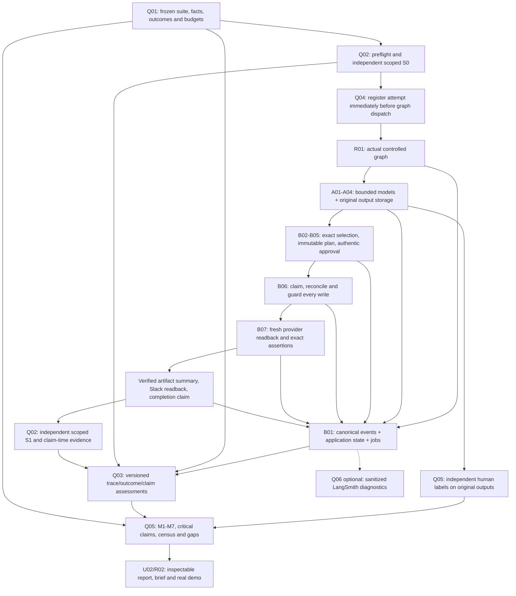

# Agent reliability: detailed implementation and proof plan

**Status: proposed implementation, September 14, 2026 (IST).** This plan translates
the [implementation audit](../reliability-implementation-audit.md) into work inside
the existing **31 commit briefs and 29 branch plans**. It creates no new commit
IDs, does not implement application code, and does not close a release gate.

The [demo/reliability contract](../demo-scenarios-and-reliability.md) remains the
authority for scenario outcomes and metrics. This document defines how to deliver
it. [Shared contracts](05-contracts-and-handoffs.md) fix producer/consumer seams;
[the backlog](04-commit-plan.md) fixes owners and merge prerequisites;
[Global Scale](Global%20Scale.md) records actual completion and evidence.

## Producer integration references

[Agent spawning and LLM integration](07-agent-spawning-and-llm-integration.md)
defines A01's actual call boundary, A02–A04 inputs/outputs, B01 invocation records,
B04 scheduling and R01 assembly. [MCP/API and external-app integration](08-mcp-api-and-external-app-integration.md)
defines I01–I05 transport/method bindings and B05/B06/B07/Q02 consumers. The
reliability pipeline below must observe those actual calls, not manually invented
model/tool events. Each related commit brief now includes that integration work.

F02 must represent model configuration and app transport/provenance separately
without rewriting legacy v1 modes. A live-model run with fake adapters tests
language/runtime behavior; a fake-model run with live apps tests integration;
combined live claims require both on the same registered run with independent
provider reads. MCP is optional and must establish the same scoped evidence as
REST. Provider consent and model judgments do not substitute for authentic Slack
approval, local effect guards or independent human quality labels.

## 1. Objective and current baseline

Prove three things independently, then join their results:

1. **AI decision quality:** original model outputs are grounded, complete, and
   useful; uncertainty and handoff are honest; corrections do not erase defects.
2. **Execution correctness:** actual actions obey exact identity, approval,
   payload, retry, reconciliation, ordering, and time constraints.
3. **Outcome correctness:** independently observed provider records match
   expectations frozen before execution, including required absence of effects.

Traces explain behavior. Provider reads establish observed app state. Human
labels evaluate meaning. None substitutes for the other two. The inline verifier
controls product completion; the separate monitor measures it and cannot grant
authority, repair business records, or overwrite the product's history.

### Reuse the working components

Preserve `tools/reliability/check-evidence.mjs`, `src/shared/reliability.ts`,
`src/server/storage/monitor-store.ts`, `src/server/monitoring/{assess,worker,cli}.ts`,
and `src/server/evaluations/metrics.ts`. The audit reran 129 code tests and 115
assertions on one synthetic input. These are baseline checker/monitor evidence,
not workflow success measurements. Preserve their dated receipts and hashes.

Missing work includes the application, model execution, provider adapters,
authentic approval, business-effect durability, independent collection, original
artifact review, full scenario execution, and live release proof. The existing
demo generates all observations and labels. Its `imported_provider_snapshot`
mode can also be supplied by a caller; that string authenticates nothing.

The audit additionally found incomplete stage/model telemetry and a critical
counter that only measures premature completion relative to declared verification.
An outcome mismatch correctly fails the current assessor but can leave its
`falseCompletion` counter at zero. Sections 5 and 8 below address these gaps.

## 2. Required pipeline

This diagram is causal for the golden path, not a success-only monitoring filter.
Every early failure, safe block, timeout, approval wait, partial effect, and
stalled start also emits durable observations and receives an assessment.
Post-run collection cannot retroactively make an early success announcement safe.

## 3. Acceptance requirements and commit ownership

These are acceptance identifiers, not additional commits. Each is open until its
implementation and evidence are attached to the existing global capability gates.

- **REL-01 — Frozen oracle:** F02/Q01 define independently authored scenario
  expectations, logical artifact references, facts, forbidden effects, and budgets.
- **REL-02 — Real telemetry:** B01/B04, A01, and I01–I05 emit actual stage/model/tool
  attempts with causal identities, outcomes, and bounded timing.
- **REL-03 — Enforced authority:** B02–B06 enforce selection, state-bound approval,
  exact payloads, durable dispatch, deduplication, and reconcile-or-stop.
- **REL-04 — Inline verification:** B07 gates useful completion on fresh provider
  records and final Slack readback; create responses are insufficient.
- **REL-05 — Independent evidence:** Q02 collects S0/S1 and claim-related receipts
  through read-only capabilities with honest scope, completeness, and provenance.
- **REL-06 — Durable measurement:** B01/Q03 integrate application state/events/jobs,
  implement versioned assessments, and preserve pending, failed, and stalled work.
- **REL-07 — Original AI quality:** A01–A04/Q05 retain real outputs, source facts,
  independent human labels, first-proposal defects, and correction histories.
- **REL-08 — Full scenario census:** Q01/Q04 record planned, attempted, failed,
  unverified, and not-run cases without changing ordinary retry denominators.
- **REL-09 — Honest scorecard:** Q03/Q05/U02 join evidence, measure all required
  metrics, classify completion claims, and keep modes/versions separate.
- **REL-10 — Demonstrated release:** R01/R02 prove live S1/S2 and declared safety
  controls, freeze results, and deliver the short brief and working demo.

Q06 LangSmith, U03 richer inspection, and B08 automatic accepted-write recovery
remain P1. B06 safe reconciliation and a minimal inspectable report remain P0.

## 4. Freeze the oracle, identities, and evidence contracts

**Owner: F02, with Q01/Q02/B03/B07/Q03/Q05 review before consumption.**

### Scenario and future provider identities

1. Freeze a suite manifest containing scenario/family/variant/repetition IDs,
   execution eligibility, expected checkpoint, required roles, source facts,
   protected records, fault boundary, budgets, and all version identifiers.
2. Freeze all five S1 artifact kinds and exact invariant expectations: service,
   company, commitment, owner, due date, recipient, draft status, content policy,
   allowed operations, and cross-app relationships. Expected facts are human
   authored independently of the model and worker output.
3. New provider IDs are unknown before creation. Express only those destinations
   as typed `EffectIdRef` values referring to immutable logical effect keys.
   B03 likewise freezes a limited set of permitted ID/link substitutions in
   approved payload templates. Arbitrary template changes are forbidden.
4. Q02 resolves references using independently retrieved, uniquely identified
   marker matches and checked associations. Record a binding receipt; reject
   missing, multiple, conflicting, or cross-account matches. Resolving an ID
   must never replace expected owner, recipient, body, status, or eligibility
   with values read from the resulting artifact.
5. Retain the original logical manifest and its hash, binding receipts, and a
   distinct resolved checker-export hash. The dependency-free checker receives
   concrete fields only after valid resolution; the logical oracle is unchanged.

### Generated content and the approved plan

An exact real LLM-generated body cannot be known before the model runs. Q01
freezes source facts, forbidden claims, required semantic content, recipients,
and other invariant predicates before the run. It may prescribe exact bytes for
deterministic text fixtures. For generated content, use typed `ApprovedContentRef`
to a permitted field of an immutable B03 approved plan. B03 preserves the exact
generated bytes, normalized digest, selected output/source references, and approval
before the first protected dispatch. Once frozen, the binding cannot change.

B07/Q02 resolve byte-equality expectations only from that stored plan receipt,
never from the provider artifact. Preserve the pre-run oracle hash, approved-plan
hash, content binding, and resolved export hash separately. This tests faithful
execution of approved text; independent human labels still determine whether the
text is grounded and useful. Approval or exact reproduction cannot make a bad
first proposal pass M7. Human edits require a new reviewed plan/content binding,
without rewriting the original output, labels, or attempted-stage result.

### Identities and versioning

- `runId`: the durable business incident. Ordinary replay reuses its effect keys.
- `evaluationAttemptId`: one predeclared scored attempt across normal waits,
  resumes, retries, and measurement revisions.
- `runtimeAttemptId`: one graph invocation/resume; it does not add an M1/M7 sample.
- `spanId`/`parentSpanId`: a causal stage/model/tool span; correlation survives
  graph checkpoints and export retries without pretending timestamps prove causality.
- `logicalCallId`: one logical call across retries. Independent reconciliation
  and final-verification reads have their own call IDs.
- `providerAttemptId`: one dispatched tool attempt; `modelAttemptId` identifies
  one model attempt, including refused, malformed, timed-out, and missing results.
- `claimId`: one externally visible success assertion or persisted completed
  status. Record its scope, effect set, plan revision, event sequence, and timing.
- `collectionId`, `observationId`, and `labelId`: immutable receipt identities;
  changed observations and adjudications create new revisions, not replacements.

V2 uses `runtimeAttemptId` consistently. Where historical design/events use
`attemptId` for the graph invocation, the compatibility adapter maps it explicitly
to `runtimeAttemptId`; conflicting aliases are rejected. Model calls use
`modelAttemptId`, tool calls `providerAttemptId`. No upgrade fabricates absent IDs
or causal evidence from timestamps alone.

Preserve the existing three evidence modes. Add provenance separately; a caller
cannot promote fixture/manual input to collector evidence by setting a Boolean,
actor, credential reference, or mode. The trusted ingest route associates a receipt
with the configured collector process/account and verifies stored response hashes
and scope. This gives scoped collection evidence, not universal cryptographic
proof of provider history or other actors' behavior.

## 5. Instrument actual execution and preserve originals

**Owners: B01/B04 for durable events and stage lifecycle; A01 for model attempts;
I01–I05 for normalized tool observations.**

1. Add versioned canonical stage start/end, model attempt start/result, tool
   dispatch/result, retry scheduled, source collection, approval/revalidation,
   reconciliation, verification, wait, fault, correction, and completion events.
   Keep existing logical event meanings; use a compatibility projection rather
   than pretending legacy events contain absent evidence.
2. Capture stage/role, causal parents, UTC timestamps, process/runtime identity,
   monotonic durations within each process, request/source/output references,
   normalized outcomes, error classification, retry owner and backoff. Record
   HTTP transport success separately from provider semantic success. Missing
   duration/usage information stays unavailable, never an invented zero.
3. Persist model attempt intent before invocation and original output immediately
   after receipt, before validation, retry, or human repair. Store original text
   and supporting sources in restricted artifact storage; traces contain hashes
   and references. Preserve malformed text and refusal metadata as evidence.
4. Freeze prompt/model/schema versions and configured roles. Required roles
   cannot silently become stubs on outage. A01 owns bounded retry; model/provider
   SDK defaults must not create unrecorded extra attempts.
5. Record source selection and approval evidence as typed observations. Validate
   actual Slack actor/workspace/thread/message/revision and exact plan payload
   at dispatch; `authorized: true` and a source reference alone are insufficient.
6. Record every public success boundary, including Slack artifact summaries,
   full-run announcements, API/UI success projections, and persisted completed
   transitions. Give genuinely separate emitted claims separate IDs. Reading
   the same persisted status again does not create another success claim.
7. Provide bounded trace reads from local persisted events. LangSmith callbacks
   are optional views, not the canonical count or delivery queue.

**Required proof:** a model timeout has a recorded start and failure/unresolved
result; a valid response with invalid schema remains a failed first proposal;
provider HTTP 200 with application-level failure is not tool success; retries
retain logical identity but have distinct attempt IDs; process restart preserves
causal links and redaction tests find no canary secret in public events.

## 6. Enforce business safety and independently observe state

### Runtime controls and B07 readback

Implement the existing B02–B06 guards before connecting live mutation paths.
Persist intent and acquire one incident/effect claim before dispatch. Unknown
writes reconcile or stop; an empty lookup does not prove nonapplication. Applied
effects retain their original approval and plan references. Protected writes
remain sequential with readback before the next protected effect.

B07 makes a fresh provider read, checks exact normalized fields and associations,
and stores the observation before marking the effect verified. Bind the verdict
to the effect key, provider ID, plan revision, read attempt, expected predicate
set, observed hashes, collection time, and source version when available.

For S1 verify the HubSpot task/note, Gmail draft, GitHub comment, and linked Slack
summary; enumerate marker duplicates and check protected Beta records. Decode
actual Gmail MIME and every To/Cc/Bcc header. The artifact summary can assert only
already verified effects; whole-run completion waits for the summary's own
readback. Failed or unavailable verification produces explicit partial/unverified
handling and no invented success.

### Q02 independent collection

1. Instantiate read-only provider capabilities separately from executor mutation
   interfaces. Shared transport/parsers are acceptable; the executor's cached
   create response and `matches: true` flag are not observed state.
2. Before execution, capture S0 over the complete declared namespace: incident,
   relevant commitments/contacts/owners, protected records, marker matches, and
   relevant draft/thread/comment/task/note state.
3. Capture S1 after the terminal checkpoint or cutoff, including failures and
   partial effects. Collect claim-related observations within the predeclared
   timing/settling policy. Record request start/finish, observed provider version,
   account/scope, page coverage, linked IDs, response hash, and restricted raw ref.
4. Preserve per-app/per-object timing. Four services do not provide a single
   atomic global snapshot. A complete scoped collection is not all-account history.
   Pagination failure, unresolved writes, unsupported history, clock uncertainty,
   and inaccessible links produce explicit incomplete evidence.
5. Dereference linked provider IDs and verify associations rather than comparing
   link strings alone. Enumerate duplicates, including known intermediate effects
   from the operation history; a later deletion does not erase a duplicate.
6. Attribute intentional human edits, injected faults, and operator repairs.
   Preserve original S0/history, then collect a new baseline for a separately
   declared continuation stage. Do not reset the environment inside a scored run.
7. Export only checker-v1-compatible effects. Unknown write outcomes remain
   unresolved in the full evidence and prevent a passing integrated assessment;
   never convert them into known failure to satisfy the old checker vocabulary.

**Required proof:** missing draft, wrong recipient/body/owner, broken association,
duplicate marker, phantom Slack success, incomplete second page, imported fake
provenance, and unchanged final state after an unauthorized intermediate mutation
all fail or remain unverified at the appropriate layer.

## 7. Integrate durable measurement without two independent commits

**Owners: B01 storage, Q03 worker/rules; composition in R01.**

1. Refactor the tested monitor storage behind a transaction-aware application
   store. One SQLite transaction persists each application transition, canonical
   event, and measurement-job enqueue. All writes use the same connection and
   transaction context. App commit followed by `MonitorStore.append()` is invalid.
2. Keep graph checkpoints separate; they do not share that transaction. Reconcile
   a resumed checkpoint against authoritative run/effect state before dispatch.
3. Measurement jobs retain evaluator version, watermark, lease token, retry
   count, and next-run time. Workers cannot complete a re-leased job or overwrite
   a newer assessment. Saving assessment and completing its job are atomic.
4. Schedule measurement independently of HTTP response lifetime. Include waiting,
   blocked, failed, partial, completed, and stalled/no-result attempts. A bounded
   sweeper repairs missing jobs without creating new scenario denominators.
5. New collector evidence and human labels enqueue a new observation watermark.
   Preserve earlier measurements; ordinary reprocessing does not create samples.
6. If the monitor fails, leave assessment pending/unverified. If the authoritative
   local effect/audit store fails, stop protected writes. These are different
   failure boundaries. Optional telemetry failure does not stop safe local work.

**Required proof:** roll back a transition between its state/event/job writes;
crash after remote acceptance; restart after a leased job; replay identical data;
arrive with late labels; exhaust the job budget; omit a result; and verify that
no state has a fabricated pass, no attempt disappears, and no write is retried
without reconciliation.

## 8. Versioned completion measurement and metric corrections

**F02 freezes contracts; Q03 owns assessment; Q05 only aggregates those facts.**

### Preserve monitor-v1

Keep old schema/version/evaluator identities and reports interpretable. Their
`falseCompletion` means the documented premature-claim check. Introduce proposed
observation schema v2 and evaluator `monitor-v2` for the expanded contract; do not
silently reinterpret historical rows or label old receipts as v2 verification.
The standalone checker-v1 executable and contract stay unchanged.

F02 defines version dispatch and compatibility fixtures; B01 owns additive store
migrations and versioned job/assessment keys; Q03 dispatches the selected
evaluator; Q05 separates report cohorts. Retain v1 readers and tests. Upgrading
old observations cannot manufacture provenance, claim IDs, source text, or timing:
missing v2 evidence remains unverified. Record a new receipt only after code lands
and its own tests run.

### Claim classification

For every unique `claimId`, persist the declared scope and expected predicates,
emission time/sequence, applicable plan revision, supporting observations, and
subsequent independent evidence. Evaluate two distinct dimensions:

- **Prematurity:** the claim preceded its required valid verification, violated
  required ordering, or hid unresolved work. A later successful write cannot fix
  that historical claim.
- **Outcome at the claim:** `confirmed`, `contradicted`, or `unverified` for the
  exact claimed scope using admissible time-linked evidence.

Use a discriminated scope: `artifacts` identifies the verified effects asserted
by a summary; `run` is artifact-producing `completed` and requires final Slack
readback; `no_affected` is `completed_no_affected_commitments`. The no-affected
contract has no plan/approval reference and requires complete source retrieval,
deterministic zero-eligible selection, protected-record/absence predicates, and
no protected mutation. It need not invent model calls, a plan, or a Slack thread.
If an optional message makes an additional artifact claim, measure that claim
against its own declared scope and evidence.

The manifest freezes evidence age, settling limits, and cutoff. Causal references,
provider revisions/history where available, and bounded observation windows
support admissibility. A recent read is evidence as of that read, not proof of
permanent state. If later S1 differs and an intervening change cannot be ruled
out, do not invent a historical false claim: retain unverified attribution and
report final-state drift separately. A known later human edit does not make a
previously corroborated claim false at emission. Both interpretations can coexist:
final outcome fails while historical claim truth is unverified.

Aggregate unique sets:

- `prematureSuccessClaims`: claim IDs with a proven ordering violation.
- `outcomeContradictedCompletionClaims`: claim IDs with admissible contradiction
  of the state asserted at emission.
- `falseCompletion`: the union of those two sets, deduplicated by claim ID.
- `successClaims`: all emitted claim IDs; the rate uses this full denominator.
- Outcome-classification counts and IDs for confirmed/contradicted/unverified;
  unresolved claim evidence is visible and prevents a zero-violation release claim.

A claim in both failure sets contributes once to the union. Separate Slack and
completed-status claims each count once; polling does not count them again.
No claims means N/A. No observed contradiction with missing evidence does not
mean completion reliability passed.

For **M3 mutation acknowledgement verification**, require the matching provider
ID and corroborated expected-versus-observed fields. An asserted verification
event cannot earn outcome credit when the applicable independent evidence is
missing or contradictory. Keep predicate-level failures visible even when other
predicates pass, and preserve M2 as transport/provider response success only.

**Required regression set:** early success then eventual repair; timely claim
with admissible wrong recipient; missing artifact at claim; both prematurity and
contradiction; duplicate delivery of one claim; separate summary/status claims;
known later edit; temporally ambiguous mismatch; collector outage; v1/v2 reports;
and a verification event contradicting the actual observed record. Expected
claim IDs, raw counts, M1 verdict, M3 contributions, and evidence gaps are
hand-calculated independently of implementation.

## 9. Measure original AI quality and complete suite coverage

### Original outputs and human judgments

Q01 freezes expected facts and forbidden claims before a scenario. A01 records
every original proposal and its source/prompt/model digests. Q05 provides a
restricted review path that shows actual text beside supporting source fields.
The reviewer records identity/reference, reason, review time, source/output
digests, grounding/completeness/decision/handoff judgments, and per-claim support.
Missing and uncertain labels cannot pass. Do not infer factual support from a
well-formed citation or use the product auditor's verdict as ground truth.

Store corrections, regenerated outputs, and superseding adjudications as linked
revisions. Compute M7 on the first required proposal and final semantic assessment
on the outputs bound to the selected execution plan. A corrected final plan may
succeed while its original proposal fails. Auditor defect recall and false blocks
use independently labeled defective/valid drafts as denominators; auditor role
quality is a separate measure. Legacy proposal-level unsupported-claim proxies
remain labeled; a v2 claim count requires actual claim-level labels.

R01 needs real labels before Q05's richer review workflow lands. Its already
planned `tools/demo/run.ts` owns a minimal trusted review input using F02 schemas and B01
artifact/label persistence: show the original text/source digests to the actual
operator, record their identity/reason/judgments and origin, and enqueue assessment.
Do not accept fixture `reviewerKind: human` as evidence that a person reviewed it.
Q05 extends/reuses these receipts and adds the full review/report path. This
explicit bootstrap avoids a circular R01 → Q05 → Q04 → R01 dependency.

### Census and attempts

The suite manifest lists all 18 baseline families, repeated baselines, declared
variants, and correction/repair legs. The canonical target is 42 baseline and
repetition attempts plus variants/legs, with at least five live scenarios. These
are planned counts, never assumed results.

Q04 records each scheduled entry as not run until it is registered and attempted.
The mandatory account/fixture preflight and independent S0 capture happen in a
fixed setup phase **before registration**. Store those receipts by `suiteEntryId`;
bind their immutable hashes to the evaluation attempt at registration. Failed S0
is `setup_failed`, visible in coverage, with no M1/M7 attempted sample. It cannot
count as a successful product run. Register immediately before actual graph
dispatch; every failure after that boundary remains an attempted sample, including
source reads by the agent, model failures, dispatch failure, interrupted/partial
work, collector outage, and missing labels. Never move this boundary after seeing
a result. Report suite coverage separately from M1/M7 attempted-run denominators:
not-run entries remain visible but do not become fictitious attempts. Ordinary
retry/resume never creates another attempt. Explicit repair legs have predeclared
identities and preserve the original result.

Run deterministic fake-provider tests through the actual graph first, then model
calls with fakes and scoped real-account runs with complete evidence. Never turn
checker input generation into a product execution. Use a deliberate missing
artifact and early-success defect to show the harness can reject false success.
Permission denial, ambiguous writes, and safe escalation must not be relabeled
as successful automatic recovery.

## 10. Commit execution sequence and reviewable deliverables

Use existing hard prerequisites; this sequence groups work for review, not a new
dependency chain. Q03 can implement against frozen collected-evidence fixtures
before Q02 lands; absent evidence yields unverified. Their integrated behavior
must join in R01. Q05 can prepare review/report code early but merges after Q04.

1. **P00, F01, F02:** preserve baseline; add the tested application scaffold;
   freeze v2 events/evidence/claims/labels/census and compatibility examples.
   Deliver schema conformance cases, version migration design, and ownership.
2. **B01, Q01, I01, U01:** deliver shared durable storage, independent scenario
   worlds, normalized transport, and an honest fixture-backed console. Tests
   reject weak manifests and missing transaction components before live writes.
3. **I02–I05, B02–B04, A01–A04:** implement four providers, deterministic policy
   and driver, actual bounded model calls, original artifact retention, and
   canonical telemetry. Smoke each required read/write/readback in scoped accounts.
4. **B05–B07, Q02/Q03, U02:** join authentic approval and guarded execution,
   fresh runtime verification, independent collection, v2 assessment, scheduled
   measurement, and minimal result projections. No live workflow success claim
   until those paths run together.
5. **R01:** integrate the complete graph; prove simulated S1/S2, then real S1
   and replay S2 with preserved provider IDs, five inspected artifacts, protected
   Beta, exact draft content, and no extra creations. Preserve failure evidence.
6. **Q04/Q05:** run the declared scenario census, labels, critical-counter
   regressions, and measured scorecard. Publish both workflow and first-proposal
   quality, all gaps, and exact version/mode/attempt identities.
7. **R02:** freeze tested source/configuration and evidence; create the brief,
   runbook, evaluation summary, and real demo. Optional B08/Q06/U03 are included
   only after their own tests and refreshed dependent results.

The brief for every commit now includes its reliability obligations, concrete
negative cases, and downstream handoff. If a task needs smaller code changes,
use the existing explicit suffix procedure and update dependencies before
consumers merge; this document does not claim 31 commits guarantee feasibility.

## 11. Planned commands and saved evidence

The only currently runnable workflow here is the offline monitor/checker. Keep
`npm run typecheck`, `npm run build`, `npm test`, and the documented monitor CLI.
The following are **proposed command contracts**, added through F01's package
owner when the listed implementation lands; they are not commands to run now:

- I01: provider smoke command selecting one app/account fixture and saving
  created IDs plus independent readback receipts. Setup cleanup is separate.
- Q01: fixture seed/reset commands limited to the declared disposable namespace.
- Q04: evaluation runner selecting suite, scenario, cohort, evidence mode,
  release versions, evidence directory, and optional registered resume identity.
- Q05: report command selecting suite manifest and assessment revision, exporting
  machine-readable results plus a readable summary; a separate human-label input
  path validates original-output/source references and reviewer metadata.
- R02: release validation command or documented sequence verifying every
  claimed gate and artifact against the frozen version.

Freeze exact flags in the owning commit, publish `--help` and example invocations,
and test actual CLI exit behavior. Invalid input, failed assertions, incomplete
evidence, and command execution failure must remain distinguishable. Successful
report generation is not proof that its scenarios passed.

Keep a private evidence directory with manifest/hash, initial/final receipts,
bindings, canonical events, original outputs, labels, claims, assessment revisions,
and raw failures. Public artifacts contain fixed codes/counts, synthetic examples,
and redacted references. A release index links each claimed result to its exact
source/fixture/prompt/model/policy/evaluator versions and evidence scope.

## 12. Hackathon completion gate

The minimum reviewable result shows: the goal and frozen expectation; original
AI output beside sources; real approval and ordered tool trace; five real
artifacts with expected/observed comparisons; replay without duplicates; a
correct safe block; and raw measured results with pending/failed/not-run entries.

G1–G4/G6 require reproducible application setup, safe core, live S1/S2, evidence
for every stated control, and the honest demo/brief. G5 additionally requires the
full declared evaluation program. All remain open until actual proof is attached.
Zero critical violations requires complete relevant evidence, not just zero
counter increments. A documentation update, green synthetic fixture, or connected
trace dashboard does not close any live behavior gate.

Cut optional export, UI polish, hosting, and automatic recovery before cutting
approval, safe uncertainty handling, independent reads, original-output labels,
or result integrity. Recompute deadlines from actual remaining time; the earlier
390-minute schedule is historical planning, not a renewed allowance.
