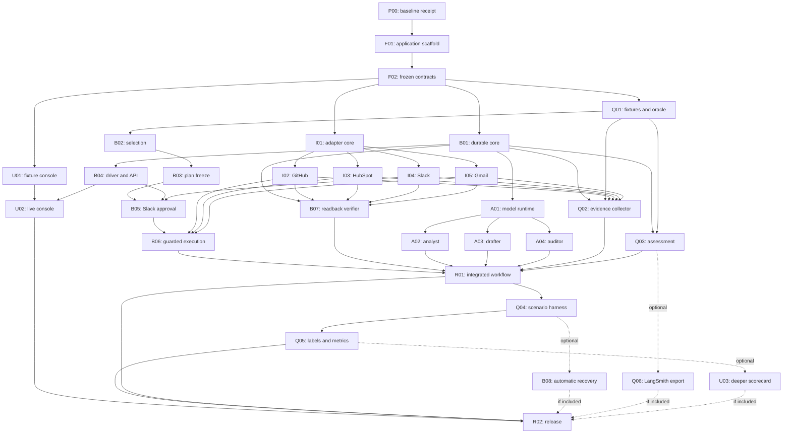

# Parallel branch and merge runbook

**Status: execution guide, September 14, 2026.** This document expands the
existing dependency graph into an operational sequence: what can be prepared or
built in parallel, which branches may merge, what must be validated after each
merge, and which next branches become available.

It does not replace the authoritative [branch index](branches/README.md),
[commit backlog](04-commit-plan.md), [commit briefs](commits/README.md),
[parallel-delivery rules](03-parallel-delivery.md), or
[shared contracts](05-contracts-and-handoffs.md). If this runbook and an
individual commit brief disagree about a hard prerequisite, the individual
commit brief wins.

The intended release remains GitHub + HubSpot + Slack + Gmail through typed REST
adapters, with three bounded model roles, authentic Slack approval, guarded
writes, fresh readback, independent collection, and honest evaluation. MCP,
automatic recovery, hosted tracing, and richer scorecard inspection remain
optional unless the release explicitly claims them.

## 1. Current starting point

**Execution update, September 14:** local main now contains the reviewed
foundation commits, merged sequentially after pulling the latest planning update:

- P00: `37e1aa029439d7cd509b237525f8b8e02553528e`.
- F01: `9235026140db8d5083a9d2eabf5a91f73d37de5b`.
- F02: `87d3c7d7bad17d54300e452e932c7f226fc74299`.

P2/P3/P4 delegated Codex boundary reviews accepted F02 under conventions 1.2;
the [F02 receipt](commits/F02.md#completion-receipt) records reviewer identities,
57 focused tests, typecheck/server build and the retained 235-test full receipt.
The reviewed local F02 base permits B01/I01/Q01/U01 work. Provider/model live
access remains unrun. Commits are merged locally but not yet pushed to origin.

At the time this runbook was written:

- `main` and `origin/main` pointed to `37e1aa0`.
- The current monitor/checker baseline passed 129 of 129 tests with `npm test`.
- The product application, provider adapters, model runtime, workflow graph,
  operator console, independent collector, and live release evidence were not
  implemented.
- The P00 brief still required its reviewed SHA and receipt to be recorded.

Do not create a redundant baseline commit merely to satisfy the P00 label. First
confirm whether `37e1aa0` is the reviewed baseline the team intends to use. If it
is, record that real SHA and evidence in [Global Scale](Global%20Scale.md) and the
P00 handoff. If the team requires a distinct P00 commit, create it only from
explicitly reviewed baseline paths. Never restage unrelated working-tree changes.

## 2. Meanings of parallel and complete

Use four separate meanings throughout execution:

1. **Preparation may run in parallel.** Access setup, payload examples, fixture
   design, test cases, and review can proceed while an upstream implementation is
   still being built.
2. **Code may be drafted in parallel.** A branch may compile against frozen F02
   interfaces or Q01 fixtures before an implementation prerequisite lands. Such
   a branch remains a draft and cannot merge early.
3. **Merges are sequential.** Merge one reviewed branch into `main`, validate the
   resulting integration state, then merge the next branch. Parallel authorship
   does not mean simultaneous merges.
4. **Runtime work follows causal order.** The analyst, drafter, checks, auditor,
   approval, protected writes, readback, and final Slack summary remain ordered.
   Development parallelism never authorizes parallel protected writes for one
   incident.

A branch is complete only when its implementation, tests, negative cases,
evidence mode, failed or unrun checks, prerequisite SHAs, and receiving handoff
are recorded. A branch name or commit subject is not completion evidence.

## 3. Ownership and shared-file locks

Use these default four contributor lanes. Substitute actual names before work
starts.

| Lane | Primary ownership | Exclusive or sensitive paths |
| --- | --- | --- |
| P1 | Foundation, storage, driver, approval, execution, integration, release | `package.json`, lockfile, root config, `src/shared/*`, migration numbering, API mounts, `src/server/composition.ts`, graph wiring |
| P2 | Common transport and GitHub, HubSpot, Slack, Gmail adapters | `src/server/adapters/*`, provider smoke tools, provider-specific fixtures and receipts |
| P3 | Deterministic selection/plan policy, model runtime and roles, inline verifier | `src/server/policy/*`, `src/server/agents/*`, `src/server/verification/*` |
| P4 | Frozen expectations, independent collection/assessment, frontend, scenarios, metrics, demo evidence | `tests/fixtures/*`, `tests/fakes/*`, `src/server/evaluations/*`, `src/server/monitoring/*`, `src/web/*` |

One person owns one active implementation PR at a time. Helpers may work in
disjoint files, but the branch owner integrates their changes. Only P1 changes
shared schemas, root dependencies, migrations, API mounts, or composition.

P4 owns both evaluation and frontend. To preserve parallelism, delegate a
disjoint U01 component or frontend test to a helper after F02 freezes DTOs and
Q01 freezes fixture identity. P4 remains the final owner of `App.tsx`, joined
styles, API client semantics, and evaluation truth.

## 4. Dependency and merge overview

The diagram omits some repeated edges for readability. The merge checklist in
Section 12 contains the complete R01 prerequisite set.

## 5. Round 0 - baseline, access, and contract inputs

### Parallel work first

These four activities begin together. Only P1 changes foundation code.

| Lane | Branch and commit | Work now | Exit evidence |
| --- | --- | --- | --- |
| P1 | `chore/monitor-baseline` / P00 if still needed, then `feat/foundation` / F01 and F02 | Confirm and record the reviewed baseline. Extend the existing package with the tested application bootstrap in F01. Freeze shared domain, role, adapter, API, event, and evaluation contracts in F02. | Baseline SHA, clean install, existing regressions, application bootstrap tests, contract tests, accepted/rejected examples, F02 schema/version handoff |
| P2 | No product feature branch until F02; private setup and review work | Verify disposable GitHub, HubSpot, Slack, and Gmail accounts, credentials, scopes, IDs, and API capabilities. Prioritize Gmail OAuth and retrieval of a real authorized human Slack reply. Supply adapter examples to F02. | Per-provider readiness matrix with ready, blocked, failed, or unrun state; no secrets committed |
| P3 | No mergeable feature branch until F02; prepare F02 inputs | Freeze deterministic selection examples and accepted/rejected analyst, drafter, and auditor payloads. Define source, uncertainty, exact selected-set, and context-exclusion examples. | Reviewed examples handed to P1/P4; no private fork of `src/shared/*` |
| P4 | No mergeable feature branch until F02; prepare Q01/UI inputs | Freeze the five required S1 artifact kinds, forbidden effects, logical identities, scenario census, evidence gaps, first-proposal label rubric, and frontend state matrix. | Independently authored oracle sketch and UI states; expectations do not copy worker output |

### Sequential merge checkpoint 0

Merge and validate in this order:

1. **P00:** record the accepted baseline SHA. If the current baseline is already
   represented by `37e1aa0`, update the handoff rather than manufacturing a
   duplicate implementation commit.
2. **F01 on `feat/foundation`:** merge the tested application scaffold. Pin only
   dependencies actually installed and smoke-tested. Keep model and provider
   modes separate and fail live startup when required secrets are absent.
3. **F02 on `feat/foundation`:** merge shared contracts only after P2, P3, and P4
   review their boundaries. F02 is the contract freeze that permits concurrent
   feature branches.

After each merge:

- update the commit-ID-to-SHA register;
- run the branch's focused tests, then typecheck/build and existing regressions;
- confirm no credentials, private evidence, databases, `dist`, or `node_modules`
  entered Git;
- confirm `main` is buildable before merging the next commit.

**Round 0 exit:** F02 is merged with a real SHA; all four owners accept its
interfaces; provider/model access blockers are known; new branches use that
reviewed `main` as their base.

## 6. Round 1 - first independently mergeable branches

### Parallel work after F02

Start these branches from the reviewed F02 base:

| Owner | Branch | Commit | Hard prerequisite | Main work |
| --- | --- | --- | --- | --- |
| P1 | `feat/durable-core` | B01 | F02 | Authoritative run, plan, approval, effect, event, job, assessment, and artifact persistence in one transaction-aware application store |
| P2 | `feat/adapter-core` | I01 | F02 | Bounded REST transport, pagination, error classification, retry/timeout budgets, attempt receipts, and provider smoke plumbing |
| P4 | `feat/evaluation-fixtures` | Q01 | F02 | Frozen worlds, scenarios, facts, logical expectations, faults, stateful provider/model fakes, census, and human-label fixtures |
| P4 or delegated frontend helper | `feat/operator-console` | U01 | F02 | Fixture-backed one-screen console, stable pipeline, exact plan/effects, all product/evaluation states, responsive and accessibility tests |

P3 may prepare B02 and A01 tests against the frozen seams, but neither commit is
mergeable yet. B02 waits for Q01; A01 waits for B01.

Q01 and U01 may overlap only after fixture identity and synthetic-marking rules
are fixed. Q01 owns scenario truth. U01 owns browser fixtures and presentation.
They must not edit each other's files or silently redefine expected outcomes.

### Sequential merge checkpoint 1

There is no reason to wait for all four branches before merging a ready branch.
Merge one at a time as soon as its own checks pass. Prefer the three branches
that unlock the most work:

1. **B01** unlocks B04, A01, Q03, B05/B07 foundations, and Q02 persistence.
2. **I01** unlocks all four provider branches.
3. **Q01** unlocks B02, Q03, Q02, and reliable UI/scenario fixtures.
4. **U01** unlocks U02 and is a required release surface, but it does not block
   backend/provider fan-out.

The first three may finish in a different order. Do not reorder authors purely to
match this list; merge whichever reviewed branch is ready, validate `main`, then
continue. U01 can merge before or after them as long as F02 is present.

Required checks at this checkpoint:

- B01: transaction rollback, uniqueness, reopen/recovery, restricted artifacts,
  event/job atomicity, and monitor-v1 compatibility;
- I01: page-two failure remains incomplete, denials are not retried, mutation
  retry is disabled by default, and budgets cover all pages/retries;
- Q01: expected facts predate execution, logical IDs/content refs cannot copy
  destination values, fakes preserve partial and unknown outcomes, and every
  planned suite entry starts as not run;
- U01: all state-matrix fixtures are visibly synthetic, no approval command
  exists, no metrics are computed in the browser, and 375x812, 768x1024, and
  1440x900 checks have no overlap.

**Round 1 exit:** B01, I01, and Q01 are merged. U01 is merged or has a named owner
and completion gate. The next branches start independently as their prerequisite
SHA appears on `main`.

## 7. Round 2 - core, providers, runtime, and assessment fan-out

### Parallel work released by individual prerequisites

Do not wait for an artificial whole-wave barrier. Open each branch when the
prerequisite in this table lands:

| Owner | Branch | Commit | Hard prerequisites | What it unlocks |
| --- | --- | --- | --- | --- |
| P3 | `feat/selection-policy` | B02 | F02, Q01 | B03 immutable plan policy |
| P1 | `feat/workflow-driver` | B04 | B01 | B05 approval, U02 live console, durable API entry |
| P2 or delegate | `feat/github-adapter` | I02 | I01 | B06 GitHub effect, B07 readback, Q02 collection |
| P2 or delegate | `feat/hubspot-adapter` | I03 | I01 | B06 HubSpot effects, B07 readback, Q02 collection |
| P2 or delegate | `feat/slack-adapter` | I04 | I01 | B05 authentic approval, B07 summary readback, Q02 collection |
| P2 or delegate | `feat/gmail-adapter` | I05 | I01 | B06 draft effect, B07 MIME readback, Q02 collection |
| P3 | `feat/agent-runtime` | A01 | F02, B01 | A02, A03, and A04 role branches |
| P4 | `feat/reliability-monitor` | Q03 | B01, Q01 | Versioned app assessment, Q04/Q05/R01 evidence path |

Recommended staffing priority:

- P1 implements B04.
- P2 implements I01 follow-through, then prioritizes I04 and I05. Delegate I02
  and I03 when another contributor is available.
- P3 implements B02 and A01. If P3 is one person, finish B02 first because B03
  is on the approval critical path; another contributor can take A01 against the
  frozen B01 contract.
- P4 implements Q03 while the U01 helper finishes browser work. Q03 may use
  complete fixture receipts and mark absent Q02 evidence unverified. Q02 is not a
  hard merge prerequisite for Q03.

Provider access and smoke work may run concurrently when accounts and namespaces
are isolated. Tests that share the same mailbox, Slack thread, HubSpot records, or
GitHub issue run sequentially. A successful provider smoke is adapter evidence,
not a four-app workflow result.

### Sequential merge checkpoint 2

Merge each branch after its own prerequisite and acceptance checks pass. There is
no total order among independent entries, but use this criticality:

1. **B02, B04, and I04** are the shortest route to B05 approval.
2. **I02, I03, and I05** are required for B06, B07, and Q02. Gmail OAuth and full
   MIME readback are release blockers, so fail them early rather than substituting
   a fake.
3. **A01** releases three independent role branches.
4. **Q03** releases versioned assessment work and optional Q06.

For every provider merge, include deterministic contract tests and a separately
classified real-account smoke receipt or an explicit failed/unrun gate. Never
commit live IDs, tokens, raw MIME, or private snapshots.

**Round 2 exit:** B02, B04, I02-I05, A01, and Q03 are merged. If one is still
blocked, all unaffected downstream work may continue, but B05/B06/B07/Q02/R01
remain gated exactly as described below.

## 8. Round 3 - second independent fan-out

### Parallel work after Round 2 prerequisites

| Owner | Branch | Commit | Hard prerequisites | Main work |
| --- | --- | --- | --- | --- |
| P3 | `feat/plan-policy` | B03 | B02 | Canonical immutable plans, claim validation, exact content bindings, stable effect keys, and plan hashes |
| P3 or separate role owner | `feat/agent-analyst` | A02 | A01 | Incident evidence analyst with cited facts, contradictions, and uncertainty |
| P3 or separate role owner | `feat/agent-drafter` | A03 | A01 | Exact selected-set customer drafts and claim/source references; no recipient authority |
| P3 or separate role owner | `feat/agent-auditor` | A04 | A01 | Blind semantic audit over original sources and proposed text; no approval authority |
| P3 or verifier delegate | `feat/readback-verifier` | B07 | B01, I02, I03, I04, I05 | Fresh field, association, MIME, duplicate, protected-record, and final Slack summary verification |
| P4 | `feat/operator-console` | U02 | U01, B04 | Authenticated start/reopen, polling, reconnect, durable status, Slack link, partial controls, and compact saved reliability summary |
| P4 with P2 support | `feat/evidence-collector` | Q02 | Q01, B01, I02, I03, I04, I05 | Independent read-only S0/S1 and claim-window collection, complete pagination, identity binding, and checker export |
| P4 or freed P2, optional | `feat/langsmith-export` | Q06 | B01, Q03 | Sanitized diagnostic export that never blocks local evidence or changes canonical counts |

Important concurrency rules:

- A02, A03, and A04 can be developed independently with frozen fixtures. The
  runtime still invokes analyst, then drafter, deterministic checks, then auditor.
- B07 does not depend on B06. Build and merge the verifier against frozen plans
  and adapter fixtures while B05/B06 are still in progress.
- Q02 and B07 intentionally use separate read paths. Shared parsers are allowed;
  cached create responses and executor `matches` flags are not independent truth.
- U02 may merge before Q05 exists if the API honestly reports that the saved
  report is unavailable. R02 still waits for actual Q05 evidence.
- Defer Q06 when required work is under pressure.

### Early merge and approval join

B03 is the highest-priority branch in this round because it releases B05. As soon
as **B01 + B03 + B04 + I04** are merged, start
`feat/slack-approval` / **B05**. Do not wait for A02-A04, B07, U02, or Q02.

While P1 implements B05, the other Round 3 branches continue in parallel.

### Sequential merge checkpoint 3

1. Merge **B03**, rerun plan/canonicalization tests, and record its SHA.
2. Open and merge **B05** only after authentic Slack post/read/reply capability
   and all approval negative cases pass.
3. Merge **A02, A03, and A04** in any order after A01, validating `main` after
   each role. Do not combine them merely because their runtime order is fixed.
4. Merge **B07**, **Q02**, and **U02** as each becomes ready.
5. Merge **Q06** only if it is selected and cannot consume required evidence time.

B05 acceptance must cover wrong actor/channel/thread/hash, ambiguous hash prefix,
edited or deleted decision, bot reply, rejection, expiry, stale source, duplicate
wakeup, restart during wait, and no protected write on read failure.

**Round 3 exit:** B05 is merged; A02-A04, B07, Q02, and U02 are merged or have
explicitly named blockers. The guarded executor may now begin once its own full
prerequisite set is present.

## 9. Round 4 - guarded execution join

### Start B06 after its exact gate

Open `feat/guarded-execution` / **B06** only after all six prerequisites are on
`main`:

- B01 durable core;
- B03 immutable plan policy;
- B05 authentic Slack approval;
- I02 GitHub adapter;
- I03 HubSpot adapter; and
- I05 Gmail adapter.

I04 is consumed transitively through B05 and remains directly required by B07
and Q02. B06 must not wait for A02-A04, B07, Q02, Q03, or U02 to begin, although
R01 waits for all required tracks.

### Parallel work while B06 is built

The following tracks can proceed together. Carry-over work stays on its existing
branch, keeps its own prerequisites, and is not folded into B06.

| Owner | Branch or track | Commit(s) | Gate to start | Work that can run in parallel |
| --- | --- | --- | --- | --- |
| P1 | `feat/guarded-execution` | B06 | B01, B03, B05, I02, I03, I05 | Own effect claims, reconciliation, mutation ordering, approval/source rechecks, and executor code. |
| P2 | B06 provider-fixture support; use a focused adapter fix branch only if a provider defect is found | B06 support; I02/I03/I05 fixes only when needed | B06 is open and the affected provider adapter is merged | Supply accepted-write timeout, duplicate-marker, conflicting-match, and incomplete-read fixtures without editing executor ownership paths. |
| P3 or delegated role/verifier owners | Outstanding `feat/agent-analyst`, `feat/agent-drafter`, `feat/agent-auditor`, and `feat/readback-verifier` branches | A02, A03, A04, B07 | A02-A04 require A01; B07 requires B01 and I02-I05 | Finish role negative cases and B07 fresh-readback assertions while P1 builds B06. Merge each branch independently when ready. |
| P4 or delegated UI/evaluation owners | Outstanding `feat/evidence-collector`, `feat/reliability-monitor`, and `feat/operator-console` branches | Q02, Q03, U02 | Q02 requires Q01, B01, and I02-I05; Q03 requires B01 and Q01; U02 requires U01 and B04 | Finish independent evidence, assessment projection, and live-console work. Q02/Q03 must land before R01; U02 may continue toward the R02 gate. |

Parallelism is across staffed owners. If P3 or P4 has no delegate, that owner's
grouped branches remain sequential within the lane even while the other lanes
continue.

B06 executes only approved payloads in this order for each selected commitment:
HubSpot task, HubSpot note, Gmail draft, then the GitHub incident comment. Before
every remaining protected mutation it rechecks approval, expiry, source freshness,
and effect state. Unknown outcomes reconcile or stop; they never receive a blind
POST retry.

### Sequential merge checkpoint 4

Merge B06 only after concurrency, crash-window, timeout-after-acceptance,
duplicate-marker, multiple-match, human-edit, persistence-failure, and stale
approval tests pass. A safe `failed_partial` result is acceptable; fabricated
completion or a second create is not.

After B06 merges, perform the complete R01 readiness audit in Section 12. Do not
open the live integration run merely because B06 itself is green.

**Round 4 exit:** B06 and every mandatory R01 prerequisite are merged. U02 may
continue separately because it gates R02, not R01.

## 10. Round 5 - integration branch and first vertical slice

### One integration branch

P1 opens `feat/workflow-integration` / **R01** after its full prerequisite list
is satisfied. P1 is the sole editor of:

- `src/server/composition.ts`;
- `src/server/workflow/graph.ts`;
- `src/server/workflow/nodes.ts`; and
- final bootstrap/client construction joins.

R01 composes existing modules; it must not absorb fixes that belong in adapters,
roles, policy, storage, verification, or collection. Send integration defects
back to the owning branch/module and merge those focused fixes first.

### Parallel support during R01

R01 remains the only planned feature branch in this round, but these support
tracks can run at the same time:

| Owner | Branch or track | Commit | Gate or status | Work that can run in parallel |
| --- | --- | --- | --- | --- |
| P1 | `feat/workflow-integration` | R01 | Complete Section 14 prerequisite set is merged | Wire the graph and own fake execution followed by controlled live execution. |
| P2 | Provider validation using merged adapters; focused adapter fix branch only if R01 exposes a defect | I02-I05 fixes only when needed | R01 is open; affected provider smoke prerequisites are available | Confirm provider account IDs, scopes, complete reads, pagination, and fault behavior; assist P4 in running the merged Q02 collector for independent capture. |
| P3 | Model/policy review using merged role and policy modules; focused owner-module fix branch only if needed | B02/B03/A02-A04 fixes only when needed | R01 is open and original source/model evidence is available | Review original model outputs against source evidence and diagnose role or policy defects. Never use the generated auditor verdict as the human label. |
| P4 | Independent evidence capture and Q04 preparation; no mergeable Q04 branch yet | Q04 preparation only | Q01, Q02, and Q03 are merged; R01 is still in progress | Capture independent S0/S1, verify attempt registration, prepare Q04 manifests, and record failed or unverified evidence without editing worker truth. |

Any defect found by a support track is fixed and merged in its owning module
before R01 is revalidated. Q04 cannot merge, or be treated as executable scenario
evidence, until R01 itself is merged.

### Required execution order inside R01

1. Validate immutable incident identity.
2. Read complete GitHub and HubSpot source state.
3. Apply deterministic selection.
4. Invoke analyst, drafter, deterministic checks, and auditor in order.
5. Freeze the exact plan and post/read the Slack review.
6. Wait for and validate authentic approval.
7. Re-read relevant source state and invalidate stale approval.
8. Execute guarded effects sequentially.
9. Perform B07 fresh readback for all five artifact kinds.
10. Post and re-read the final Slack summary.
11. Persist the scoped completion claim.
12. Let Q02 collect independent outcome and claim-time evidence.

### Sequential merge checkpoint 5

Before merging R01:

- run the complete fake graph through the real composition path;
- prove zero model calls for invalid or complete no-affected selection;
- prove analyst/drafter/auditor order and no repeated model calls on approval
  resume or completed replay;
- run controlled S1 and replay S2 with real providers and the selected model mode;
- verify stable provider IDs, no excess effects, protected Beta unchanged, exact
  Gmail draft content, and final Slack summary readback;
- record original outputs and a real minimal human-review receipt;
- keep model-live, provider-live, combined-live, and fake evidence distinct; and
- record every failed, partial, unavailable, or unrun gate.

Merge R01 only when the claimed vertical slice is backed by its saved evidence.

**Round 5 exit:** R01 is merged and the application can execute the guarded
vertical slice. This is not yet the measured release.

## 11. Round 6 - scenario execution

### Parallel work inside one Q04 branch

After R01, Q01, Q02, and Q03 are merged, P4 opens
`feat/scenario-harness` / **Q04**. The branch has one owner, but implementation
and review can be split by disjoint scenario files:

| Owner | Branch and commit | Hard prerequisites | Parallel scenario slice | Ownership and merge rule |
| --- | --- | --- | --- | --- |
| P4 | `feat/scenario-harness` / Q04 | R01, Q01, Q02, Q03 | Manifest registration, attempt identity, frozen expectation binding, execution, census, and result classification | Own the branch and all shared harness/manifest files; integrate helper slices and perform the single Q04 merge. |
| P1 or backend helper | Q04 helper slice integrated by P4 | Q04 branch is open | Restart, concurrency, approval, ledger, and graph-dispatch faults | Edit only assigned backend scenario fixtures/tests; do not change shared graph or manifest ownership. |
| P2 or provider helper | Q04 helper slice integrated by P4 | Q04 branch is open | Provider denial, pagination, timeout, ambiguous-write, duplicate, and incomplete-read cases | Edit only assigned provider scenario fixtures/tests; do not redefine expected outcomes. |
| P3 or model helper | Q04 helper slice integrated by P4 | Q04 branch is open | Malformed model output, refusal, prompt injection, unsupported claim, auditor miss, false block, and partial-role cases | Edit only assigned model scenario fixtures/tests; keep deterministic policy and human-label authority separate. |

These are parallel contributions to one P4-owned branch, not four independently
mergeable Q04 branches.

Register each attempt immediately before graph dispatch. Setup and S0 failures
remain visible as `setup_failed`; every failure after registration remains an
attempt. Retry or graph resume never creates a new scored attempt. Not-run suite
entries stay visible and never become fictitious passes.

### Sequential merge checkpoint 6

Merge Q04 only after:

- all 18 canonical families exist in the manifest;
- attempted, failed, unverified, setup-failed, and not-run entries are distinct;
- the actual assembled graph is used rather than a checker-input generator;
- at least the declared live subset has complete evidence or is explicitly unrun;
- a deliberately missing artifact is rejected;
- an early success claim is classified correctly; and
- repeated/resumed runs preserve one evaluation-attempt denominator.

**Round 6 exit:** Q04 is merged. Q05 becomes mergeable; optional B08 may now be
built if the release explicitly includes automatic recovery.

## 12. Round 7 - measured results and optional increments

### Mandatory Q05 work

P4 opens `feat/evaluation-metrics` / **Q05** after Q02, Q03, and Q04 merge.
P3 or another named reviewer performs actual source-based human review of the
original analyst/drafter/auditor outputs. P4 must not convert generated fixture
labels or the product auditor's verdict into human ground truth.

Q05 publishes versioned M1-M7 counts, critical counts, census, evidence gaps,
claim classifications, first-proposal quality, corrections, and final selected
plan quality. Raw numerator/denominator values remain available; zero eligible
items are N/A rather than 100 percent.

### Optional work that may overlap

| Branch | Commit | Hard prerequisites | Rule |
| --- | --- | --- | --- |
| `feat/durable-recovery` | B08 | R01, Q04 | May be coded while Q05 report plumbing is prepared. If included, merge B08 before the final Q05 evidence freeze, rerun affected Q04 cases, and regenerate Q05. |
| `feat/langsmith-export` | Q06 | B01, Q03 | May already be ready. It remains diagnostics only and cannot block or replace local evidence. |
| `feat/evaluation-view` | U03 | U02, Q05 | Starts after Q05. It is optional deeper inspection; U02 must remain a complete P0 operator surface without it. |

Do not run B08, Q06, or U03 merely because contributors are free. First decide
whether each capability will be claimed in R02. An included optional branch
becomes a release prerequisite and forces affected evidence to be refreshed.

### Sequential merge checkpoint 7

Use one of these paths:

**Required-only release:**

1. Merge Q05.
2. Mark B08, Q06, and U03 deferred in Global Scale and release notes.
3. Proceed to R02.

**Release with optional capabilities:**

1. Merge selected B08/Q06 work after its prerequisites and focused checks.
2. Rerun affected Q04 scenarios and regenerate Q05 evidence after B08 or any
   behavior-changing optional work.
3. Merge the final Q05 result.
4. Merge U03 after U02 + Q05 only if deeper inspection is selected.
5. Revalidate the complete selected release before R02.

**Round 7 exit:** Q05 is merged with actual labels and measured results. Every
optional capability is either merged with refreshed evidence or explicitly
excluded.

## 13. Round 8 - release freeze, demo, and final merge

### Parallel release preparation

Once R01, U02, Q04, and Q05 are merged, prepare R02 in parallel without changing
the frozen behavior:

- P1 freezes source/configuration, runs clean validation, owns release notes and
  the final merge.
- P2 supplies sanitized provider API/version/scope receipts, object-link checks,
  and known integration limitations.
- P3 supplies model/prompt/schema versions, original-output review coverage, and
  unresolved semantic defects.
- P4 verifies the console against the saved Q05 report, prepares the two-minute
  demo, evidence index, screenshots, reliability brief, and submission checklist.

No contributor adds features during release preparation. Fix a release blocker
in its owning module, merge that focused fix, rerun affected downstream evidence,
and then return to the release freeze.

### Sequential merge checkpoint 8

Open `chore/demo-release` / **R02** only when these mandatory prerequisites are
present:

- R01 integrated workflow;
- U02 required operator console;
- Q04 scenario execution; and
- Q05 labels and measured results.

Also require B08, Q06, or U03 only when that optional capability is claimed.

Before merging R02:

1. perform a clean install and run typecheck, builds, unit/contract/integration
   tests, checker/monitor regressions, and the selected scenario suite;
2. run the golden S1 path from a clean fixture and replay S2 without new provider
   IDs, duplicate effects, or additional model work;
3. show one safe block with zero protected effects and one honest partial or
   failure case;
4. verify all authorized app links, exact recipient/body/owner/associations,
   Gmail draft-only state, protected records, and final Slack readback;
5. compare browser counts byte-for-byte with the saved Q05 projection;
6. confirm failed, unverified, unavailable, and not-run cases remain visible;
7. scan source, logs, evidence exports, screenshots, and video for secrets and
   private data;
8. update Global Scale with real SHAs, commands, versions, evidence modes, and
   remaining open gates;
9. record the two-minute demo and short system/reliability brief; and
10. verify every submitted link in a clean or private browser session.

Merge R02 only after the frozen release passes. Save submission status separately
from product completion status.

## 14. Complete R01 readiness checklist

R01 cannot merge until all of these hard prerequisites are merged and reviewed:

- B02 selection policy;
- B03 immutable plan policy;
- B04 durable workflow driver;
- B05 authentic Slack approval;
- B06 guarded execution;
- B07 independent inline verifier;
- I02 GitHub adapter;
- I03 HubSpot adapter;
- I04 Slack adapter;
- I05 Gmail adapter;
- A02 analyst;
- A03 drafter;
- A04 auditor;
- Q01 frozen fixtures/oracle;
- Q02 independent collector; and
- Q03 versioned assessment.

F02, B01, I01, and A01 are transitive prerequisites and must also be present in
the integration history. R01 composition must use their reviewed versions rather
than a private replacement.

## 15. Branch-by-branch merge queue

This is the default topological queue. A branch may move earlier than another
entry in the same row when its own prerequisites are satisfied.

| Merge layer | Branches and commits | Release rule |
| --- | --- | --- |
| 0 | `chore/monitor-baseline` / P00 | Record or merge the reviewed baseline first |
| 1 | `feat/foundation` / F01 | Merge application scaffold after P00 |
| 2 | `feat/foundation` / F02 | Merge contracts after F01 and all boundary reviews |
| 3 | `feat/durable-core` / B01; `feat/adapter-core` / I01; `feat/evaluation-fixtures` / Q01; `feat/operator-console` / U01 | Independent after F02; merge one at a time |
| 4 | `feat/selection-policy` / B02; `feat/workflow-driver` / B04; `feat/github-adapter` / I02; `feat/hubspot-adapter` / I03; `feat/slack-adapter` / I04; `feat/gmail-adapter` / I05; `feat/agent-runtime` / A01; `feat/reliability-monitor` / Q03 | Start and merge as individual prerequisites land |
| 5 | `feat/plan-policy` / B03; `feat/readback-verifier` / B07; `feat/agent-analyst` / A02; `feat/agent-drafter` / A03; `feat/agent-auditor` / A04; `feat/operator-console` / U02; `feat/evidence-collector` / Q02 | Parallel modules; do not wait for B06 |
| Optional 5 | `feat/langsmith-export` / Q06 | Defer unless selected; requires B01 + Q03 |
| 6 | `feat/slack-approval` / B05 | Requires B01 + B03 + B04 + I04 |
| 7 | `feat/guarded-execution` / B06 | Requires B01 + B03 + B05 + I02 + I03 + I05 |
| 8 | `feat/workflow-integration` / R01 | Requires the complete checklist in Section 14 |
| 9 | `feat/scenario-harness` / Q04 | Requires R01 + Q01 + Q02 + Q03 |
| 10 | `feat/evaluation-metrics` / Q05 | Requires Q02 + Q03 + Q04 |
| Optional 10 | `feat/durable-recovery` / B08 | Requires R01 + Q04; refresh affected Q04/Q05 evidence |
| Optional 11 | `feat/evaluation-view` / U03 | Requires U02 + Q05 |
| 11 or final | `chore/demo-release` / R02 | Requires R01 + U02 + Q04 + Q05 and every selected optional branch |

## 16. Per-merge procedure

Use this procedure for every branch:

1. Confirm every hard prerequisite SHA is already in reviewed `main`.
2. Update the branch from `main` without discarding another contributor's work.
3. Review only the branch's owned paths and declared dependency changes.
4. Run its focused tests and negative cases.
5. Run typecheck/build plus affected existing regressions.
6. Run live smoke only when the commit explicitly owns it, using disposable
   fixtures and private receipt storage.
7. Record exact commands, pass/fail/unrun results, runtime/package/API versions,
   fixture/policy/prompt/schema/evaluator versions, and evidence mode.
8. Confirm secrets, private IDs, local databases, receipts, generated output, and
   credentials are absent from the diff.
9. Merge one branch.
10. Validate the resulting `main` before taking the next merge.
11. Record commit ID to real SHA and update Global Scale only for capabilities
    supported by actual evidence.
12. Notify the next consumers that their hard gate is available.

A draft PR may exist before prerequisites merge, but it must name those missing
gates and may not change the meaning of F02/Q01 contracts privately.

## 17. What must never be parallelized

- Editing `package.json`, lockfiles, shared schemas, migrations, API mounts,
  composition, or graph topology by multiple branches.
- Two live fixture resets or protected writes against the same account namespace.
- Analyst, drafter, and auditor calls for one plan revision.
- Slack approval validation and protected effects.
- Protected writes for one incident.
- A second create after an unknown provider result before reconciliation.
- Runtime verification and final success emission.
- Q04 attempt registration after seeing the outcome.
- Q05 human labels generated from the product auditor or worker output alone.
- R02 evidence freeze while behavior-changing branches are still merging.

## 18. Smaller-team adaptation

### Two contributors

- **Person A:** F/B/A/R lane. Own F01/F02, B01-B07, A01-A04, R01, and R02.
- **Person B:** I/Q/U lane. Own I01-I05, Q01-Q05, U01/U02, and evidence/demo
  preparation.

Follow the same merge gates. Person A and Person B exchange reviews for approval,
recipients, expected outcomes, and independent evidence. Skip B08, Q06, and U03.
Keep U02 minimal but complete.

### One contributor

Use this dependency-ready order:

1. P00 receipt, F01, F02.
2. Q01, B01, I01, U01.
3. I04 and I05, then I02 and I03.
4. B02, B03, B04, A01.
5. A02, A03, A04, B05, B07, Q02, Q03, U02.
6. B06.
7. R01.
8. Q04.
9. Q05.
10. R02.

This order prioritizes access, approval, safe execution, verification, and
evidence. Omit optional work before reducing those controls.

## 19. Scope cuts under time pressure

Cut in this order:

1. MCP transport.
2. Hosting and deployment polish.
3. Q06 LangSmith export.
4. U03 deeper scorecard inspection.
5. B08 automatic recovery demonstration, while retaining B06 reconcile-or-stop.
6. Nonessential UI polish beyond the required U01/U02 states.

Do not cut exact deterministic selection, authentic approval, effect claims,
unknown-write handling, fresh readback, independent S0/S1 collection, original
output preservation, actual human labels, failed/unrun reporting, or release
evidence integrity. Reducing the four-app or three-role scope requires an explicit
release decision and revised acceptance criteria; it must not happen silently.

## 20. Definition of execution complete

The implementation sequence is complete only when:

- all required commit IDs map to real merged SHAs;
- `main` passes clean install, typecheck, build, required tests, and the frozen
  scenario suite;
- the same registered run joins the declared model and provider modes;
- authentic Slack approval covers the exact current plan;
- HubSpot task/note, Gmail draft, GitHub comment, and Slack summary are read back
  and match the approved plan;
- replay reuses provider IDs and creates no excess effects;
- independent collection supports the claimed outcome and claim timing;
- first model outputs have actual human labels and corrections remain visible;
- M1-M7 and critical counts expose raw denominators, gaps, and not-run cases;
- U02 shows product, trace, outcome, and first-proposal states independently;
- optional capabilities are either proven and included or explicitly deferred;
  and
- R02 freezes the exact source, configuration, evidence, demo, brief, and known
  limitations used for submission.

Until then, a green branch test proves only that branch's bounded contract, not a
working four-app PromiseGuard release.
