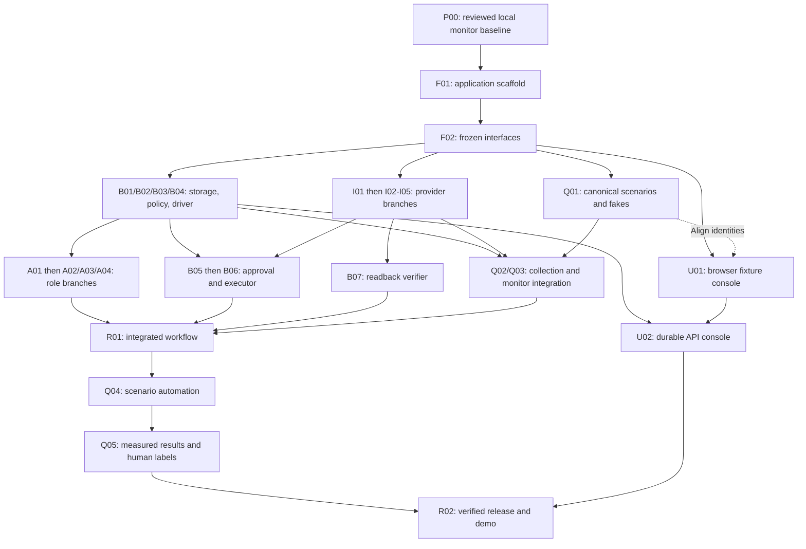

# Branch plans and merge order

Start here to assign work. There are **29 proposed branches with 31 planned
commits**, including P00 to save the existing local monitor before feature work.
Each branch has its own Markdown file; each commit has a separate file under
[`commits/`](../commits/README.md). No Git branches, commits, or pushes are created
by writing these plans. The current monitor remains a partial application foundation.

The [reliability implementation plan](../06-agent-reliability-implementation.md)
now defines the audit-driven acceptance work for these same branches. Read its
contracts, temporal completion cases, and evidence handoffs with the detailed
commit brief. Original AI quality, trace/process correctness, and independent
app outcomes all remain P0 evidence; optional trace hosting does not replace them.
The [frontend pipeline and reliability guide](../09-frontend-pipeline-and-reliability.md)
defines the one-screen surface, DTO/state contract, component/browser tests, and
file-level joins for foundation, API, fixture, UI, report, and release branches.

The September 14 working-tree review found no uncommitted frontend/API/browser
implementation to assign. Frontend work therefore begins with F01. Q01 and U01
are sibling layer-3 branches after F02: Q01 owns canonical scenario truth, U01
owns browser display fixtures, and P4 aligns their IDs before U02/R01 rather than
making either branch import the other's unmerged files.

```text
implementation-plan/
  branches/README.md                 branch order and team rules
  branches/feat-foundation.md        F01 then F02 on one branch
  branches/feat-operator-console.md  U01 then U02 on one branch
  branches/feat-agent-analyst.md     analyst branch and its A02 handoff
  commits/README.md                  every commit, grouped by workstream
  commits/F01.md                     one concrete commit brief
  commits/A02.md                     one concrete commit brief
   09-frontend-pipeline-and-reliability.md  canonical browser execution plan
  Global Scale.md                    real completion and evidence
```

## LLM and app integration ownership

The [LLM guide](../07-agent-spawning-and-llm-integration.md) assigns the model
client/runtime to `feat/agent-runtime` and the three role entry points to their
agent branches. The [external-app guide](../08-mcp-api-and-external-app-integration.md)
assigns common transport to `feat/adapter-core` and each business app to its own
adapter branch. Foundation owns configuration/types; `feat/workflow-integration`
owns `composition.ts`, `workflow/graph.ts` and `workflow/nodes.ts` where these
modules become a real workflow. Backend, evaluation and UI branches consume only
their documented narrow interfaces. See the linked commit briefs for exact steps.

REST is required for this MVP. A future MCP transport needs foundation-owned
dependencies/configuration and adapter conformance before assembly; it cannot be
added privately by a role branch. Shared credentials and live test accounts must
not be embedded in branches or reused concurrently for destructive fixture resets.

## Branch execution rules

1. **Save the shared baseline first:** P00 preserves the reviewed monitor and
   associated documentation from the dirty tree. User-owned ideation relocations
   must be accounted for without discarding them. Record the merged baseline SHA.
2. **Build the common seam:** F01 extends the existing Node/TypeScript scaffold;
   F02 freezes application interfaces while reusing the existing reliability
   contracts. These are remaining application tasks, not a request to rebuild the monitor.
3. **Branch from reviewed `main`:** create a feature branch/worktree once its
   interface is stable. It can start against frozen interfaces before an upstream
   implementation lands, but its PR must list missing hard prerequisites. Refresh
   it from reviewed `main` and satisfy those gates before merging.
4. **Use incremental PRs for branches with two commits:** `feat/foundation` can
   land F01 before F02; `feat/operator-console` can land U01 before B04 enables U02.
   Keep the branch for its second commit or recreate it from the updated `main`.
   Do not block ready consumers by waiting for the branch's unrelated later gate.
5. **Merge one PR at a time:** check the resulting integration state, preserve the
   task-ID-to-SHA mapping, and update Global Scale. Never force-push a shared branch
   or switch a teammate's worktree to another branch.
6. **Serialize shared files:** P1 owns root package/configuration, shared schemas,
   migration numbering, graph composition, API mounts, and the final integration.
   Other owners request a reviewed change at that seam. B01 and Q03 must share one
   application transaction for state/event/job persistence; separate SQLite files
   with sequential appends do not satisfy that requirement.
7. **Reuse the monitor deliberately:** Q03 integrates the existing storage/worker/
   assessment behavior; Q05 extends its metrics and labels. Preserve first-proposal
   versus final-outcome scoring, job exhaustion, censored latency, and causal recovery
   checks. B01's narrow store refactor lands before Q03 edits the same boundary.
8. **Keep release claims conditional:** B08 automatic recovery, U03 richer metrics
   UI, and Q06 LangSmith are optional. They may develop after their own prerequisites,
   but cannot consume the time reserved for required evidence. If included, their
   checks and affected Q04/Q05 results become additional R02 release gates.
9. **Version reliability semantics:** F02 freezes schema v2 and `monitor-v2`
   contracts; B01 owns compatibility/storage changes; Q03 owns assessor and
   claim-verdict changes; Q05 owns aggregation. Legacy v1 counters and receipts
   retain their meaning. Q02/Q03 can develop independently against frozen receipt
   fixtures; R01 must join their real observation path before live claims.

Code may be developed in parallel; the live runtime still orders analyst → drafter
→ auditor, approval, protected writes with independent readback, then verified Slack
finalization. Planning additional branches never authorizes parallel writes to one incident.

## Exact dependency layers

These are dependency layers, **not days, time estimates, or 29 simultaneous
staffed tasks**. Members of a layer may overlap only when different people/files
are available. A branch can move as soon as its individual prerequisites land;
it need not wait for unrelated members of an earlier layer.

- **Layer 0:** P00.
- **Layer 1:** F01 after P00.
- **Layer 2:** F02 after F01.
- **Layer 3:** B01, I01, U01, Q01 after F02.
- **Layer 4:** B02, B04, I02, I03, I04, I05, A01, Q03 after their layer-3 prerequisites.
- **Layer 5:** B03, B07, A02, A03, A04, U02, Q02. Optional Q06 can start after B01/Q03.
- **Layer 6:** B05 after B01/B03/B04/I04.
- **Layer 7:** B06 after B01/B03/B05/I02/I03/I05.
- **Layer 8:** R01 after its full integration checklist.
- **Layer 9:** Q04 after R01/Q01/Q02/Q03.
- **Layer 10:** Q05; optional B08 can now integrate after R01/Q04.
- **Layer 11:** R02 when required gates pass; optional U03 is ready after U02/Q05.
  If optional capabilities are selected, R02 waits for their tested final versions
  and refreshed scenario/metric evidence. Do not silently treat them as mandatory
  for a release that explicitly excludes their claims.
- **Conditional layer 12:** R02 follows U03 if that richer UI is selected for the
  release. B08/Q06 also need their own checks and refreshed downstream evidence;
  the layer number alone does not prove those checks passed.



The diagram groups modules for readability; commit files and the exact layers
above determine readiness. Optional branches are governed by rule 8.
The audit update does not add Q02 as a hard dependency of Q03: the assessor can
accept missing evidence as unverified and test complete fixture receipts. Q02
and Q03 are both hard prerequisites of R01. Q05 review/report preparation may
start early against contracts, but its hard merge gate still follows Q04.

## Four-contributor starting allocation

- **P1:** P00 → F01/F02 → B01/B04 → B05/B06 → R01 → R02. Integrates shared-file
  changes and reviews the store/monitor transaction boundary.
- **P2:** I01, then prioritize Slack/Gmail access while GitHub/HubSpot adapters
  are assigned to available contributors. Help Q02 collection after provider handoff.
- **P3:** B02/B03 and A01, then assign A02/A03/A04 and B07 as separate ready tasks.
  Their folders are independent; their live model order remains sequential.
- **P4:** freeze Q01 scenario/oracle identities, then move to U01 while delegated
   P2/P3 contributors can finish disjoint provider/model fake files. Align IDs
   before U02/R01, then take Q03/U02/Q02 as gates open, followed by Q04/Q05 and
   demo evidence. Delegate a ready collector or UI component to a freed teammate;
   preserve independent expectations and labels rather than self-approving them.

One contributor owns one active implementation PR at a time. A waiting owner can
review another branch or prepare fixtures in disjoint files. With two people,
combine P1/P3 and P2/P4 and take the same dependency-ready queue sequentially;
with one, use the dependency layers above. Do not promise a completion date from
these commit counts; select scope against the actual remaining deadline.

## Shared baseline and foundation branches

- [`chore/monitor-baseline`](chore-monitor-baseline.md) — [P00](../commits/P00.md); owner P1.
- [`feat/foundation`](feat-foundation.md) — [F01](../commits/F01.md) → [F02](../commits/F02.md); owner P1.

## Backend, policy, approval, execution branches

- [`feat/durable-core`](feat-durable-core.md) — [B01](../commits/B01.md); owner P1.
- [`feat/selection-policy`](feat-selection-policy.md) — [B02](../commits/B02.md); owner P3.
- [`feat/plan-policy`](feat-plan-policy.md) — [B03](../commits/B03.md); owner P3.
- [`feat/workflow-driver`](feat-workflow-driver.md) — [B04](../commits/B04.md); owner P1.
- [`feat/slack-approval`](feat-slack-approval.md) — [B05](../commits/B05.md); owner P1.
- [`feat/guarded-execution`](feat-guarded-execution.md) — [B06](../commits/B06.md); owner P1.
- [`feat/readback-verifier`](feat-readback-verifier.md) — [B07](../commits/B07.md); owner P3.
- [`feat/durable-recovery`](feat-durable-recovery.md) — [B08](../commits/B08.md); owner P1.

## Provider adapters branches

- [`feat/adapter-core`](feat-adapter-core.md) — [I01](../commits/I01.md); owner P2.
- [`feat/github-adapter`](feat-github-adapter.md) — [I02](../commits/I02.md); owner P2.
- [`feat/hubspot-adapter`](feat-hubspot-adapter.md) — [I03](../commits/I03.md); owner P2.
- [`feat/slack-adapter`](feat-slack-adapter.md) — [I04](../commits/I04.md); owner P2.
- [`feat/gmail-adapter`](feat-gmail-adapter.md) — [I05](../commits/I05.md); owner P2.

## Agent runtime and three model roles branches

- [`feat/agent-runtime`](feat-agent-runtime.md) — [A01](../commits/A01.md); owner P3.
- [`feat/agent-analyst`](feat-agent-analyst.md) — [A02](../commits/A02.md); owner P3.
- [`feat/agent-drafter`](feat-agent-drafter.md) — [A03](../commits/A03.md); owner P3.
- [`feat/agent-auditor`](feat-agent-auditor.md) — [A04](../commits/A04.md); owner P3.

## Frontend branches

- [`feat/operator-console`](feat-operator-console.md) — [U01](../commits/U01.md) → [U02](../commits/U02.md); owner P4.
- [`feat/evaluation-view`](feat-evaluation-view.md) — [U03](../commits/U03.md); owner P4.

## Evidence, monitoring, and evaluations branches

- [`feat/evaluation-fixtures`](feat-evaluation-fixtures.md) — [Q01](../commits/Q01.md); owner P4.
- [`feat/evidence-collector`](feat-evidence-collector.md) — [Q02](../commits/Q02.md); owner P4.
- [`feat/reliability-monitor`](feat-reliability-monitor.md) — [Q03](../commits/Q03.md); owner P4.
- [`feat/scenario-harness`](feat-scenario-harness.md) — [Q04](../commits/Q04.md); owner P4.
- [`feat/evaluation-metrics`](feat-evaluation-metrics.md) — [Q05](../commits/Q05.md); owner P4.
- [`feat/langsmith-export`](feat-langsmith-export.md) — [Q06](../commits/Q06.md); owner P4 or freed P2.

## Integration and release branches

- [`feat/workflow-integration`](feat-workflow-integration.md) — [R01](../commits/R01.md); owner P1.
- [`chore/demo-release`](chore-demo-release.md) — [R02](../commits/R02.md); owner P1 with P4 as demo owner.

## Handoff that every branch must supply

Supply the actual base/commit SHA, prerequisite PRs, owned paths, passing commands,
failed or unrun checks, fixture/policy/prompt/model/evaluator versions, evidence
mode, remaining limits, and named receiving owner. The [individual commit files](../commits/README.md)
hold the checklists; [Global Scale](../Global%20Scale.md) holds the completion
verdict. Synthetic checks, human labels, model calls, and live provider workflows
are distinct evidence categories and must remain distinct in the handoff.
