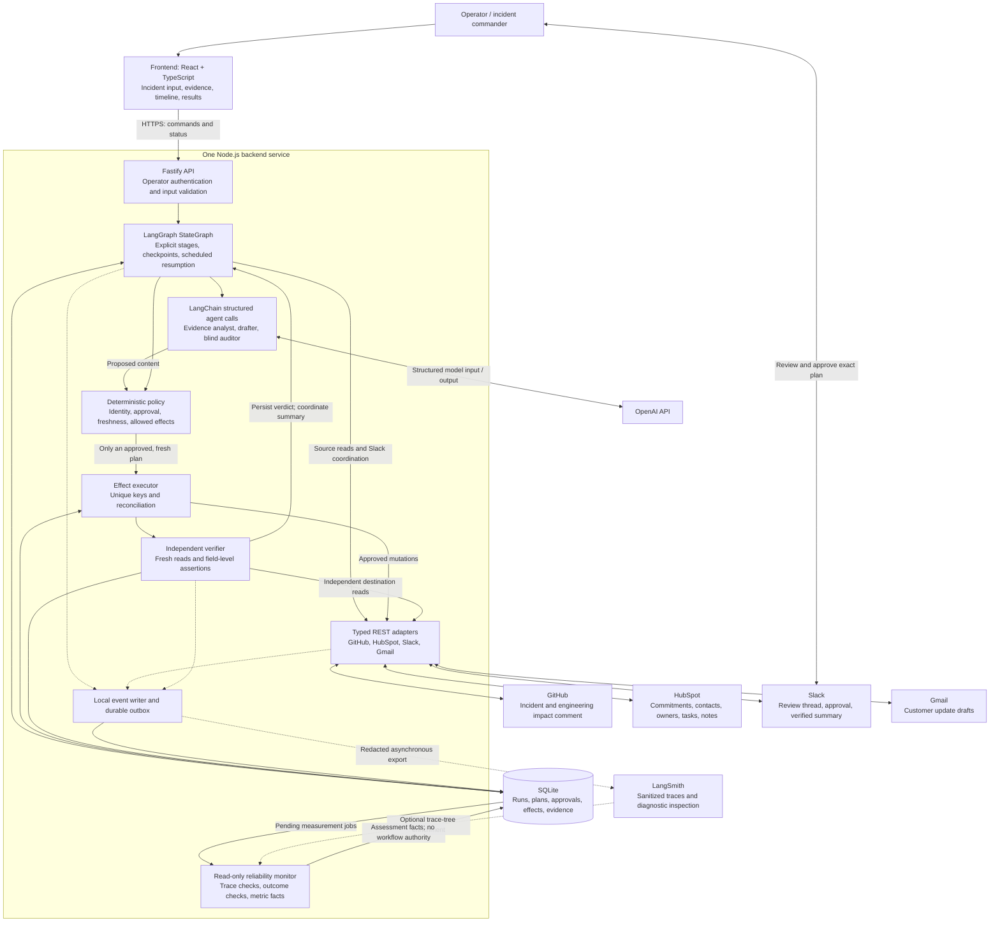
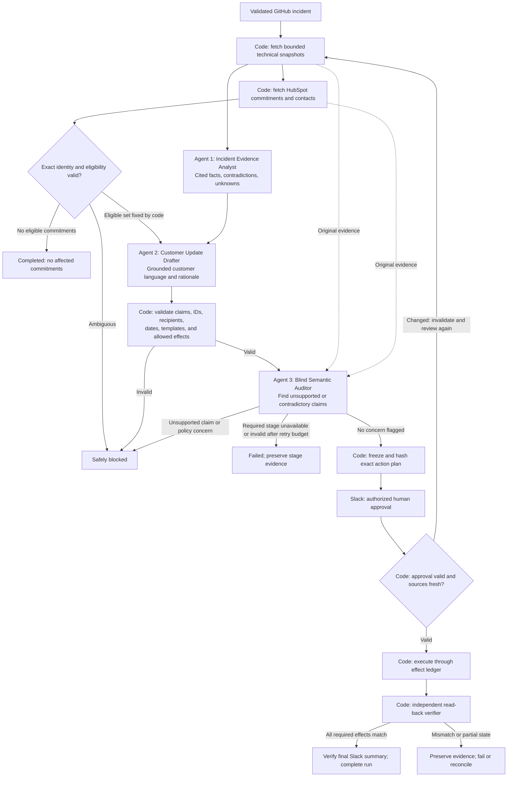
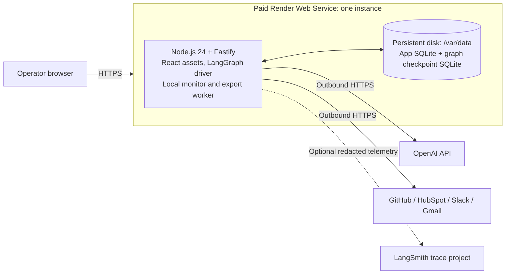
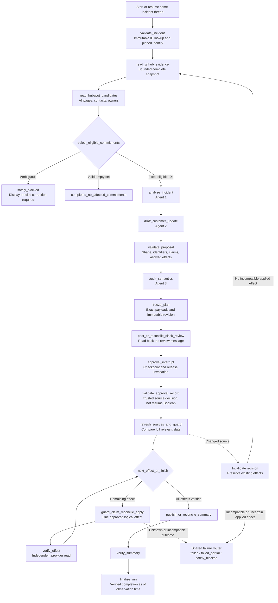
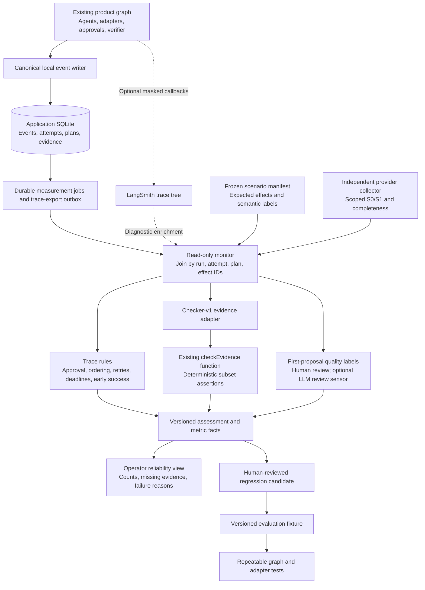

# PromiseGuard: Fine-Grained Agent and Reliability Architecture

**Status:** Proposed application architecture; implementation and deployment have
not started. The repository's offline evidence checker/tests are runnable, but
do not implement or demonstrate this agent workflow. The
[demo and reliability plan](demo-scenarios-and-reliability.md) is the source of
truth for scenario coverage, measured evidence, and remaining work.

**Basis:** [Final project proposal](final-project-promiseguard.md) and the
[reliability standard](winning-ideas.md#2-reliability-standard-for-every-idea).
The final proposal defines the product scope. This design adds explicit agent
roles to meet the requested multi-agent direction.

**Current design decision:** use **LangGraph + LangChain + LangSmith** for
orchestration, structured agent calls, and trace inspection respectively. This
refines the implementation of the existing pipeline; it adds no new business
app or autonomous customer action. The application/frameworks and monitor remain
proposed. The existing offline checker is the only runnable reliability component.

The business order stays: **GitHub incident → exact HubSpot selection → evidence
analysis and drafting → checks/audit → Slack approval → fresh-state guards →
HubSpot task/note + Gmail draft + GitHub comment → independent verification →
verified Slack summary**. Sections 13–18 specify the finer runtime and monitoring
design; the adjacent demo document remains the acceptance and metric contract.

Jump to the [agent graph](#13-fine-grained-langgraph-execution-design),
[checkpoint and approval mechanics](#14-checkpoints-approval-interrupts-and-replay-safe-execution),
[trace-monitoring pipeline](#15-trace-collection-and-reliability-monitoring-pipeline),
or [measurement engines](#16-measurement-engines-and-integration-with-the-existing-checker).

## 1. Recommended stack

Build a **React frontend, a TypeScript backend containing three bounded agents,
and a SQLite database**. Run them as one application, locally first and on a
**paid Render Web Service with a persistent disk** when a hosted demo is needed.

- **Frontend:** React + TypeScript + Vite, with simple CSS. One operator screen
  shows incident evidence, affected promises, approval status, and verified work.
- **Backend:** Node.js 24 LTS + Fastify + Zod. The backend owns orchestration,
  credentials, policy, integrations, and verification. This is the proposed app
  runtime; the separate offline checker also supports the local Node 18 runtime.
  [Node.js release status](https://nodejs.org/en/about/previous-releases)
- **Orchestration:** `@langchain/langgraph` supplies `StateGraph`, explicit
  conditional edges, durable checkpoints, and interrupt/resume. It implements
  the same bounded state machine; it does not choose permissions or business
  effects. [LangGraph Graph API](https://docs.langchain.com/oss/javascript/langgraph/graph-api)
- **Agent composition:** `@langchain/core` supplies prompt/runnable interfaces;
  `@langchain/openai` supplies `ChatOpenAI` and `withStructuredOutput()`. Keep
  three distinct prompt/schema/context boundaries for the Evidence Analyst,
  Customer Update Drafter, and Blind Semantic Auditor. Use `useResponsesApi: true`
  for the planned OpenAI Responses transport and validate the actual model/schema
  combination in a smoke test. Pin the tested model and package releases.
  [ChatOpenAI integration](https://docs.langchain.com/oss/javascript/integrations/chat/openai)
- **Graph persistence:** `@langchain/langgraph-checkpoint-sqlite` supplies
  `SqliteSaver`. Its checkpoint records are separate from application effects,
  approvals, and evidence. [LangGraph checkpointers](https://docs.langchain.com/oss/javascript/langgraph/checkpointers)
- **Database:** SQLite with `better-sqlite3`, SQL migrations, and unique effect
  keys. It stores workflow memory and audit evidence, while GitHub and HubSpot
  remain authoritative for their business records.
- **Integrations:** Typed REST adapters for GitHub, HubSpot, Slack, and Gmail.
- **Trace inspection:** `langsmith` supplies the LangSmith client and tracing
  integration. Local structured events remain durable evidence; sanitized
  LangSmith traces provide a navigable view and optional diagnostic enrichment.
  [Trace LangGraph applications](https://docs.langchain.com/langsmith/trace-with-langgraph)
- **Measurement:** a local read-only monitor joins traces, the frozen scenario
  contract, independent provider reads, and semantic labels. It runs the existing
  checker plus additional approval, ordering, and quality checks.
- **Testing:** keep the existing `node:test` checker suite. Add TypeScript graph
  and fake-adapter tests with Vitest when the application exists, followed by the
  canonical live-account scenarios. Framework tracing is not an evaluation result.

This is one deployable application with separate internal modules. Multiple
agents do not require multiple servers, databases, or model providers.
Use the named packages directly; the top-level `langchain` package, a generic
ReAct executor, CrewAI, and a second orchestration framework are unnecessary.
No framework dependencies have been installed or compatibility-tested in this
repository. Resolve compatible published releases and commit a lockfile during
implementation instead of copying version numbers from examples.

## 2. Overall architecture diagram



The adapter layer exposes separate read, coordination, and mutation interfaces.
Only the executor receives HubSpot/GitHub/Gmail mutation capabilities. Agents
receive bounded data and return proposals; they never receive provider tokens.

## 3. Frontend: a small operator console

Use one screen with four sections:

1. **Start or reopen a run:** paste an allowlisted GitHub incident URL. A replay
   opens the existing incident run and reconciles its effects.
2. **Evidence and promises:** show the incident, cited technical facts, selected
   commitments, excluded commitments with reasons, and uncertainty about cause.
3. **Plan and approval:** show each proposed action and the exact recipient,
   subject, and email body. Link to the Slack review thread and show its status.
4. **Results:** show the three agents' stages, created/reused records, read-back
   checks, failures, and the evaluation scorecard with raw passes/runs.

Poll the backend for status approximately every two seconds while a run is
active. Closing the browser does not cancel backend work. Slack is the approval
authority for the MVP; a UI button must not bypass it.

Build the frontend into static assets and serve them from Fastify using its
static-file plugin. This keeps the UI and API on one origin. Vite produces the
deployment assets; the backend serves them.
[Vite production builds](https://vite.dev/guide/build)

## 4. Backend: ownership and execution

The API accepts commands quickly; the workflow continues outside the HTTP
request. Persist the run before returning its ID. A small driver in the same
process claims runnable records from SQLite and invokes/resumes their LangGraph
threads. LangGraph owns node progression; the driver owns scheduling and one
active invocation per incident. The application effect ledger owns remote writes.

Minimal endpoints:

- `POST /api/runs`: validate an incident URL and create or return its run.
- `GET /api/runs/:id`: return evidence, plan, approval status, effects, and verdict.
- `GET /api/runs/:id/events?after=<cursor>`: return new redacted timeline events.
- `POST /api/runs/:id/reconcile`: inspect a partial run and resume only work whose
  approval and source state are still valid.
- `GET /api/evaluations/latest`: return the saved evaluation report.
- `GET /healthz`: report readiness after database initialization.

Use an operator login with a server-side session, an HTTP-only secure cookie,
and CSRF protection on command routes for the hosted demo. Store provider
credentials and the model key in server-side secrets. Restrict incident
repositories, CRM account, Slack channel, approvers, and Gmail mailbox through
configuration. Treat an incident URL as an identifier to parse, never as an
arbitrary URL for the server to fetch.

The coordinator owns transitions, retry budgets, deadlines, and resumption.
The executor owns side effects. The verifier alone determines whether required
effects match the approved plan. Persist `awaiting_approval` and release the
worker between Slack polls; do not hold a database transaction or model session
open while waiting for a human.

## 5. Multi-agent schematic



### Agent 1: Incident Evidence Analyst

**Input:** GitHub issue fields, referenced deployment/commit, bounded workflow
results, and stable source references.

**Output:** `IncidentAssessment` containing cited facts, contradictions, unknowns,
and a candidate-change explanation. Code determines whether the available
evidence permits a causal assertion. A recent deployment alone supports
investigation, not a proven root cause.

### Agent 2: Customer Update Drafter

**Input:** validated assessment, source facts, and the customer commitments
already selected by deterministic service/status/owner/due-date policy.

**Output:** `DraftProposal` with customer-update text and claim-to-source
references. Code supplies the recipient, subject marker, owner IDs, dates, and
action types. The agent cannot add recipients, broaden impact, or promise an
unsupported recovery date. For the seeded demo, use one eligible commitment and
one draft; additional commitments receive separate, explicitly approved effects.

### Agent 3: Blind Semantic Auditor

**Input:** original source snapshots, proposed customer text, claim references,
and the supported task contract. Exclude the other agents' reasoning and any
self-assessed confidence.

**Output:** `AuditFindings` identifying unsupported claims, contradictions, or
omissions. A concern blocks this plan for review. The auditor cannot grant
approval or override a deterministic failure.

The auditor remains a fallible supplementary check and can share the other
agents' biases. A clean audit does not prove factual correctness; labeled
evaluations must measure missed claims and false blocks.

Each agent has its own prompt, input/output schema, trace span, and fixed token
and time budget. Use one logical invocation per agent per plan revision; permit
only bounded transport/schema retries. There is no open-ended agent debate.
Implement each role as `prepare scoped input → LangChain prompt/model runnable →
Zod and reference validation → immutable result record`. Keep the unedited first
proposal before any repair. Detailed graph boundaries are specified below.

The final proposal makes the auditor optional. This architecture includes it in
the intended three-agent build to satisfy the requested schematic. If it is
explicitly removed from a later reduced release, disclose the two-agent design
and rerun its evaluations; do not silently skip a failed auditor during a run.

## 6. Approval-to-execution sequence

```mermaid
sequenceDiagram
    actor Operator
    participant UI as React UI
    participant Backend as Coordinator + agents
    participant DB as SQLite
    participant Slack
    participant Apps as HubSpot / Gmail / GitHub
    participant Verify as Independent verifier

    Operator->>UI: Submit incident URL
    UI->>Backend: Start or reopen run
    Backend->>DB: Persist run and source snapshots
    Backend->>Backend: Select commitments, analyze, draft, audit
    Backend->>DB: Save immutable plan and plan hash
    Backend->>Slack: Post or reuse exact review thread
    Backend->>Slack: Read back proposal
    Backend->>DB: Checkpoint awaiting_approval
    Operator->>Slack: approve runId hashPrefix
    Backend->>Slack: Read and validate approval
    Backend->>Apps: Re-read incident, full eligible set, owners, contacts
    alt Approval expired/rejected or relevant state changed
        Backend->>DB: Invalidate approval; retain applied effects
        Backend->>Slack: Request review of revised plan
    else Exact plan remains valid
        loop Each approved logical effect
            Backend->>Backend: Recheck decision/expiry; refresh expired source snapshot
            Backend->>DB: Claim unique effect key; record inflight
            Backend->>Apps: Reconcile existing object or apply missing effect
            Backend->>DB: Record provider ID and applied state
            Verify->>Apps: Independently retrieve object
            Verify->>DB: Save field checks and verified state
        end
        Backend->>Slack: Update thread with verified links and verdict
        Verify->>Slack: Read back final summary
        Verify->>DB: Complete only if all assertions pass
    end
    UI->>Backend: Fetch persisted status and results
```

Slack review messages are permitted coordination effects before approval.
HubSpot tasks/notes, GitHub comments, and Gmail drafts require approval first.
Rejecting an initial plan with no protected effects yields `safely_blocked`;
after applied or uncertain protected writes, preserve `failed_partial` instead.
An unexpired undecided plan remains
at the resumable `awaiting_approval` checkpoint. That checkpoint is not terminal
success. Apply a configured human-response deadline and report its expiry.

## 7. Database: required for the reliability contract

**Yes, PromiseGuard needs a database.** It must remember an approval across
restarts, distinguish applied work from missing work, and avoid repeating an
external write. In-memory state cannot provide those properties after a crash.

Use these logical tables:

- **`runs`:** run ID, unique immutable repository/issue identity, pinned incident
  fingerprint, state, policy/model/prompt versions, next attempt time, and last
  error. Source edits cannot create a second run for the same issue.
- **`snapshots`:** provider, source ID, relevant source version/hash, capture time,
  and the minimum evidence fields needed for review and verification.
- **`agent_results`:** agent name, plan revision, structured output, referenced
  snapshots, token usage, latency, and validation outcome.
- **`plans`:** immutable plan revision, selected records, exact action payloads,
  draft text, evidence hashes, and plan hash.
- **`approvals`:** plan hash, Slack workspace/channel/thread/message IDs, approver,
  decision, creation time, and expiry.
- **`effects`:** unique effect key, app, operation, target, approved plan reference,
  state, provider ID, attempt metadata, and expected payload hash.
- **`verifications`:** effect/run ID, assertion, expected and observed values or
  hashes, evidence references, check time, and verdict.
- **`events`:** append-only transition and tool-call metadata, including actor,
  operation, latency, retries, and result IDs.
- **Graph checkpoints:** framework-owned state/pending-write records in
  `langgraph-checkpoints.sqlite`, separate from `promiseguard.sqlite` application
  tables. Store references rather than full provider responses in graph state.
- **`effect_attempts` and `run_attempts`:** dispatch/retry/unknown-outcome history
  and fresh invocation IDs; never collapse attempts into the final effect row.
- **`evaluation_attempts`:** frozen scenario/cohort identity and runtime-attempt
  mappings spanning approval resumes and retries; separately label repair legs.
- **`measurement_jobs` and `trace_exports`:** durable local work queues with
  deduplication keys, retry schedules, and completion/error state.
- **`assessments`, `metric_facts`, and `proposal_labels`:** versioned evaluations,
  raw numerators/denominators, first-proposal labels, and human corrections.

Enable foreign keys, short transactions, and one active executor per incident.
Persist checkpoints and scheduling times in SQLite so the process can resume
after restart. Keep raw tokens out of these tables and redact personal data from
logs. Exact draft content belongs in restricted plan storage because approval
and verification need it; general trace logs should contain hashes/references.

For the single-instance MVP, enforce one backend process and a serialized
per-incident execution queue. Atomically claim the unique effect row in a short
SQLite transaction before dispatch; a competing request attaches to the existing
run instead of starting a second writer. Do not release an inflight claim simply
because its request timed out. On restart, reconcile pending claims before further
writes. A unique key alone does not prevent two workers from both calling a
provider; multi-process operation needs fencing/ownership enforcement and is
outside this prototype's supported deployment mode.

No vector database is needed. Customer selection uses exact service, company,
commitment, owner, and contact identifiers. Semantic similarity must not decide
which customer receives follow-up. Redis and a separate message broker are also
unnecessary for the single-instance MVP.

## 8. External adapters and reliability boundaries

### Four app adapters

Every list/search adapter must paginate to completion within configured page,
record, response-size, and time budgets. An exhausted budget, malformed page,
authorization error, or failed page means incomplete evidence; it cannot be
normalized to an empty list. Store completeness and source-read timestamps.

- **GitHub:** read the incident and technical evidence; find, create, retrieve,
  or update one marked impact comment after approval. Never change code or close
  the incident. Keep customer email bodies out of the engineering comment.
- **HubSpot:** read companies, commitment tickets, owners, and designated
  contacts; find/create/read one task and one internal note per selected
  commitment. Verify company/commitment associations as well as content.
- **Slack:** post/update/read one review thread and retrieve approval replies.
  Parse only the documented approval command from an allowlisted human in the
  correct workspace/thread. Implement pagination, check Slack's `ok` field, and
  respect the installation's rate limits. Smoke-test thread reads with the actual
  token and channel before committing to polling.
  [Slack thread retrieval](https://docs.slack.dev/reference/methods/conversations.replies/)
- **Gmail:** create/get drafts and implement `findDraftsByEffectMarker` using
  draft listing plus full read-back. List/get accepts `gmail.compose`; a returned
  list entry alone does not contain the body needed for verification.
  [List drafts](https://developers.google.com/workspace/gmail/api/reference/rest/v1/users.drafts/list),
  [Get a draft](https://developers.google.com/workspace/gmail/api/reference/rest/v1/users.drafts/get)

Gmail's compose scope also permits sending. Enforce the draft-only product
boundary through narrow adapter methods and no model-accessible generic request
function. Keep test-draft deletion in a separate fixture cleanup utility.
[Gmail scopes](https://developers.google.com/workspace/gmail/api/auth/scopes)

### Supported source and selection contract

Accept only an allowlisted repository issue with valid typed incident fields,
supported service/environment, open state, nonfuture start time, and explicit
customer impact. Malformed, unsupported, conflicting, closed, or non-impacting
incidents safely block before consequential writes. Pin normalized identity on
first ingestion; changes to incident/service/environment identity require review,
not a new fingerprint and second execution. Transport failures produce `failed`
(or `failed_partial` after applied effects), not a business no-op.

Enumerate the full candidate commitment set, validate typed service/status/date
and unique company/owner/contact associations, then apply exact policy. A
malformed potentially affected commitment blocks selection rather than silently
disappearing. Define horizon inclusivity, UTC/date conversion, and overdue
handling in versioned policy. Only a complete valid query with no eligible
commitments permits `completed_no_affected_commitments`.

### State-bound approval

Compute the approval hash over canonical incident identity, source versions,
selected commitment/contact/owner IDs, policy version, exact email recipient,
subject/body, and every proposed effect. The displayed hash prefix identifies
the stored full hash; require a unique match and an unexpired approval from an
authorized human Slack user, in the configured workspace/channel and exact review
thread. Independently retrieve the proposal and decision, reject bot/app-authored
messages, and ignore malformed, unrelated, superseded, or replayed approvals.
Treat edited/deleted approval messages as invalid unless revalidated through a
new review. Persist the approver, message ID/version, decision, full plan hash,
and receipt/expiry timestamps. Rejection closes that revision to execution; later
approval cannot revive it. A new review must use a new revision and fresh decision.

Re-query the full eligible commitment set and relevant GitHub/HubSpot fields
after approval and before remaining writes on a resumed run. A changed owner,
recipient, due date, incident state, selected set, or payload invalidates the
plan. Set explicit freshness and approval-expiry limits in configuration.
Immediately before every remaining mutation, revalidate decision/rejection and
expiry, and re-read sources if the freshness limit has elapsed. Unavailable
approval/source reads cannot authorize writes. Stop when approval expires or is
rejected, even if earlier effects already succeeded. These checks bound staleness;
they cannot make independent provider reads and writes atomic or remove a change
that races the final check.

Keep Gmail text independent of destination IDs created later. Where internal
records need future links, the approved plan must include exact templates and
permitted deterministic ID substitutions. Do not ask a model to rewrite approved
content after approval.

### Idempotency and partial failure

```text
runIdentity = (repositoryId, immutableIssueId)
incidentFingerprint = SHA256(canonicalPinnedIncidentIdentity)
effectKey = SHA256(incidentFingerprint | app | targetRecordId | actionType)
effect state: planned -> inflight -> applied -> verified
```

Here `targetRecordId` is a stable source identity: the commitment ID for HubSpot
and Gmail effects, the incident issue ID for the GitHub comment, and the incident
fingerprint for Slack coordination. It is never a newly created destination ID.
`canonicalPinnedIncidentIdentity` contains the immutable source identity plus
validated incident/service/environment fields pinned on initial ingestion. Use
unambiguous canonical serialization for all key inputs.

Use the fingerprint across incident replays. Plan revisions do not create new
effect identities. A unique database constraint and a single active writer
prevent two local workers from creating the same logical effect.

Before a write, search for its provider marker and check equivalent existing
work against exact fields and associations. After a timeout or restart with an
`inflight` effect, reconcile provider state before retrying. Adopt one exact
match; block on conflicting or multiple matches. After an ambiguous write, an
empty search result is not proof that no object was created: use bounded settling
reads and require manual review if the outcome remains unknown.

Preserve successful effects if a later app fails. Report `failed_partial` and
repair only missing effects under valid approval. Do not automatically delete
successful work or recreate a human-edited/missing Gmail draft.

On a revised plan, compare each already-applied effect with that revision's exact
expected fields. Retain its original approval/plan reference. A matching effect
may be adopted with explicit compatibility evidence; an incompatible owner,
recipient, body, association, or removed commitment requires `failed_partial` and
manual review. Do not create a replacement under a new key or overwrite the old
HubSpot/Gmail object. Show old and active revisions separately; retained stale
work cannot satisfy the new plan's completion checks. Resolve it through an
operator-reviewed remediation outside the prototype's automatic repair path.

The intended contract is **idempotent logical effects with reconciliation**. Fresh reads
and local locks cannot provide atomic transactions across independent providers
or eliminate every race with a human actor.

### Independent verification and permitted outcomes

The verifier fetches destination state itself. Check task ownership and
associations, note/comment content, cross-links, and Gmail draft status, recipient,
subject, and decoded body against the approved canonical content. Check the final
Slack summary too. Inspect event history for forbidden operations and duplicates;
an HTTP success or an agent's statement of completion is insufficient.

The runtime can establish that the inspected object is a draft and its own
executor issued no send operation. It cannot establish that no other mailbox
actor ever sent a message. Provider traces and known initial/final state in the
test harness strengthen that evidence without broadening the worker's authority.

Terminal outcomes are `completed`, `completed_no_affected_commitments`,
`safely_blocked`, `failed_partial`, and `failed`; `awaiting_approval` is a
resumable checkpoint. Completion means verified customer-follow-up coordination, not incident resolution or
customer notification.

## 9. Hosting and deployment



**Recommended hosted configuration:**

- Build React assets and compile the backend in the build step.
- Start Fastify on `0.0.0.0` using Render's `PORT` environment variable.
  [Render web services](https://render.com/docs/web-services)
- Pin a tested Node 24 version rather than relying on the platform default.
  [Render Node versions](https://render.com/docs/node-version)
- Mount a persistent disk at `/var/data`; set
  `DATABASE_PATH=/var/data/promiseguard.sqlite`. Run migrations at application
  startup before readiness, because the disk is available at runtime, not during
  builds or pre-deploy commands. Only files inside the mount persist.
  [Render persistent disks](https://render.com/docs/disks)
- Keep the polling/execution loop in this same service. Render disks attach to
  one instance and cannot be shared with a separate worker. This configuration
  trades horizontal scaling and zero-downtime deploys for simplicity.
  [Render disk limitations](https://render.com/docs/disks)
- Use paid compute for this deployment: free web services cannot attach a
  persistent disk and can spin down after inactivity.
  [Render free-service limitations](https://render.com/docs/free)

This recommendation incurs hosting and model-usage costs; no specific price or
credits are assumed. For a zero-hosting-cost hackathon demo, run the same app on
the team laptop with a persistent local SQLite file. External APIs still require
internet access, and model usage may cost money.

Local execution is the first delivery target. Add hosted demo access only after
the core reliability gates pass, consistent with the proposal's time budget.
Public production deployment is a later phase. A separate Vercel frontend,
Kubernetes cluster, or dedicated agent server is unnecessary for this build.

## 10. Suggested code layout

```text
src/
  web/                    # React operator console
  server/
    api/                  # Auth, commands, status, health
    workflow/             # LangGraph state/schema, graph, driver, wait nodes
    agents/               # Scoped prompts, structured calls, role output schemas
    policy/               # Eligibility, claims, approval, freshness
    adapters/             # GitHub, HubSpot, Slack, Gmail
    execution/            # Effect claiming, writes, reconciliation
    verification/         # Independent read-back assertions
    storage/              # Application SQLite, separate graph SqliteSaver
    observability/        # Event writer, redaction, LangSmith bridge, export outbox
    monitoring/           # Trace reader, rule checks, measurement worker
    evaluations/          # Manifest validation, evidence export, labels, metrics
  shared/                 # Zod contracts shared with the UI
tests/
  reliability/            # Existing dependency-free checker tests
  fixtures/               # Seeded worlds and injected failures
  adapters/               # API contract tests
  scenarios/              # End-to-end reliability checks
```

## 11. Build order and proof of reliability

The [390-minute build plan](final-project-promiseguard.md#13-390-minute-build-plan)
is the original estimate. Use actual remaining time and the
[demo-plan priorities](demo-scenarios-and-reliability.md#12-remaining-build-decisions-and-prioritized-checklist),
adding distinct analyst/drafter/auditor modules in the model-work phase.

1. **Integration gate:** prove reads, writes, and read-back in all four test apps,
   including Gmail OAuth and Slack approval-thread retrieval.
2. **Durable core:** define contracts, SQLite records, deterministic selection,
   fake adapters, and state transitions.
3. **Agent pipeline:** add the analyst, drafter, auditor, and frozen plan payload.
4. **Approved effects:** implement Slack approval, freshness checks, effect keys,
   writes, reconciliation, and independent verification.
5. **Operator console and demo:** expose persisted evidence and outcomes, run the
   evaluation suite, record the working demo, then add hosting if time allows.

Use the [canonical scenario suite and scoring rules](demo-scenarios-and-reliability.md#9-repeatable-evaluation-set-and-improvement-loop), including unrelated promises,
ambiguous contacts, weak causal evidence, stale approvals, duplicate replay,
concurrent equivalent work, partial failure, edited drafts, phantom API success,
permission denial, and prompt injection. Add a crash immediately after provider
write but before saving its ID. Test initial state, final state, and actor-tagged
event history; do not use the worker's summary as the oracle.

Follow that suite's named families, variants, planned repetitions, and separate
simulated/live denominators; record actual attempts and unrun cases. Exercise at
least five live scenarios: happy path, replay, stale approval, draft verification,
and a safe block. Display raw counts for critical
invariants, forbidden effects, duplicates, approval bypasses, independently
verified mutations, false completion, safe blocks, latency, and model usage.
Compare removal of reliability layers only in resettable test environments.

**Release targets:** zero forbidden sends, approval bypasses, duplicate logical
effects, unsupported factual claims, and false completion statuses or premature
success messages; every required outcome and acknowledged mutation independently
verified. Grade first proposals for grounding, completeness, and accurate handoff
against human-authored labels; record corrections and regenerations separately.
Report measured results only after running the
suite. Passing a small fixture set is evidence for that version and test set,
not a production reliability guarantee.

## 12. Later production evolution

Preserve the agent contracts and replace infrastructure as needed: managed
PostgreSQL, a managed queue and separately deployed workers, distributed effect
claims, signed webhooks, tenant-specific OAuth and access control, encrypted
credentials, database backups, and retention policies. Isolate Gmail credentials
and enforce draft-only API access at an additional process/network boundary.

Datadog can later supply incidents through the same normalized incident contract.
For the hackathon, keep GitHub, HubSpot, Slack, and Gmail as the four-app workflow.

## 13. Fine-grained LangGraph execution design

### Graph nodes and handoffs

The following is the implementation graph for the same business workflow.
Rectangles named as model roles are the three agents; all other nodes are normal
TypeScript functions with explicit input/output contracts.



Every node has a failure route even where the diagram omits an edge for
readability. Policy ambiguity before effects yields `safely_blocked`; transport
or exhausted required-model failures yield `failed`; applied/uncertain protected
effects require `failed_partial`. `awaiting_approval` remains the existing
resumable checkpoint. Internal scheduling reasons do not add new public success
states. Rejection prevents execution of that revision permanently.

**Ingestion group:** parse only allowlisted GitHub URLs; resolve immutable
repository/issue IDs; load or create one business run; capture complete bounded
GitHub and HubSpot snapshots. A failed page cannot become an empty eligible set.

**Reasoning group:** select exact commitments in code, then invoke the existing
three model roles. Each returns a structured artifact, not instructions to call
arbitrary APIs. Validate citation existence and mechanically testable facts;
semantic support still needs the auditor and labeled evaluation.

**Approval group:** freeze all payloads and deterministic future-ID substitutions;
post/reconcile and independently retrieve the Slack proposal; interrupt; validate
the source approval and refresh source state after resumption.

**Execution group:** process one effect at a time in the existing order: HubSpot
task/note per selected commitment, its Gmail draft, then the incident's GitHub
comment. Each iteration rechecks approval/freshness, claims the stable effect,
reconciles uncertain/provider-existing work, applies only authorized missing work,
and independently verifies it. Remaining-effect selection reads the ledger;
it does not depend on a mutable model-generated cursor.

**Completion group:** build the Slack summary from verified effects, retrieve it,
and finalize the run only after required assertions pass. Before its own read-back,
the summary describes the verified artifacts and that coordination finalization
is pending; it must not prematurely claim the whole run completed. The final API
status records when all checks, including that message, were observed to pass.

### State and context ownership

Define a Zod-backed LangGraph `StateSchema` with typed fields corresponding to:

```typescript
interface PromiseGuardState {
  runId: string;
  stateVersion: number;
  incidentIdentityRef: string;
  snapshotBundleRef: string | null;
  selectedCommitmentIds: string[];
  analystResultRef: string | null;
  firstDraftRef: string | null;
  activeDraftRef: string | null;
  auditResultRef: string | null;
  planRevision: number;
  planHash: string | null;
  approvalRecordRef: string | null;
  activeEffectKey: string | null;
  verificationRefs: string[];
  status: RunStatus;
  failureReasonCode: string | null;
}
```

This is a proposed contract, not a compiled application. Store sensitive evidence
and exact draft content in access-controlled application records; graph state
holds references. Agents receive only the projection their role needs. The
auditor receives original evidence and draft text, excluding analyst rationale,
drafter self-confidence, or a shared chat history. Credentials live in injected
adapter/model clients, never state fields or prompts.

Use dedicated nodes initially. A role can later become a small
`prepare_input → model_call → validate_output` subgraph with mapped inputs and
outputs. That organization does not add an agent or confer additional authority.
[LangGraph subgraphs](https://docs.langchain.com/oss/javascript/langgraph/use-subgraphs)

### Where LangChain is used

Each role uses its own versioned `ChatPromptTemplate`, a `ChatOpenAI` model
instance/configuration, and `withStructuredOutput(RoleSchema)`, followed by
application-owned validation and immutable result persistence. The role's
run name, prompt version, model ID, token usage, schema verdict, and artifact
reference become trace metadata. Preserve failed/invalid first proposals as
restricted artifacts too; retries must not erase them.

`GitHubAdapter`, `HubSpotAdapter`, `SlackAdapter`, and `GmailAdapter` stay ordinary
typed services invoked by graph nodes. Do not expose executor capabilities via
`bindTools`, a generic URL tool, or a shared agent tool registry. The model's
outputs propose language; deterministic code constructs and executes app requests.
No vector database, conversational memory service, or fuzzy customer retrieval
is needed for this structured evidence workflow.

## 14. Checkpoints, approval interrupts, and replay-safe execution

### Two SQLite responsibilities

Use `/var/data/langgraph-checkpoints.sqlite` for `SqliteSaver`, and
`/var/data/promiseguard.sqlite` for the application ledger/evidence/jobs. Both are
on the persistent disk and owned by the same backend process. Separate files
avoid coupling framework tables/migrations to business tables.

Compile the graph with the durable saver. Use `runId` as `thread_id`, retain the
same thread on resume, and request synchronous graph durability for the tested
release. Checkpoint state can lag an already-committed application effect or vice
versa; nodes must reload the authoritative ledger and reconcile, not assume the
checkpoint and provider state were atomically committed. Framework persistence
does not schedule workers or guarantee external exactly-once effects.
[LangGraph checkpointers](https://docs.langchain.com/oss/javascript/langgraph/checkpointers)

At startup, initialize both stores before readiness, load unfinished runs, and
reconcile unresolved claims before dispatching writes. Allow one graph invocation
per business run. Disable graph time travel/state editing against live adapters;
exploratory replay belongs in isolated fixtures.

### Human approval wiring

`post_or_reconcile_slack_review` and `approval_interrupt` are separate nodes.
The wait node performs no provider mutation. LangGraph resumes an interrupted
node from its beginning, so putting Slack posting before `interrupt()` in the
same node risks repeating that side effect. Do not catch the interrupt's control
signal as an ordinary tool failure.
[LangGraph interrupts](https://docs.langchain.com/oss/javascript/langgraph/interrupts)

Illustrative API wiring; handlers and stores still need implementation:

```typescript
import { interrupt, Command } from "@langchain/langgraph";

// A pure wait node; validation occurs in the next deterministic node.
function approvalInterrupt(state: PromiseGuardState) {
  const resume = interrupt({ runId: state.runId, planHash: state.planHash });
  return { approvalRecordRef: resume.approvalRecordRef };
}

// Called only by the backend driver after it records an observed Slack decision.
await graph.invoke(
  new Command({ resume: { approvalRecordRef } }),
  { configurable: { thread_id: runId }, durability: "sync" },
);
```

Validate the resume payload's shape before storing its reference. The reference
is a wake-up signal, not approval. `validate_approval_record` reloads the record
and independently checks actor, workspace, thread, exact revision/hash, rejection,
expiry, and source-message integrity. A browser cannot submit `approved: true`,
replace graph state, choose a node, or change recipients through a resume API.
Persist duplicate decision-message IDs and consume a given wake-up idempotently.

An identity clarification keeps the existing `safely_blocked` behavior. The
operator corrects the typed source record and reruns the incident; the driver
starts a fresh review revision on that business run and refetches evidence.
Do not add a new chat-based identity-resolution mechanism to support interrupts.

### One retry owner per operation

- **Read nodes:** the application adapter owns bounded retries for classified
  transient failures, with pagination and `Retry-After` inside the run budget.
- **Model nodes:** an agent-call wrapper owns the bounded transport/schema
  budget and records every attempt. Configure provider SDK retries explicitly
  so they do not multiply an outer retry loop.
- **Mutation nodes:** disable generic graph/SDK POST retries. A re-entry runs the
  same guard/claim/reconciliation procedure. Unknown response outcomes stay
  `unknown` in `effect_attempts` until provider evidence resolves them.
- **Policy/identity/approval:** no transient retry can turn an invalid decision
  into authorization. Changed evidence requires review through the existing path.
- **Required auditor:** failure exhausts its fixed budget and stops the run;
  measurement infrastructure never silently replaces it with a pass.

LangGraph supports node retry policies; use explicit classification if selecting
them instead of an adapter wrapper. Some timeout/error-handler facilities depend
on package version. Verify installed APIs and choose one owner; do not combine
library defaults with another unnoticed retry layer.
[LangGraph fault tolerance](https://docs.langchain.com/oss/javascript/langgraph/fault-tolerance)

## 15. Trace collection and reliability-monitoring pipeline

The new pipeline observes the product workflow. Its only writes are local
measurement records and sanitized telemetry. It cannot approve a plan, resume a
protected mutation, edit a customer artifact, or override the inline verifier.



### Canonical events and identities

Give each business incident one `runId`/graph thread. Each accepted graph
invocation or resume gets a fresh runtime `attemptId`. Separately, freeze an
`evaluationAttemptId` for each scenario attempt: it spans the initial invocation,
approval wait/resume, bounded tool retries, and its final assessment. A normal
resume must not create a second M1/M7 denominator entry or restart M6 elapsed
latency. Explicit correction/repair legs receive separately frozen evaluation
identities and cohort labels, as required by the demo plan; they do not overwrite
the original attempt. Record the mapping from runtime attempts to evaluation
attempts before execution.

Every model/tool attempt gets its own `spanId` and `providerAttemptId`. Record
`parentSpanId`, local `sequence`, and per-effect causal references. Keep LangSmith
root IDs in a separate mapping: one graph thread and evaluation attempt can have
several invocation traces.

A proposed versioned event envelope is:

```json
{
  "schemaVersion": 1,
  "eventId": "event-017",
  "runId": "run-demo",
  "evaluationAttemptId": "evaluation-s1-repetition-1",
  "attemptId": "attempt-2",
  "spanId": "span-gmail-create-1",
  "parentSpanId": "span-execute-effect",
  "sequence": 17,
  "kind": "tool.result",
  "stage": "guard_claim_reconcile_apply",
  "actor": "executor",
  "app": "gmail",
  "operation": "draft.create",
  "effectKeyRef": "effect-reference",
  "planRevision": 2,
  "planHashRef": "plan-hash-reference",
  "requestHashRef": "request-hash-reference",
  "providerAttemptId": "provider-attempt-1",
  "outcome": "unknown",
  "errorCode": "response_timeout",
  "elapsedMs": 15000,
  "evidenceRef": null,
  "mode": "synthetic_fixture"
}
```

This illustrates runtime telemetry, not the existing checker's JSON format or an
observed run. Real envelopes also include UTC timestamps and app/fixture/model/
prompt/policy versions. Emit stage start/end, source completeness, model-result
references and validation, approval decisions/revalidation, dispatch/result,
retry scheduling, verification, human edits, injected faults, and every public
completion claim. Record wait intervals separately from active time.

Persist attempt intent before dispatch. A missing result means unresolved work,
not proven nonapplication. Do not infer causality solely from a waterfall's wall
timestamps, or infer an applied effect from HTTP success. Emit redacted error
codes rather than raw exception text, and preserve unedited first proposals in
restricted artifact storage before model retries or human correction.

### LangSmith integration and reading traces

Use an explicit `LangChainTracer` with a configured LangSmith `Client`, project,
and allowlisted tags/metadata for graph/model runnables. Custom deterministic
stages can use explicit SDK tracing. Keep one named span per graph stage and
child spans per actual model/tool attempt. Store the root trace ID for later
lookup rather than scanning an entire project.
[LangChain tracing integration](https://docs.langchain.com/langsmith/trace-with-langchain)

Set client `hideInputs`/`hideOutputs` controls or approved masking transformations
before enabling callbacks. The default export should contain stage names,
durations, counts, verdict codes, and opaque evidence references, not raw source
records or customer text. Scrub metadata, tags, event names, and exception fields
separately; hiding input/output payloads does not sanitize them. Do not enable
unrestricted global auto-tracing as a shortcut. Confirm nested spans use the same
privacy policy with synthetic canary-secret tests.
[Masking trace inputs and outputs](https://docs.langchain.com/langsmith/mask-inputs-outputs)

The monitor may call `Client.readRun(traceId, { loadChildRuns: true })` for the
known invocation tree. Use the paginated/async `listRuns` interface only for
bounded repair/export queries. Missing children mean incomplete diagnostic
coverage. Canonical local events supply exact attempt counts and critical
ordering, even if LangSmith export is delayed or sampled.
[Query traces using the SDK](https://docs.langchain.com/langsmith/export-traces)

Native SDK callbacks are convenient diagnostics, not a durable delivery queue.
Persist sanitized canonical spans in a local export outbox; use stable export
IDs/mappings so a retry does not duplicate telemetry. Avoid exporting the same
logical span once through callbacks and again through the outbox without a
shared identity or explicit representation label. A callback-flush hook improves
graceful shutdown but cannot repair a killed process; local outbox replay can.

No trace needs private model reasoning. When a human must review grounding, load
the original public model output and supporting evidence through the restricted
local review path. Hashes alone cannot support a semantic judgment.

### Measurement jobs and failure behavior

Commit the application state transition (`runs` or effect state), its canonical
event, and the corresponding `measurement_jobs` row in one application SQLite
transaction. This includes terminal states: a committed completion must not lack
its measurement event/job after a crash. Graph checkpoints are a separate store;
do not claim a transaction spans both files. Deduplicate jobs by
`(runId, attemptId, eventWatermark, evaluatorVersion)`, and metric observations by
`(evaluationAttemptId, checkId, evaluatorVersion)`. New watermarks update an
assessment revision for that observation; they do not add a denominator entry.
Keep different evaluator versions in separate result views. Reprocessing the
same job or resuming after approval must not add another evaluation attempt.

Create jobs for waiting, blocked, failed, partial, and completed checkpoints.
A bounded sweeper also finds starts without results, stalled runs, and application
transitions missing their expected jobs; monitoring only completed traces would
miss the worst failures. A worker uses a lease,
attempt count, bounded retry delay, and next-run time. Run one monitor job at a
time in the same process; cap optional semantic work so it cannot starve the demo.

- **LangSmith unavailable:** defer trace export/enrichment; keep local evidence,
  product guards, and local measurements operating.
- **Monitor unavailable:** queue work and show assessment pending; never display
  an absent assessment as passed.
- **Provider collector unavailable:** report incomplete outcome evidence; the
  product's own independent verification rules still apply.
- **Local effect/audit persistence unavailable:** stop protected writes. Running
  without an authoritative ledger would violate the product contract.

## 16. Measurement engines and integration with the existing checker

### Engine A: deterministic runtime and trace rules

Implement ordinary TypeScript rules over causal event history plus trusted plan/
approval records. Examples:

1. Every protected dispatch references the exact valid approval and request hash;
   retries cannot change recipients, body, owner, or scope.
2. Freshness/selection checks completed before dispatch; missing pages and failed
   approval reads cannot authorize work.
3. An unknown write result is reconciled before another create for that effect.
4. Read-back follows the relevant write and verifies the resulting provider ID.
5. All required artifact checks precede any claim of their verified success;
   full-run completion also follows the final Slack read-back.
6. Retry counts, active time, and wait windows stay inside the frozen budget.

For example, `dispatch → timeout → create again` is a candidate unsafe retry;
`dispatch → timeout → provider lookup → exact match adopted → read-back` is
the expected recovery chain. A trace still needs provider evidence to establish
what actually happened. Distinguish prevented attempts, violations detected
before effect, and violations detected after effect.

### Engine B: independent outcome assertions

Keep [check-evidence.mjs](../tools/reliability/check-evidence.mjs) and its tests
unchanged. Build an adapter around it:

1. Validate the scenario manifest independently of the worker. S1 explicitly
   requires task, note, Gmail draft, GitHub comment, and Slack thread; a reduced
   caller-supplied allowlist cannot count as the S1 oracle.
2. Join frozen expectations, complete scoped before/after provider reads, exact
   associations, parsed single-recipient MIME fields, and ordered effect evidence.
3. Resolve unknown writes before exporting checker v1. Never translate a timeout
   into its `error` outcome, which means nonapplication is known. Otherwise mark
   the evidence incomplete and preserve an unverified assessment.
4. Normalize only mutation/reuse/verification events into the checker's narrow
   ledger vocabulary. Keep the full runtime trace separately.
5. Invoke `checkEvidence()`, retain its fixed codes, and join with runtime rules,
   completeness, deadline, and semantic results. A checker pass alone never
   becomes a product-quality pass.

Preserve human edits and incompatible partial effects in the full history.
S3/S5 can export labeled stage windows with independently captured post-edit
baselines, as specified by the demo plan. Do not rewrite the original baseline
or omit intermediate mutations to make the checker pass. Its known limitations
around manifest completeness, mailbox parsing, intermediate payloads, approval
authenticity, and link dereferencing still require separate checks.

LangSmith hosted online code evaluators cannot access the internet and require
inline code. Therefore provider collection and this repository's checker run in
the local monitor; upload only approved summary feedback/metadata if useful.
Do not design a hosted evaluator that imports this repository and calls all four
apps. [Online code evaluator constraints](https://docs.langchain.com/langsmith/online-evaluations-code)

### Engine C: agent-quality review

Keep preapproval **Blind Semantic Auditor** results separate from post-run
measurement. Store original analyst/drafter proposals, revisions, and independent
human labels for grounding, completeness, decision quality, and honest handoff.
Missing/invalid proposals do not disappear from the denominator; human repair
can fix eventual work while the first proposal remains a failure.

An optional post-run LangChain reviewer may read source evidence and original
proposals to prioritize review. Give it a separate schema, prompt version, budget,
and no write tools. For independent comparison, hide the product auditor's verdict.
Label its result as model-assessed; it cannot manufacture human ground truth.
An optional trace-triage call may suggest a failure category/regression case from
redacted events, but its diagnosis is a hypothesis until reviewed.

### Metric facts and presentation

Implement M1–M7 exactly as defined in the
[canonical measurement plan](demo-scenarios-and-reliability.md#7-small-meaningful-metric-set):

- **Task success:** successful complete contracts / execution-eligible attempts,
  including failures before approval.
- **Tool success:** normalized successful attempts / dispatched attempts,
  including unresolved/timeouts in the denominator.
- **Outcome correctness:** independently confirmed required predicates / required
  predicates; missing evidence stays unverified.
- **Recovery:** verified recovery within budget / predeclared recoverable cases.
- **Duplicates:** excess applied creates / applied creates, plus raw affected
  runs; later deletion does not erase an extra effect.
- **Latency:** raw durations, wait union, active time, sample count, median/max;
  retain timeout/censored observations.
- **First proposal:** original proposals passing all required labels / attempts
  requiring proposals; keep corrections and regenerations visible.

Store numerator, denominator, sample IDs, cohort, evaluator version, evidence
watermark, and observation time. Empty denominators show N/A. Report no live
scores until live attempts exist. Never aggregate checker assertions, simulated
agent attempts, and live attempts into a single success percentage.

## 17. Reliability UI and operational boundaries

Extend the existing operator console with a reliability pane rather than a
separate monitoring product. Add proposed read-only routes:

- `GET /api/runs/:id/trace`: local stage/attempt tree, sanitized events, and an
  optional LangSmith link for an authorized reviewer.
- `GET /api/runs/:id/assessments`: rule results, outcome checks, label status,
  evidence gaps, observation time, and evaluator version.
- `GET /api/metrics?cohort=<id>`: raw M1–M7 counts, failures, and sample metadata.

Keep distinct fields: `productStatus`, `traceCoverage`, `outcomeAssessment`, and
`semanticAssessment`. “Product completed at T; semantic measurement pending”
means the inline product contract passed while the independent quality review
has not finished. It must not appear as overall reliability passed. The enabled
precommit auditor remains a prerequisite for its own product stage regardless
of asynchronous measurement state.

Show the timeline as **source reads → agent results → review/wait → guarded
writes → read-backs**, with monitoring alongside it. A failure drill should let
the presenter open one rule, its supporting event IDs, and the destination
artifact. Put first-proposal failures and human corrections beside the final
approved result instead of concealing them behind a final green status.

Monitoring findings create local review items and regression candidates. This
architecture does not add automatic customer messages, new Slack notifications,
agent self-modifying policies, or automatic execution in response to an evaluator.
LangSmith is infrastructure and is not counted as a fifth business integration.

## 18. Implementation increments and acceptance

These are proposed increments, not implemented features or a new full-event
schedule. Use the adjacent document's actual remaining-time priorities.

1. **Install and lock the focused stack:** compatible Node 24, LangGraph,
   LangChain core/OpenAI, SQLite saver, Zod, and LangSmith SDK. Verify structured
   output and SQLite native dependency compatibility. No model or package version
   is claimed tested by this documentation change.
2. **Express the existing flow as graph nodes:** start with fake adapters and
   fixed model fixtures; preserve public statuses, source/policy checks, effect
   identity, and all approval boundaries. Keep effect persistence independent
   of framework checkpoints.
3. **Prove pause/restart/resume:** same thread/run, no duplicate Slack review,
   rejection remains effective, no arbitrary Boolean approval, and replay reloads
   the application ledger. An in-memory saver does not pass this requirement.
4. **Add canonical local events and measurement jobs:** test durable attempt
   intent, unknown outcomes, job deduplication, failure checkpoints, and no false
   success claims. Instrument real graph/adapter calls when they exist.
5. **Add masked LangSmith traces and trace reading:** use synthetic canaries to
   test that inputs, nested spans, metadata, and exceptions do not expose secrets.
   Disable LangSmith during a fixture run and verify local guards/metrics survive.
6. **Connect independent snapshots to the checker and rule engine:** keep
   `unverified` for missing evidence and preserve all incompatible partial effects.
7. **Run and label the canonical evaluation set:** 18 baseline families plus
   four extra repetitions for six critical families = **42 planned attempts**,
   with variants and correction/repair attempts counted separately. Keep live
   runs separate. Use LangSmith dataset experiments if access is available;
   `evaluate` supports evaluator functions and bounded concurrency, but its
   “offline evaluation” still may use network/model services. Maintain the
   credential-free local checker/fake-adapter path.
   [LangSmith evaluation](https://docs.langchain.com/langsmith/evaluate-llm-application)

Freeze the runtime, prompt, policy, fixture, and evaluator versions before demo
recording. The currently runnable checks remain:

```bash
node --test tests/reliability/check-evidence.test.mjs
node tools/reliability/check-evidence.mjs tools/reliability/examples/happy-path.synthetic.json
```

Those commands exercise the existing offline checker only. There is still no
LangGraph application start command, live trace reader, model-driven run, or
connected-app measurement result in the repository. This change specifies their
integration without changing the main business pipeline or the current checker.
