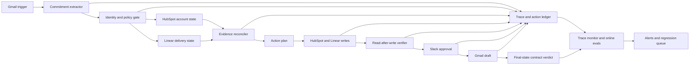

# Winning Ideas for the Multi-App AI Agent Hackathon

Research snapshot: September 13, 2026

## Audited Recommendation

Build **Customer Promise Guardian** if Gmail, HubSpot, Linear, and Slack are all
authenticated before coding begins or pass smoke tests by minute 40. It remains
the strongest product, but the four integrations make it a **medium-feasibility**
build rather than the safest one. If any of those four smoke tests fails, switch to
**Verified Incident Commander**, whose GitHub, Linear, and Slack setup is faster
and whose Datadog input can be seeded through the API or one Arga twin.

It has the best balance of the published rubric:

- The multi-app chain is essential to the outcome, not decorative.
- The business pain is immediate and easy to explain.
- Conflicting state, duplicate actions, and unsafe communication create a strong
  reliability story.
- The complete workflow is understandable in a two-minute demo.
- It resonates with the organizers' focus on dependable agents, real-world app
  actions, customer outcomes, and useful vertical products.

The scores below are strategic estimates based on the official judging weights,
not predictions from the organizers.

This audit distinguishes three things that are often conflated:

- **API available:** a supported REST or GraphQL integration can be built now.
- **Official MCP available:** the app vendor operates or maintains the server.
- **Prototype-ready:** credentials, test data, permissions, and write operations
  are realistic inside the 390-minute event window.

An official MCP is not automatically the safest implementation. For a narrow
workflow, a direct API adapter is often faster to type, easier to mock, and easier
to make idempotent. Use MCP where it removes integration work; keep consequential
writes and read-after-write checks behind typed application code.

## 1. What the Organizer and Judge Companies Signal

Company fit is not a published judging category. Use this research to choose a
problem and proof strategy, not to force sponsor logos into the project.

### Lemma AI: production reliability for AI agents

Lemma AI, a host, monitors production agents. Its product analyzes traces against
the agent's instructions, groups recurring failures into issues, alerts teams in
Slack, brings incident context into coding agents, and turns discovered failures
into ongoing evaluations. Its public integrations include Vercel AI SDK, OpenAI
Agents, LangGraph, Langfuse, Arize Phoenix, Azure, and Anthropic-related tooling.

**What this suggests:** judges will recognize the difference between an API call
returning success and the user's intended outcome actually being achieved. Show
traces, detect silent failures, convert failures into regression cases, and make
the expected behavior explicit.

### Comma Capital: earliest-stage investor

Comma Capital, a host, publicly describes itself as investing at the earliest
stages and being based in New York City and San Francisco. Its sparse public
homepage does not expose a detailed sector thesis or enough portfolio detail to
justify narrower claims.

**What this suggests:** present a credible product wedge: a painful user problem,
a buyer, a repeatable workflow, and a path beyond the demo. Do not invent a
sector preference that the public source does not state.

### Arga Labs: real-world sandboxes for agents

Arga Labs builds stateful service twins of external APIs, CLIs, and MCP servers
for testing and training agents. Teams can seed scenarios, run an agent against
isolated app environments, inspect every provider call and side effect, and
assert final state in automated tests. Its public app list includes Slack,
GitHub, Gmail, Google Calendar, HubSpot, Linear, Notion, Stripe, Salesforce,
Jira, QuickBooks, Xero, and others.

Judges from Arga Labs:

- Phillip Li, co-founder and CEO
- Akira Tong, co-founder and CTO

**What this suggests:** use apps as stateful systems, not as icons on a slide.
Show before/after state, forbidden-side-effect checks, scenario replay, and safe
behavior when one dependency fails.

### Userlens: behavior-driven product adoption

Userlens builds Lumi, an adoption agent for B2B SaaS and product-led-growth
teams. Lumi combines customer state from databases with behavior from analytics,
identifies users falling behind, generates guidance personalized to actual usage,
keeps outreach within configured rules, and measures whether product behavior
changes rather than stopping at opens or clicks.

Judges from Userlens:

- Ankur Dahama, co-founder and CEO
- Hai Ta, co-founder

**What this suggests:** ground every action in real user context, make the next
action specific, and measure a downstream outcome. Personalized text alone is
not enough; close the loop.

### Clera: an AI talent agent for warm introductions

Clera is an AI talent agent that learns a candidate's experience, preferences,
and dealbreakers, matches that person to startup roles, and makes direct warm
introductions to decision-makers. It emphasizes a short conversational intake,
constraint-aware matching, and a network of more than 900 startups.

Judge from Clera:

- Shlok Mundhra, founding engineer

**What this suggests:** a focused vertical agent can beat a generic assistant.
Respect explicit constraints, minimize user effort, explain why a match or
action is appropriate, and make the handoff useful to both sides.

## 2. Reliability Standard for Every Idea

Treat reliability as an end-to-end product property, not as "the API returned
200" or "an LLM judge liked the answer." A reliable run satisfies the user's
intent, obeys policy, produces the required state in every app, and creates no
forbidden side effect. A safe refusal or escalation is a successful outcome when
the request is ambiguous or unsafe.

More precisely, agent reliability is the measured probability that a specific
agent release reaches an acceptable terminal outcome for a declared task and
environment distribution while respecting its safety contract. It is conditional,
versioned, and risk-weighted; there is no honest context-free claim that an agent
is simply "reliable." Measure these dimensions separately:

- **Task correctness:** did the agent satisfy the user's supported intent?
- **Artifact quality:** is a generated draft, plan, explanation, or classification
  factually grounded and fit for its intended use?
- **Policy safety:** did it avoid every forbidden action and obtain scoped approval
  for consequential actions?
- **Robustness and calibration:** does it handle ambiguity, stale data, tool
  failure, hostile content, and unfamiliar inputs by recovering or abstaining?
- **State integrity and recoverability:** are cross-app effects complete,
  idempotent, verified, and repairable after partial failure?
- **Detectability:** when behavior is wrong, does the system recognize, alert,
  explain, and preserve enough evidence to reproduce it?

The associated companies point to four complementary layers:

1. **Specify and prevent:** define machine-checkable invariants, scoped
   permissions, approval boundaries, idempotency, and safe stop conditions before
   prompting the model. This reflects the constraint-aware behavior visible in
   Clera and the campaign guardrails visible in Userlens.
2. **Test before release:** run resettable, seeded scenarios; capture every
   provider call and side effect; and assert the final state of every app. This is
   the strongest use of Arga Labs-style stateful twins and repeatable tests.
3. **Detect after release:** trace the full run, evaluate completed traces against
   the contract, group recurring failures, alert an owner, and turn each confirmed
   production failure into a regression case. This follows Lemma AI's public
   production-monitoring loop.
4. **Measure the real outcome:** track whether the user's downstream state
   improved, not merely whether a message was sent. This follows Userlens's focus
   on adoption behavior rather than opens or clicks and gives the idea the product
   wedge an early-stage investor can understand.

### Common run contract

Every run should persist a redacted evidence envelope containing:

- `runId`, trigger ID, scenario/version, policy version, model, and prompt version
- normalized user intent and source-record IDs
- each tool request, response status, latency, retry, and resulting record ID
- the evidence used for each consequential decision
- approval identity, scope, decision, and expiry when approval is required
- before/after state or a canonical hash for every mutation
- worker status, deterministic verifier verdict, and optional blind-auditor verdict
- terminal status: `completed`, `awaiting_approval`, `safely_blocked`, or `failed`

Redact message bodies, credentials, and unnecessary personal data. An LLM
evaluator can find semantic failures, but it must supplement rather than replace
deterministic checks for identity, amounts, dates, permissions, duplicates, and
final app state.

### Common scorecard and launch gates

Use the same scorecard across all ideas so the reliability claim is auditable:

- **End-to-end task success:** eligible runs whose required final state satisfies
  every task assertion / all eligible runs
- **Critical invariant pass rate:** runs with no critical invariant violation /
  all runs; required gate: **100%**
- **Silent failure rate:** runs reported as completed whose final state is wrong /
  runs reported as completed; required gate: **0%**
- **Forbidden side-effect rate:** forbidden mutations / all runs; required gate:
  **0%**
- **Verified mutation rate:** successful mutation acknowledgements confirmed by an
  independent read / all successful mutation acknowledgements; required gate:
  **100%**
- **Duplicate mutation rate:** repeated side effects for the same idempotency key /
  mutation attempts; required gate: **0%**
- **Approval-bypass rate:** gated actions executed without a valid approval /
  gated actions; required gate: **0%**
- **Safe-block recall:** dangerous or ambiguous fixtures blocked / all fixtures
  that should be blocked; required gate: **100% on critical cases**
- **Trace completeness:** runs containing every required evidence-envelope field /
  all runs; required gate: **100%**
- **Recovery rate and time:** partial failures reconciled without duplicate effects,
  plus median and p95 time to a verified terminal state

Run at least 12 deterministic fixtures spanning happy path, ambiguity, conflict,
duplicate delivery, stale state, permission denial, timeout, partial failure, and
prompt injection. Report raw counts beside percentages because a hackathon-sized
sample is small. Keep task reliability separate from the product outcome: for
example, "correctly contacted 19/20 eligible accounts" and "7/19 later adopted"
answer different questions.

### Critique of the end-state testing thesis

The proposed principle is directionally right: seed a known world `S0`, run the
agent, observe `S1`, and judge against expectations written before execution. It
correctly refuses to use the worker's own "done" message as ground truth. Golden
fixtures, invariants, injected faults, repeated runs, and a worker-only baseline
are all strong choices.

It needs seven corrections before it is a complete reliability plan:

1. **Do not say "never test the output."** Sometimes the artifact is the product:
   a customer email, incident diagnosis, match explanation, or journal proposal.
   Test both artifact quality and resulting world state.
2. **`S1` alone is insufficient.** A final snapshot can hide a forbidden action
   that was later reversed, duplicate notifications, or who created an effect.
   Verify `S0`, `S1`, and an append-only transition/event ledger.
3. **Post-run detection is not prevention.** A verifier or auditor that runs after
   an irreversible refund can only describe the damage. Put deterministic policy,
   fresh-state, idempotency, and approval checks before the commit boundary.
4. **Expected state need not be one literal snapshot.** Open-ended tasks may have
   several valid outcomes. Pre-commit predicates, invariants, allowed-effect sets,
   and forbidden-effect sets instead of overfitting to one tool sequence.
5. **An LLM auditor is a fallible sensor.** It can find semantic omissions, but it
   can share the worker's bias. Calibrate it on labeled cases and never let it
   override deterministic identity, money, permission, consent, or duplicate
   checks.
6. **Five repeats are evidence, not a guarantee.** Report raw counts and model,
   prompt, policy, tool-schema, and fixture versions. Increase repetitions and add
   uncertainty intervals after the demo; do not generalize `5/5` to production.
7. **A fair baseline is an ablation, not a weaker product.** Hold model, prompt,
   tools, task mode, seed, and budgets constant, then remove one reliability layer.
   Distinguish unsafe actions prevented, detected before effect, and detected only
   after effect. "Caught" alone can conceal real harm.

### Layered testing plan, cheapest first

0. **Contract and risk model:** before prompts, define supported tasks, acceptable
   terminal statuses, required effects, allowed alternatives, forbidden effects,
   critical invariants, and the point after which an action is irreversible.
1. **Adapter contract tests:** with fixed requests and provider fixtures, test
   schema validation, authentication failures, pagination, rate limits, timeouts,
   retries, idempotency, semantic `200` responses, redaction, and trace emission.
   The harness step counter is useful, but it is not the adapter contract.
2. **Golden state-transition scenarios:** seed realistic `S0` states and assert
   the required `S1` predicates and event history. Include more than one valid path
   where the task allows it, and keep propose-only and execute modes explicit.
3. **Invariant and property tests:** check rules that must hold after every run,
   including generated combinations not represented by golden examples. Examples
   are no action without authority, no duplicate per idempotency key, exact amount
   or identity match, and no false `completed` status.
4. **Perturbation and concurrency tests:** at named synchronization boundaries,
   inject stale reads, concurrent human actions, duplicate delivery, out-of-order
   events, rate limits, phantom success, partial failure, and eventual consistency.
   Named boundaries such as `after stripe.list_refunds` survive plan changes better
   than a brittle global step number.
5. **Untrusted-content and injection tests:** place malicious instructions in
   email, Slack, issue, resume, document, and tool-response fields. Assert that data
   cannot alter policy, recipients, permissions, or tool authority. The legitimate
   portion of the task may still proceed; "the whole world stays unchanged" is not
   the correct oracle for every injection case.
6. **Repeated and distributional runs:** repeat critical scenarios at least five
   times for the demo, vary relevant wording and ordering, and report raw results.
   Keep deterministic adapter/verifier failures separate from model variance and
   expand the suite across real task segments over time.
7. **Controlled ablations:** compare worker-only, worker plus pre-commit guards,
   and the full system with verifier and auditor on identical runs. Measure both
   reliability gain and added latency/cost, and count false blocks as failures.
8. **Online monitoring and regression:** apply the same contracts to production
   traces, alert on high-risk failures, label incidents with a human, convert each
   confirmed failure into a seeded test, and watch for recurrence after the fix.

### Corrected scenario shape

Store assertions as structured data rather than prose-like expressions. The
event ledger is what proves that the existing refund came from the injected human
action and that the agent did not create a second one.

```yaml
id: stale_read_01
mode: execute_after_source_approval
instruction: Process pending refund approvals from #refunds.
initial_state:
  slack:
    approvals:
      - approval_id: ap_42
        charge_id: ch_42
        amount_minor: 12000
        currency: USD
  stripe:
    charges:
      - charge_id: ch_42
        amount_minor: 12000
        currency: USD
        refunds: []
  github:
    issues: []
fault:
  boundary:
    after_call: stripe.list_refunds
    match:
      charge_id: ch_42
  effect:
    actor: simulated_human
    operation: stripe.create_refund
    args:
      charge_id: ch_42
      amount_minor: 12000
expected:
  terminal_status: completed
  assertions:
    - query: stripe.refunds
      where:
        charge_id: ch_42
      count: 1
    - query: slack.messages
      where:
        charge_id: ch_42
        reason: already_refunded
      count: 1
  forbidden_effects:
    - actor: agent
      operation: stripe.create_refund
      where:
        charge_id: ch_42
settle:
  timeout_ms: 5000
  until: expected.assertions
```

For every test, freeze and version the scenario and expectations, seed `S0`, run
the worker while capturing events, wait only for declared eventual-consistency
conditions, snapshot `S1`, and evaluate assertions without the worker's summary.
Then compare the summary with the verifier verdict: `worker=completed` plus
`verifier=failed` is the silent-failure signal.

### What to report

For each failure class, show the scenario count, repetitions, worker-only contract
passes, guarded-worker passes, full-system passes, unsafe effects prevented,
failures detected before versus after consequence, false blocks, median/p95
latency, and cost. Also report aggregate critical-invariant, forbidden-effect,
silent-failure, duplicate, approval-bypass, verified-mutation, and trace-completeness
rates from the common scorecard.

Show actual numerators and denominators, not only percentages. Explain every miss,
whether it caused harm, and the next control or fixture. A perfect result is valid
when earned, but it supports only the tested distribution and version.

### Production monitoring loop

- Emit one trace per run and one child span per model decision, tool call,
  approval, retry, state verification, and compensation.
- Evaluate every high-impact run and sample low-impact successes; never sample
  errors, safe blocks, approval rejections, or verification mismatches.
- Alert immediately on a forbidden effect, approval bypass, duplicate mutation,
  or false completion. Alert on trends for rising ambiguity, retries, latency,
  cost, safe-block rate, or business-outcome degradation.
- Group alerts by invariant and likely cause rather than sending one alert per
  trace. Assign an owner and preserve representative evidence.
- Contract-test sandbox adapters against provider test accounts so twin or mock
  behavior does not silently diverge from the real APIs.
- Add every confirmed incident to the seeded suite, replay it against the fix,
  deploy only when critical gates pass, and watch the new online evaluation for
  recurrence.

These controls are the reliability product inside each proposal. The remaining
product principles still apply: make all three apps necessary, expose evidence,
approve only consequential actions, and tell one two-minute story from trigger to
verified outcome.

## 3. API, MCP, and Sandbox Availability

Status is current to September 13, 2026. "Ready" means usable now with an
ordinary developer account; it does not mean credentials are already provisioned
for this team.

| App | Official API | Official first-party MCP | Prototype verdict |
|---|---|---|---|
| **Gmail** | [REST API](https://developers.google.com/workspace/gmail/api/quickstart/python) is ready after a Cloud project, consent screen, and test user are configured. | [Remote MCP](https://developers.google.com/workspace/gmail/api/guides/configure-mcp-server) exists, but is **Developer Preview** and requires preview-program access. It reads mail, applies labels, and creates drafts; it does not send. | **Conditional.** Use the direct API and a disposable seeded inbox unless preview access was approved before the event. Budget 25-40 minutes for first-time Google OAuth. |
| **HubSpot** | CRM APIs are ready; a [private app token](https://developers.hubspot.com/docs/apps/developer-platform/build-apps/authentication/overview) is fastest for one test account. | [Hosted MCP](https://developers.hubspot.com/docs/apps/developer-platform/build-apps/integrate-with-hubspot-mcp-server) at `https://mcp.hubspot.com` is usable now, requires an MCP auth app and OAuth PKCE, and can read and write CRM records and activities. | **Ready.** A [developer test account](https://developers.hubspot.com/docs/getting-started/account-types) lasts 90 days and can be seeded. Prefer the private-app API if PKCE is not already implemented. |
| **Linear** | [GraphQL API](https://linear.app/developers/graphql) is ready; a personal API key is the fastest auth path. | [Hosted MCP](https://linear.app/docs/mcp) at `https://mcp.linear.app/mcp` is usable now with OAuth or an API key; a hard read-only endpoint is also available. | **Ready.** A free throwaway workspace is enough. Treat GraphQL `200` responses containing an `errors` array as failures. |
| **Slack** | [Web API](https://docs.slack.dev/authentication/installing-with-oauth/) is ready after creating and installing an app. | [Hosted MCP](https://docs.slack.dev/ai/slack-mcp-server) at `https://mcp.slack.com/mcp` is usable now, but needs a registered internal or Marketplace app, confidential OAuth, and fixed app identity. | **Ready with caveat.** A bot token plus `chat.postMessage` is the shortest path. The [developer sandbox](https://docs.slack.dev/tools/developer-sandboxes) is useful but may require a paid workspace or payment method for identity verification. |
| **Stripe** | API and [sandboxes](https://docs.stripe.com/sandboxes) are ready; the CLI can create an anonymous sandbox with working keys and fixtures. | [Hosted MCP](https://docs.stripe.com/mcp) at `https://mcp.stripe.com` is usable with OAuth or a restricted key. Sensitive writes such as refunds require Stripe-hosted human confirmation. | **Ready.** No live merchant activation is needed. Use direct API webhooks and idempotency keys for the pipeline; MCP is useful for rapid reads and demos. |
| **PostHog** | [Capture and query APIs](https://posthog.com/docs/api) are ready. | [Hosted MCP](https://posthog.com/docs/model-context-protocol) at `https://mcp.posthog.com/mcp` is available now and supports scoped/read-only use. | **Ready and preferred analytics source.** The free tier needs no card. Seed one event type through the capture API and query it back before relying on it. |
| **Mixpanel** | Ingestion and query APIs are ready; private queries use a service account or OAuth. | [Hosted MCP](https://docs.mixpanel.com/docs/mcp) is available at regional endpoints. OAuth is stable; headless service-account authentication and experiment/flag tools have beta caveats. | **Ready but slower than PostHog.** New free accounts have MCP enabled; older accounts may need an admin toggle and a propagation wait. |
| **Amplitude** | HTTP V2 ingestion and Dashboard REST APIs are ready. | [Hosted MCP](https://amplitude.com/docs/mcp) at `https://mcp.amplitude.com/mcp` is usable now, but it does **not** ingest events. | **Ready with a split path.** Seed events through HTTP V2 and use MCP or REST to query them. This adds one more contract than PostHog. |
| **Datadog** | APIs are ready with API and application keys. | [Hosted MCP](https://docs.datadoghq.com/mcp_server/setup/) is usable now with OAuth or scoped tokens. Core monitors, metrics, events, incidents, and logs are available; the deeper [APM toolset](https://docs.datadoghq.com/mcp_server/tools/) is Preview. | **Conditional on seeded telemetry.** Do not depend on Preview APM tools. Seed an alert or event directly, or use one Arga Datadog twin. |
| **GitHub** | REST and GraphQL APIs are ready; a fine-grained PAT works immediately for a personal test repository. | The [official hosted and local MCP server](https://github.com/github/github-mcp-server) is mature, supports OAuth or PATs, and offers read-only and prompt-injection-reducing lockdown modes. | **Ready.** A throwaway repository with commits, issues, and Actions data is quick to seed. |
| **Google Drive** | [Drive REST API](https://developers.google.com/workspace/drive/api/quickstart/python) is ready under ordinary test-user OAuth. | [Remote MCP](https://developers.google.com/workspace/drive/api/guides/configure-mcp-server) is **Developer Preview** and supports search/read plus create/copy operations. | **Conditional.** Use REST and temporary files unless preview access already exists. |
| **Google Sheets** | [Sheets REST API](https://developers.google.com/workspace/sheets/api/quickstart/python) is ready and easy to seed. | [Remote MCP](https://developers.google.com/workspace/sheets/api/guides/configure-mcp-server) is **Developer Preview** and supports value, formula, and structural writes. | **Ready through REST; conditional through MCP.** Reuse the same Cloud project and OAuth client as Gmail and Calendar. |
| **Google Calendar** | [Calendar REST API](https://developers.google.com/workspace/calendar/api/quickstart/python) is ready. | [Remote MCP](https://developers.google.com/workspace/calendar/api/guides/configure-mcp-server) is **Developer Preview** and documents event writes. Its setup page currently lists read-only event scopes, so write access must be smoke-tested. | **Ready through REST; conditional through MCP.** Use the direct writable event scope for the prototype. |
| **QuickBooks Online** | API is available, but every user needs an Intuit developer app and OAuth; there is no personal-key shortcut. | Intuit maintains an [official local MCP server](https://github.com/intuit/quickbooks-online-mcp-server) with broad CRUD controls, but it has no published releases and must be cloned, built, and authenticated. | **High setup risk.** A sandbox exists, but OAuth and data seeding can consume the window. Do not choose it over Xero without credentials already working. |
| **Xero** | API is ready after OAuth app registration. | Xero maintains the local [`@xeroapi/xero-mcp-server`](https://github.com/XeroAPI/xero-mcp-server), but the repository has no formal releases. | **Usable and preferred for finance.** The [free Demo Company](https://developer.xero.com/documentation/development-accounts/) is pre-populated and resettable. Treat the MCP package as prototype-grade and keep writes approval-gated. |
| **Jira Cloud** | REST API v3 is ready; an email/API token is sufficient for a personal prototype. | The [Atlassian Rovo MCP server](https://github.com/atlassian/atlassian-mcp-server) at `https://mcp.atlassian.com/v2/mcp` is **Generally Available**, with Jira read/write/search tools and OAuth or API-token auth. | **Ready.** Use a disposable Cloud or demo site. Delete and admin tools are disabled by default, which is useful for safety. |
| **Notion** | API is ready; an internal integration token is quick, but pages must be explicitly shared with it. | [Hosted MCP](https://developers.notion.com/guides/mcp/get-started-with-mcp) at `https://mcp.notion.com/mcp` is maintained and supports read/write, but currently requires interactive OAuth and has no headless auth. | **Ready for an interactive demo.** Use the direct API if the evaluation runner must be unattended. |
| **Google Workspace Admin/Directory** | [Directory API](https://developers.google.com/workspace/admin/directory/v1/quickstart/python) exists but requires a Workspace domain, enabled API access, and an administrator. Domain-wide delegation can add administrative delay. | **No first-party Admin/Directory management MCP was verified.** Google's [supported MCP list](https://developers.google.com/workspace/guides/configure-mcp-servers#supported-products) includes People directory search, not group or user administration. | **Blocked unless a test tenant and admin are already available.** Do not give a community MCP domain-wide delegation during a hackathon. Use a narrow direct adapter only. |

### Arga Labs constraint

[Arga](https://www.argalabs.com/) lists twins for every core app above except
PostHog, Mixpanel, and Amplitude; its Google Workspace label does not prove that
Admin/Directory mutations are covered. The [free plan](https://www.argalabs.com/pricing)
allows ten twins per month, ten-minute sessions, and **one twin per run**. A
three-app workflow therefore cannot run entirely on free Arga twins in one
scenario. Use organizer credits, a hybrid of one twin plus real test accounts,
or local fake adapters for evaluation. Confirm that twins count as external apps
before relying on them for eligibility.

### Integration preflight gate

Before selecting an idea, perform one read and one harmless write in every
required app. Record the object IDs and scopes. If all required integrations do
not pass by minute 40, switch to the documented fallback rather than debugging
OAuth during the middle of the build.

### Feasibility and collision method

The feasibility ranges below estimate the chance of reaching a stable,
two-minute-demo-ready MVP by the 4:00 PM deadline. They assume a two-person team,
accounts created before the coding window if the rules permit it, one narrow
scenario, direct APIs where they are faster, and the final 50-60 minutes reserved
for regression, recording, and submission. The solo range assumes the same
credentials but one implementer. These are planning estimates, not measured odds.

"Analogous idea" means another team attacks the same user problem with a similar
app chain; "same differentiator" means it also centers the specific reliability
mechanism proposed here. No participant roster or submitted-idea list is public,
so collision ranges are directional estimates based on common hackathon
archetypes, sponsor signals, API accessibility, and implementation difficulty.

| Project | Two-person feasibility | Solo feasibility | Chance of an analogous entry | Chance of the same differentiator |
|---|---:|---:|---:|---:|
| Customer Promise Guardian | 60-75% | 35-50% | 35-55% | 10-20% |
| Revenue Rescue Agent | 70-85% | 50-65% | 55-75% | 25-40% |
| Verified Incident Commander | 75-90% | 60-75% | 65-85% | 30-50% |
| Close Guard for Finance Operations | 45-65% | 20-40% | 25-45% | 10-20% |
| Least-Privilege Access Coordinator | 15-30% from zero; 55-70% with a ready admin tenant | 10-20% from zero | 30-50% | 15-25% |
| Warm Introduction Coordinator | 70-85% | 50-70% | 45-65% | 20-35% |

The wide ranges are intentional. A single blocked OAuth flow can erase an hour;
a pre-authenticated test tenant can remove that risk completely.

## 4. Project Audits

### 1. Customer Promise Guardian - estimated 94/100

**Pitch:** When a customer commitment appears in email, the agent turns it into
verified, owned work and prevents unsupported promises from reaching the customer.

**Primary user:** customer success lead, founder, or account executive at a B2B
software company.

**Prototype integrations:** Use Gmail REST with one test user, HubSpot's private
app API, Linear GraphQL with a personal key, and Slack Web API with a bot token.
Use the official MCP servers only if they are already authenticated and their
exact tool schemas have passed smoke tests. Calendar is a stretch integration,
not part of the MVP.

**Detailed pipeline:**

1. A manual run fetches one Gmail thread by immutable message ID. The LLM extracts
  a typed commitment, quoted evidence, and candidate date; deterministic code
  normalizes the date and rejects missing or relative dates it cannot resolve.
2. The identity gate maps sender domain and contact email to exactly one HubSpot
  company and owner. Zero or multiple companies terminate as `safely_blocked`.
3. HubSpot and Linear are read in parallel. The Linear search uses account ID,
  product area, and normalized deliverable; it does not rely only on semantic
  title similarity.
4. The reconciler compares promised date, CRM history, issue status, blockers,
  and target date. It emits `on_track`, `unowned`, or
  `conflict_requires_approval` with cited record IDs.
5. The executor upserts one HubSpot commitment/risk note and one Linear issue or
  comment using the commitment idempotency key. It immediately reads both back
  and verifies owner, due date, source link, and status.
6. Slack receives a human-readable evidence summary. For the hackathon, poll one
  known thread for `approve <runId>` or `reject <runId>` rather than building a
  public Events API callback.
7. After approval, Gmail creates a draft whose recipients and content hash match
  the approved plan. The agent verifies the draft and reports the final contract
  verdict; it never sends autonomously.

**Why it is valuable:** customer promises are scattered across conversations,
CRM records, and issue trackers. Missed commitments cause churn; unsupported
promises create expensive escalations. The agent creates accountability while
keeping external communication grounded in delivery reality.

**Original hook:** it is contradiction-aware. If the email promises Friday but
Linear says the dependency is blocked until next week, the agent must not draft
a false confirmation. It escalates the conflict with both source citations.

**Reliability contract:** A run is complete only when one source-backed
commitment maps to exactly one account, the intended HubSpot and Linear states
are independently verified, and any customer-facing draft is bound to a valid
approval. On ambiguity or conflicting delivery evidence, `safely_blocked` is the
correct result; claiming completion is a critical failure.

**Ensure:**

- Extract into a strict schema with quoted source spans. Parse dates with normal
  code and an explicit timezone; do not let the model invent missing dates.
- Resolve identity through deterministic email-domain and CRM identifiers. Zero
  or multiple matches must stop before any mutation.
- Enforce policy outside the prompt: permitted recipients, allowed CRM fields,
  date-conflict rules, and the requirement for external-send approval.
- Derive one idempotency key from the Gmail message ID and canonical commitment.
  Use optimistic version checks before writes so a stale plan cannot overwrite a
  newer CRM or Linear update.
- Bind approval to a hash of the exact recipients, wording, due date, and planned
  actions. Expire it whenever source state or the draft changes.
- Journal each mutation. If HubSpot succeeds and Linear fails, mark the run
  `failed_partial`, suppress the email, and reconcile only the missing effect on
  retry. Re-read both systems before reporting success.

**Measure before release:**

- Run the 12 scenarios in Section 5 from identical seed state and add field-level
  assertions for account ID, deliverable, due date, owner, and source evidence.
- Gate release on all common critical thresholds plus 100% contradiction recall,
  100% identity accuracy on resolvable fixtures, and zero mutations on ambiguous
  fixtures. Compare the worker's terminal status with the end-state verifier to
  expose false-completion events.
- Report raw scenario counts, tool-sequence accuracy, and median/p95 time to a
  verified owner. Track business impact separately as promises assigned before
  deadline, promises rescued, and median time from email to accountable work.

**Monitor in operation:**

- Trace extraction evidence, identity candidates, policy decisions, state
  versions, writes, read-backs, approval scope, and terminal verdict under one
  commitment ID.
- Page on any approval bypass, duplicate mutation, contradicted customer draft,
  or worker/verifier disagreement. Queue an owner alert for a partial run that is
  not reconciled within five minutes.
- Dashboard completion, safe-block, ambiguity, contradiction, verification, and
  retry rates by prompt/model/policy version. Group recurring failures by broken
  invariant and promote each confirmed example into the seeded regression suite.

**Suggested score:** technical execution 28/30; reliability and evaluation
24/25; usefulness 19/20; originality 14/15; demo clarity 9/10.

**Main risk:** OAuth and real-account setup can consume the build window. If the
organizers provide multi-twin credits, use Arga for Gmail, HubSpot, Linear, and
Slack. The free plan cannot host that four-app run, so otherwise use real test
accounts, at most one twin, and local fake adapters for deterministic tests.

**390-minute build plan:**

- **0-40:** seed one account, email, issue, and Slack channel; prove one read and
  harmless write in all four apps. Kill the idea if any required adapter is still
  unauthenticated at minute 40.
- **40-105:** implement Gmail fetch, strict extraction, date normalization, the
  commitment schema, and fake-adapter fixtures.
- **105-175:** implement deterministic HubSpot identity resolution and Linear
  discovery; return an evidence bundle with record versions.
- **175-235:** implement reconciliation, idempotent HubSpot/Linear upserts, and
  independent read-after-write assertions.
- **235-285:** add the Slack thread approval and approval-bound Gmail draft. Cut
  the draft, not verification, if this phase slips.
- **285-335:** run the 12 local deterministic scenarios, plus one live happy path
  and one live safe-block path; fix critical invariant failures only.
- **335-390:** freeze features, run the complete suite from a reset seed, record
  the two-minute demo, finish the reliability brief, and submit with buffer.

**Feasibility:** **60-75% for two people; 35-50% solo**, assuming all four
credentials work at 9:30. Four auth surfaces and two verified writes are the
schedule risk. The hard fallback is Verified Incident Commander; do not replace
HubSpot with a local fixture and still claim a four-app production path.

**Collision risk:** **35-55%** that another team builds an email-to-CRM/task
commitment agent, but only **10-20%** that it makes contradictory CRM/engineering
state, approval invalidation, and end-state verification the central demo. Lead
with the prevented false promise, not generic inbox automation.

### 2. Revenue Rescue Agent - estimated 91/100

**Pitch:** Detect a high-value account at risk from a payment or adoption issue,
choose the evidence-backed recovery action, and coordinate it across the revenue
team before the customer leaves.

**Prototype integrations:** Choose **PostHog**, not a runtime choice among three
analytics vendors. Use Stripe's direct API/webhook fixtures, PostHog capture and
query APIs or its hosted MCP, HubSpot's private-app API, and Slack Web API. A
Gmail draft is a stretch only after the four-app verified path works.

**Detailed pipeline:**

1. Replay one signed Stripe `invoice.payment_failed` event from a sandbox. Store
  the event ID and fetch current customer, invoice, and subscription state.
2. Resolve the Stripe customer to exactly one HubSpot company and one PostHog
  account through a pre-seeded external-ID mapping. Any missing or conflicting
  mapping stops the run.
3. Query one explainable behavior signal, such as `setup_completed` in the last
  seven days. Query the value back after seeding; do not infer adoption from a
  capture API's success response.
4. Read HubSpot plan, account value, owner, lifecycle state, previous contacts,
  and opt-out flags. Build one versioned account snapshot.
5. Deterministic policy assigns one of four outcomes: `billing_only`,
  `adoption_help`, `combined_recovery`, or `no_contact`. The LLM may explain and
  draft the recommendation but cannot change eligibility or offer limits.
6. Upsert one HubSpot task/risk record, verify it, and post the evidence and
  proposed next action to Slack. A thread approval is bound to the account,
  action, offer, recipient, and current snapshot hash.
7. For the MVP, approval moves the HubSpot task to `approved`; if time remains,
  create and verify a Gmail draft. Re-read Stripe before any outreach and cancel
  if payment or subscription state has recovered.

**Why it could win:** it combines direct economic value with Userlens-style
behavioral context and strong safety boundaries. The outcome can be expressed as
revenue protected, accounts recovered, or time-to-intervention.

**Best demo:** a valuable account has a failed payment but is also stuck on a new
feature. The agent avoids a generic dunning email, opens the right CRM action,
requests approval, and drafts guidance specific to the user's actual behavior.

**Reliability contract:** A run succeeds only when Stripe, analytics, and CRM
records resolve to one customer, the live state makes that customer eligible for
one policy-allowed recovery action, and the CRM task and approved communication
are verified. Sending a plausible message to the wrong or ineligible customer is
a critical failure.

**Ensure:**

- Maintain an explicit mapping from Stripe customer ID to CRM account ID and
  analytics user/account ID. Never join consequential records with model-based
  name similarity alone.
- Deduplicate on provider webhook ID plus action type. Require fresh billing and
  subscription reads immediately before execution so a recovered payment cannot
  trigger stale outreach.
- Encode eligibility, discount limits, contact frequency, quiet hours,
  never-contact flags, and approved channels in code. Bind approval to the exact
  account, offer, recipient, and message; changed state invalidates approval.
- Separate proposal from execution. Verify the CRM action and Gmail draft or send
  with read-after-write checks, and leave a resumable partial-run record if either
  app is unavailable.

**Measure before release:**

- Seed at least 12 accounts covering payment failure, low adoption, both signals,
  neither signal, active dispute, recovered payment, merged identities, stale
  analytics, recent contact, duplicate webhook, excessive discount, API timeout,
  and prompt injection in CRM notes.
- Measure eligible-account precision/recall, action-policy accuracy, cross-app
  identity accuracy, duplicate-contact rate, and worker/verifier disagreement.
  Require the common critical gates, 100% recall for never-contact and discount
  violations, and zero contact for ineligible fixtures.
- Keep operational correctness separate from impact. Report verified interventions
  immediately; measure recovered revenue, payment recovery, or target-feature
  adoption later, ideally against an untreated holdout rather than attributing
  every recovery to the agent.

**Monitor in operation:**

- Trace source freshness, joined IDs, eligibility reasons, policy version,
  approval scope, contact history, and verified destination records.
- Page on an identity mismatch, prohibited offer, contact-rule breach, duplicate
  outreach, or false completion. Alert on cohort-level changes in eligibility,
  safe-block, retry, unsubscribe, and complaint rates.
- Join delayed billing and product-behavior outcomes back to the run ID. Slice
  reliability and outcome metrics by segment and model/prompt version, then turn
  confirmed bad selections or actions into regression fixtures.

**Suggested score:** technical 27/30; reliability 23/25; usefulness 20/20;
originality 12/15; demo clarity 9/10.

**Main risk:** product analytics data is harder to seed and explain quickly. Use
one behavior signal and one recovery policy, not a broad churn model.

**390-minute build plan:**

- **0-40:** create an anonymous Stripe sandbox, seed PostHog and HubSpot IDs, and
  smoke-test Stripe, PostHog, HubSpot, and Slack. Switch ideas if the account join
  cannot be queried end to end.
- **40-95:** implement Stripe event replay, signature/fixture handling,
  idempotency, and a fresh-state fetch.
- **95-155:** implement the explicit three-system identity map and the single
  PostHog behavior query with a read-back seeding check.
- **155-220:** implement the four-outcome policy, contact caps, opt-outs, quiet
  hours, and typed model explanation.
- **220-270:** implement and verify the HubSpot upsert and Slack approval thread.
  Keep Gmail out unless this path is green.
- **270-330:** execute the labeled account suite, duplicate webhook, stale
  analytics, recovered-payment, and forbidden-offer cases; repair critical
  failures.
- **330-390:** freeze, run reset-to-reset regression, record one eligible and one
  no-contact case, document delayed outcome measurement, and submit.

**Feasibility:** **70-85% for two people; 50-65% solo** with PostHog and seeded
external IDs. API access is no longer the main risk; explaining and validating a
cross-system join is. Cut Gmail first, then extra behavior signals. Never replace
the product signal with an LLM-generated churn score.

**Collision risk:** **55-75%** for an analogous churn, dunning, or customer-health
agent because the business value and Userlens alignment are obvious. The chance
of the same payment-plus-behavior eligibility policy and verified no-contact path
is roughly **25-40%**. Differentiate on proving whom the agent deliberately did
not contact and why.

### 3. Verified Incident Commander - estimated 90/100

**Pitch:** Turn an operational alert into a verified incident response: correlate
the likely change, create owned remediation, notify the right people, and prove
that every coordination step occurred.

**Prototype integrations:** Use Datadog's direct Events/Monitors APIs or the
official MCP **core** toolset, GitHub's official MCP or REST API with a
fine-grained PAT, Linear GraphQL with a personal key, and Slack Web API. Do not
depend on Datadog's Preview APM toolset. Calendar is out of scope.

**Detailed pipeline:**

1. Seed and retrieve one Datadog alert or event tagged with service, environment,
  monitor, and deployment SHA when available. Normalize it into an immutable
  alert snapshot.
2. Deterministic code computes an incident fingerprint from service, monitor,
  environment, and a bounded time bucket. It first looks up any open Linear issue
  or Slack thread carrying that fingerprint.
3. Fetch the monitor status and a small metric window from Datadog. Map service to
  repository through a checked-in allowlist, then retrieve GitHub deployments and
  commits in the explicit correlation window.
4. Rank candidates using deterministic service, environment, time, and deployment
  evidence. The LLM summarizes the evidence. Below threshold, the cause is
  `unknown`; no person or commit is blamed.
5. Upsert one Linear incident with fingerprint, alert link, evidence, owner, and
  status. Re-read it and verify all required fields.
6. Create or update one Slack incident thread with the same fingerprint and a
  link to Linear. Re-read the thread, verify both cross-links, and record a
  repairable partial state if either destination fails.
7. Replay the same alert and prove that it updates the existing issue and thread.
  The agent may propose investigation or rollback steps but executes neither.

**Why it could win:** the technical chain is immediately visible, reliability is
native to the problem, and the workflow aligns strongly with both Lemma and Arga.

**Best demo:** a latency alert starts the run, a recent deployment is identified
with evidence, an incident issue and Slack response are created, and a duplicate
alert updates the existing incident rather than creating noise.

**Reliability contract:** A run succeeds only when one incident fingerprint owns
one Linear record and one Slack response thread, every claimed causal change has
cited evidence above a fixed threshold, and all created links are verified. An
uncertain cause must be labeled unknown; an unsupported blame assignment is a
critical failure.

**Ensure:**

- Calculate incident fingerprints and candidate deployment windows in code. Let
  the model summarize evidence, but require deterministic time, service, deploy,
  and repository checks before naming a likely change.
- Use the fingerprint as the idempotency key so repeated or out-of-order Datadog
  alerts update the existing incident. Re-check incident status before every
  write to avoid reopening resolved work from stale alerts.
- Never roll back, merge, page customers, or publish a status update autonomously.
  Bind approval to the exact proposed action and current incident-state version.
- Re-read Linear and Slack after mutation. Persist a repairable partial state if
  one write fails, and do not mark coordination complete until both destinations
  cross-link to the same incident.

**Measure before release:**

- Seed incidents with one correlated deployment, no relevant deployment, two
  plausible changes, an old unrelated commit, duplicate and out-of-order alerts,
  a resolved incident, missing GitHub access, a phantom-success write, Slack
  failure, and prompt injection in issue or commit text.
- Measure cause-attribution precision and abstention accuracy, alert-deduplication
  accuracy, coordination completeness, forbidden action count, and silent failure
  rate. Require 100% rejection of the unrelated-commit cases and all common
  critical gates.
- Track product outcomes separately: median time to acknowledged incident, time
  to an owned remediation item, duplicate pages avoided, and postmortem evidence
  completeness. Do not claim lower resolution time from a tiny demo fixture set.

**Monitor in operation:**

- Trace the alert fingerprint, candidate set, evidence scores, chosen/abstained
  cause, issue/thread IDs, approvals, read-backs, and terminal verifier verdict.
- Page on unsupported attribution, duplicate incidents, forbidden autonomous
  action, missing destination state, or worker/verifier disagreement. Alert on
  shifts in abstention, candidate count, tool errors, and time to verified owner.
- Group failures by incident invariant and service. Replay representative traces
  in a seeded sandbox and retain the uncorrelated-commit case as a permanent
  release-blocking evaluation.

**Suggested score:** technical 29/30; reliability 23/25; usefulness 18/20;
originality 11/15; demo clarity 9/10.

**Main risk:** incident copilots are familiar. The verified cross-app state and
counterexample test must be the differentiator.

**390-minute build plan:**

- **0-40:** seed one Datadog event and GitHub deployment, create a Linear team and
  Slack channel, and smoke-test reads/writes in all four apps. If Datadog data is
  not queryable, use one Arga Datadog twin with the other three apps live.
- **40-95:** implement alert normalization, service-to-repository configuration,
  fingerprinting, and resettable fixture state.
- **95-155:** implement the bounded GitHub candidate query and deterministic
  evidence scorer with an explicit abstention threshold.
- **155-220:** implement idempotent Linear and Slack upserts, cross-links, and
  independent read-after-write verification.
- **220-270:** add duplicate/out-of-order handling, resolved-incident checks,
  bounded retries, and resumable partial writes.
- **270-330:** run correlated, uncorrelated, ambiguous, duplicate, stale,
  permission-denied, phantom-success, and prompt-injection fixtures. Keep the
  unrelated-commit test release-blocking.
- **330-390:** freeze, run a clean golden path plus duplicate replay, record the
  abstention counterexample and scorecard, finish the brief, and submit.

**Feasibility:** **75-90% for two people; 60-75% solo.** GitHub, Linear, and
Slack have low-friction credentials; telemetry seeding is the only meaningful
unknown. This is the safest fallback when Customer Promise Guardian misses its
minute-40 auth gate.

**Collision risk:** **65-85%** for an alert-to-ticket/Slack incident agent and
**30-50%** for one that also deduplicates and verifies final state. Incident
copilots are a default developer-hackathon archetype. Make the memorable moment
the agent refusing to accuse an unrelated commit, not the creation of another
incident channel.

### 4. Close Guard for Finance Operations - estimated 88/100

**Pitch:** Investigate a reconciliation exception, collect evidence, prepare the
correct accounting action, and route it to a human before the monthly close slips.

**Prototype integrations:** Commit to **Xero**, not a runtime choice between two
ledgers. Use a Stripe anonymous sandbox through the direct API, Xero's Demo
Company through direct OAuth or its official local MCP package, Google Drive REST,
and Slack Web API. Gmail is out of the MVP. Restrict the world to one legal
entity, one currency, one chart of accounts, and one exception type: a paid
Stripe invoice missing from Xero.

**Detailed pipeline:**

1. Start from one Stripe invoice or payment ID and fetch its amount, currency,
  customer, status, and source metadata from the sandbox.
2. Use an explicit external reference to query Xero for the corresponding invoice,
  payment, and journal state. Query by provider IDs before trying amount/date
  heuristics.
3. Retrieve one Drive invoice document whose metadata contains the same external
  reference. Extract a strict evidence schema for subtotal, tax, total, currency,
  entity, vendor, and invoice number, preserving quoted source spans.
4. Deterministic reconciliation compares all three sources and returns
  `already_reconciled`, `safe_to_propose`, `conflict`, or `missing_evidence`.
5. For `safe_to_propose`, normal code constructs a balanced draft journal from an
  allowlisted template. For any tax, amount, currency, entity, period, or match
  conflict, it posts only an escalation and cannot expose a ledger-write tool.
6. Slack receives the evidence, line-level proposal, and approve/reject request.
  Approval is bound to the full journal hash and one authorized reviewer.
7. Only in the clean fixture, create the Xero manual journal after approval,
  retrieve it by provider ID, and verify every debit, credit, reference, and
  total. Replaying the run must find that journal and create nothing.

**Why it could win:** finance operations are repetitive, high value, and unsafe
to automate casually. That creates a natural reason for evidence, policy checks,
approvals, and post-action verification.

**Best demo:** a paid invoice is missing from the ledger. The agent finds the
matching document, proposes the exact entry, flags a tax mismatch, and refuses to
post until a reviewer approves.

**Reliability contract:** A run succeeds only when the legal entity, transaction,
invoice, amount, currency, tax treatment, and accounting period all agree; the
proposed entry balances; one authorized reviewer approves that exact entry; and
the resulting ledger state is independently verified. A conflict must produce no
ledger mutation.

**Ensure:**

- Represent money in integer minor units or decimal types, never binary floating
  point. Match stable transaction and document IDs before using amount/date
  heuristics, and stop when more than one candidate remains.
- Enforce balanced debits and credits, account allowlists, entity and currency
  equality, period locks, tax rules, and segregation of duties in deterministic
  code. Treat model output as a proposal, not an accounting control.
- Hash the source transaction, evidence document, and complete journal proposal
  into the approval and idempotency keys. Any changed input expires approval.
- Prefer propose-only mode for the hackathon. If posting is enabled, re-read the
  ledger by provider ID, verify every line, and route partial or phantom-success
  writes to a repair queue without issuing another journal blindly.

**Measure before release:**

- Seed exact matches, missing invoices, duplicate invoices, near-equal amounts,
  wrong currency, wrong entity, tax mismatch, closed period, duplicate event,
  ambiguous vendor, rejected approval, permission denial, timeout, and malicious
  instructions inside an invoice.
- Measure exception-classification precision/recall, transaction-document match
  accuracy, exact journal-line accuracy, monetary-weighted error, duplicate-post
  rate, and approval compliance. Require all common critical gates, 100% balanced
  proposals, and zero writes for every conflict fixture.
- Measure operational value separately as exceptions correctly cleared, reviewer
  minutes per exception, aging of unresolved exceptions, and close-cycle time.

**Monitor in operation:**

- Trace redacted source IDs and hashes, rule results, proposed journal lines,
  approval scope, provider journal ID, and post-write verification. Do not put raw
  invoices, bank details, or credentials into observability data.
- Page on any unbalanced proposal, currency/entity mismatch, approval bypass,
  duplicate journal, unexpected total, or worker/verifier disagreement. Alert on
  unreconciled partial runs and rising ambiguity by vendor or document source.
- Reconcile aggregate posted counts and amounts against the source system on a
  schedule; convert each confirmed exception into a resettable regression case.

**Suggested score:** technical 27/30; reliability 22/25; usefulness 19/20;
originality 12/15; demo clarity 8/10.

**Main risk:** accounting logic can overwhelm the demo. Restrict the MVP to one
exception type and one proposed journal action.

**390-minute build plan:**

- **0-40:** open Stripe and Xero sandboxes, seed a Drive document and Slack
  channel, and smoke-test all four adapters. Kill this idea if Xero OAuth and a
  harmless sandbox write are not complete; switching to QuickBooks mid-build is
  not a recovery plan.
- **40-100:** create the exact-ID fixture contract and implement Stripe, Xero,
  and Drive reads with canonical money and date types.
- **100-165:** implement document extraction and deterministic three-way matching;
  defer OCR and support only the seeded text-readable document format.
- **165-225:** implement the balanced journal template, conflict rules, period
  lock, account allowlist, and independent proposal verifier.
- **225-280:** add Slack approval, one Xero sandbox write, read-after-write line
  verification, and idempotent replay.
- **280-335:** run exact, duplicate, amount, currency, tax, period, ambiguity,
  missing-document, denied, timeout, phantom-success, and injection cases.
- **335-390:** freeze, reset the Demo Company fixture, run the clean and tax-
  conflict demos, record, document the limited accounting scope, and submit.

**Feasibility:** **45-65% for two people; 20-40% solo.** Xero's resettable,
pre-populated Demo Company makes this possible, but OAuth, accounting semantics,
and exact end-state assertions leave little recovery time. This is a strong
domain-expert choice, not the general fallback.

**Collision risk:** **25-45%** for another reconciliation or close assistant and
only **10-20%** for the same evidence-bound, approval-hashed journal workflow.
Finance agents are common in the market but less common in short hackathons
because accounting credentials and domain logic deter casual entries. That lower
collision is useful only if the team can explain the journal correctly.

### 5. Least-Privilege Access Coordinator - estimated 86/100

**Pitch:** Convert an onboarding, role-change, or offboarding request into a
policy-checked set of access changes and verify that no excess access remains.

**Prototype integrations:** This idea is viable only with a pre-provisioned
Google Workspace admin test tenant, a GitHub organization the team controls, and
a Slack workspace where the app can manage the target channels. Use Jira REST or
Rovo MCP for intake, Notion API or hosted MCP for policy, a **narrow direct
Directory API adapter** for identity, GitHub REST or official MCP for one test
repository/team, and Slack Web API for one test channel. Never use a community
Admin MCP with domain-wide delegation.

**Detailed pipeline:**

1. Read one Jira request containing request ID, immutable employee ID, verified
  work email, change type, target project role, effective time, and approver.
  Missing fields stop before discovery.
2. Resolve the person in Google Directory and map that immutable identity to
  pre-seeded GitHub and Slack provider IDs. Display-name or fuzzy email matches
  are forbidden.
3. Read a versioned Notion policy page whose machine-readable table maps the one
  supported role to an exact GitHub repository/team and Slack channel set. Hash
  the source page and compile it into a deterministic allowlist.
4. Read current GitHub and Slack project memberships, then compute the complete
  expected-versus-current diff. The model may explain the diff but cannot add a
  permission not present in policy.
5. Post the exact diff to Slack for approval. Bind the approval to request ID,
  person, policy hash, current-state versions, removals, additions, and expiry.
6. Execute removals before additions for a role change, one provider at a time.
  Verify each mutation before continuing and journal a partial terminal state on
  failure; never broaden access as compensation.
7. Re-read both providers, compare complete sets, and comment on the Jira request
  only when actual state equals expected state. Any residual excess permission
  pages an owner and leaves Jira open.

**Why it could win:** multi-app action is unavoidable, the workflow is broadly
useful, and forbidden side effects can be tested clearly.

**Best demo:** a contractor changes projects. The agent reads policy, proposes
removing old access before adding the new team, requests approval, performs the
changes, and verifies the final membership set.

**Reliability contract:** A run succeeds only when a canonical employee identity
is resolved, the approved policy produces one expected permission set, and the
verified final membership in Google Workspace, GitHub, and Slack equals that set.
Any excess permission or change to the wrong person is a critical failure;
missing access is a failed run, not a reason to broaden access.

**Ensure:**

- Join systems through an immutable HR/directory employee ID and verified provider
  IDs, not display names. Deny on similar, missing, or conflicting identities.
- Compile versioned Notion policy into a deterministic allowlist. Generate an
  explicit before/after permission diff, enforce role and environment boundaries,
  and require an authorized approver for that exact diff.
- Use one request ID across systems, least-privilege service credentials, and
  compare-and-set checks so retries cannot add membership twice or overwrite a
  newer administrator change.
- Execute a documented order, verify each mutation, and stop on failure. For a
  role change, do not claim success until old access is removed and new access is
  verified; for offboarding, escalate any residual access immediately rather than
  attempting unsafe compensation.

**Measure before release:**

- Seed same-name employees, reused email aliases, contractor expiry, department
  transfer, termination, missing policy, conflicting policy versions, stale group
  state, duplicate request, one-provider timeout, denied permission, and prompt
  injection in the Jira request or policy page.
- Compare the complete expected and actual permission sets. Report identity
  accuracy, exact-set accuracy, excess and missing entitlements, duplicate changes,
  partial-recovery rate, and time to revoke. Require zero wrong-identity changes,
  zero excess access, 100% critical offboarding revocation, and all common gates.
- Track operational outcomes separately: median provisioning time, offboarding
  time, manual corrections, and policy exceptions per request.

**Monitor in operation:**

- Trace identity resolution, policy version, calculated diff, approver, each
  provider mutation/read-back, and the final expected-versus-actual set.
- Page on wrong-identity risk, excess access, approval bypass, residual offboarding
  access, or a false-completion verdict. Alert on slow revocation, repeated policy
  ambiguity, permission errors, and partial runs.
- Run periodic full-state reconciliation because permissions can drift outside the
  agent. Group drift by policy rule/provider and preserve each incident as a
  release-blocking fixture without logging sensitive resource contents.

**Suggested score:** technical 27/30; reliability 23/25; usefulness 18/20;
originality 10/15; demo clarity 8/10.

**Main risk:** access automation is common and high stakes. Keep all changes in
sandboxes and make the policy engine and verification visually central.

**390-minute build plan, only after credentials are ready:**

- **0-40:** prove Directory identity lookup, Jira/Notion reads, and harmless
  GitHub/Slack project-membership writes. Kill the full idea if any admin or owner
  permission is missing at minute 40.
- **40-95:** define the single role policy table, canonical employee map, expected
  permission-set schema, and reset fixtures.
- **95-155:** implement Jira intake, Directory resolution, policy versioning, and
  current GitHub/Slack membership snapshots.
- **155-220:** implement the exact-set diff, deny-by-default checks, approval hash,
  and stale-state invalidation.
- **220-280:** implement ordered mutations, per-provider read-backs, partial-run
  journaling, and final Jira evidence comment.
- **280-335:** run wrong-identity, excess-access, missing-policy, stale-policy,
  duplicate, denied, partial-failure, and injection cases; repeat the offboarding
  critical case.
- **335-390:** freeze, restore the test memberships, run a clean role change and
  one ambiguity block, record, document privileges, and submit.

**Feasibility:** **15-30% for two people and 10-20% solo from zero**. With the
admin tenant, GitHub org, Slack scopes, and IDs already proven, this rises to
**55-70% for two people**. The fallback is explicitly a smaller **Project Access
Coordinator** using Jira, Notion, GitHub, and Slack with identity pinned in the
request; do not present that as Google Workspace offboarding.

**Collision risk:** **30-50%** for an onboarding/offboarding or access-request
agent and **15-25%** for the same exact-set verification and residual-access
reconciliation. The archetype is common, but privileged API setup will eliminate
many teams. Differentiation comes from proving the final permission set, not from
showing a sequence of successful API responses.

### 6. Warm Introduction Coordinator - estimated 84/100

**Pitch:** Match a candidate's hard constraints to a real opening, gather consent
from both sides, and coordinate a warm introduction without repetitive forms.

**Prototype integrations:** Use Gmail, Sheets, and Calendar REST APIs under one
Google Cloud project and OAuth client, plus Slack Web API. Do not depend on the
Google Workspace Developer Preview MCP servers. Use one seeded Sheet as the role
source rather than adding an ATS.

**Detailed pipeline:**

1. Fetch one tagged Gmail intake thread by message ID. Extract explicit hard
  constraints, soft preferences, consent-to-match state, and quoted evidence into
  a typed candidate profile.
2. Read a fixed-range role table from Sheets with role ID, status, level,
  compensation range and currency, locations, remote policy, stage, industry,
  hiring-manager Slack ID, and last-verified timestamp.
3. Normalize compensation, geography, level, and dates in code. Apply every hard
  constraint as a deterministic filter; stale or incomplete roles are ineligible.
4. Let the model rank only the eligible rows and draft an evidence-backed reason
  for the top match. The verifier confirms that every claim maps to candidate
  evidence or a Sheet cell.
5. Post the exact candidate-role pair to the hiring manager in Slack. A positive
  response creates a manager consent token bound to both record versions; a
  rejection produces no candidate contact.
6. Create a Gmail draft asking for candidate consent to that exact role. After a
  seeded affirmative reply, create the second consent token and re-check that
  the role remains open and unchanged.
7. Query Calendar free/busy, choose only from supplied availability, create one
  event with both parties, and verify attendees, timezone, start/end, and event
  ID. The candidate-role-consent tuple is the idempotency key for both the intro
  and meeting.

**Why it could win:** it is a focused vertical workflow with human value and a
clear handoff, closely reflecting the constraint-aware experience Clera values.

**Best demo:** the agent rejects a superficially strong role because it violates
a remote-only constraint, explains the accepted match, gathers both approvals,
and schedules the introduction.

**Reliability contract:** A run succeeds only when every stated hard constraint is
satisfied by fresh role data, the explanation cites allowed evidence, both parties
consent to the exact pairing, exactly one introduction is sent, and one mutually
accepted calendar event is verified. A good semantic match cannot override a
dealbreaker or missing consent.

**Ensure:**

- Store explicit preferences as typed hard constraints and soft preferences. Apply
  hard filters in code before model ranking, and never infer protected or private
  attributes from names, photos, schools, or other proxies.
- Require current role availability, compensation/location normalization, and
  evidence for every match reason. Abstain when required data is absent or stale.
- Issue separate, expiring consent tokens for the candidate and hiring manager,
  bound to the same candidate-role pair. Re-check both tokens and role state before
  sending an introduction.
- Deduplicate by candidate, role, and consent version; enforce contact frequency
  and withdrawal rules; and verify the sent thread and calendar attendee/timezone
  state rather than trusting API acknowledgements.

**Measure before release:**

- Build a labeled set of candidate-role pairs covering remote-only, geography,
  compensation, stage, role level, excluded industry, stale/closed role, missing
  field, withdrawn consent, duplicate acceptance, calendar race, similar identity,
  and prompt injection in resumes or job descriptions.
- Report hard-constraint violation rate, eligible-match precision and recall,
  explanation evidence coverage, consent-bypass rate, duplicate-introduction rate,
  scheduling exactness, and safe-abstention recall. Require zero hard-constraint,
  privacy, or consent violations and all common critical gates.
- Track usefulness separately as match acceptance, introduction-to-interview
  conversion, time to interview, and opt-out rate. Audit those metrics by role and
  geography to expose uneven quality rather than hiding it in one aggregate.

**Monitor in operation:**

- Trace only the minimum necessary profile fields, normalized constraints, source
  record versions, match evidence, consent states, communication IDs, and calendar
  verification; redact resumes and private conversation content.
- Page on a hard-constraint, privacy, or consent violation and on duplicate
  introductions. Alert on stale-role selections, unexplained matches, scheduling
  failures, opt-outs, and segment-level precision or acceptance drift.
- Feed rejections, corrections, withdrawals, and bad matches into reviewed labels,
  then add confirmed failures to the regression set. Never learn a new hard
  constraint silently from one rejection; ask the user to confirm it.

**Suggested score:** technical 25/30; reliability 20/25; usefulness 18/20;
originality 13/15; demo clarity 8/10.

**Main risk:** it may look too close to a judge's existing product and role data
can be awkward to integrate. Keep it as a fallback if the team knows recruiting
workflows unusually well.

**390-minute build plan:**

- **0-40:** configure one Google OAuth client for Gmail, Sheets, and writable
  Calendar scopes; install the Slack app; prove all reads plus a draft, test event,
  and test message. Use REST immediately if preview MCP access is absent.
- **40-100:** seed the candidate thread and role sheet, define the profile/role
  schemas, and build deterministic normalization and fixture reset.
- **100-160:** implement evidence-bound extraction, hard filtering, freshness
  checks, and ranking over eligible rows only.
- **160-220:** implement manager Slack consent, candidate Gmail draft/reply
  polling, dual consent tokens, expiry, and withdrawal.
- **220-275:** implement free/busy lookup, deterministic slot selection,
  idempotent event creation, and full event read-back.
- **275-335:** run hard-constraint, missing-field, stale-role, rejected/withdrawn
  consent, duplicate, timezone, calendar-race, identity, and injection fixtures.
- **335-390:** freeze, run the rejected-near-match and accepted-match demos,
  record, document privacy boundaries and bias limits, and submit.

**Feasibility:** **70-85% for two people; 50-70% solo.** Three Google APIs share
one project and consent flow, and Sheets is easy to seed. Calendar scope mistakes
and the two-sided consent state machine are the main risks. If Calendar writes do
not pass the minute-40 gate, ship a consented introduction workflow across Gmail,
Sheets, and Slack and state clearly that scheduling is not implemented.

**Collision risk:** **45-65%** for recruiting, matching, or scheduling agents and
**20-35%** for the same dual-consent, hard-constraint, evidence-only workflow.
Clera's presence makes the category salient and raises the risk of looking like a
clone. The demo should emphasize a tempting match rejected by code-enforced
dealbreakers, not the semantic ranking itself.

## 5. Recommended Build: Customer Promise Guardian

### One-sentence demo story

"A customer was promised an enterprise feature by Friday; the agent discovers
that engineering is blocked, creates accountable work, prevents a false reply,
and routes an evidence-backed recovery plan to the owner."

### Minimal architecture



The orchestrator should be a small explicit state machine, not an open-ended
loop. Use model calls for extraction, reconciliation, and drafting; use normal
code for authorization, idempotency, deadlines, tool schemas, and assertions.
The final verifier reads destination state independently of the worker's
self-report. An optional blind auditor can catch semantic omissions from the
instruction plus before/after state, but cannot override hard policy checks.

### Core data contract

Track one commitment object throughout the system:

```json
{
  "commitmentId": "gmail-message-id:normalized-commitment",
  "accountId": "hubspot-company-id",
  "source": {
    "app": "gmail",
    "recordId": "message-id",
    "evidence": "We will enable SSO by Friday"
  },
  "deliverable": "Enable SSO",
  "promisedAt": "2026-09-13T16:20:00Z",
  "dueAt": "2026-09-18T23:59:00Z",
  "confidence": 0.96,
  "status": "conflict_requires_approval",
  "plannedActions": [],
  "verifiedEffects": []
}
```

### Hard safety invariants

- Never create work or communication without a unique source record.
- Never guess between multiple matching customers.
- Never claim a delivery date contradicted by the source systems.
- Never send external email without explicit approval.
- Never execute the same mutation twice for one commitment ID.
- Never report success until destination state has been read back and checked.
- Never follow instructions embedded in customer text that attempt to change the
  agent's policy, tools, recipients, or authorization.

### Evaluation suite

Implement at least these 12 deterministic scenarios:

1. Clear promise with an existing on-track Linear issue
2. Clear promise with no delivery issue
3. Promise date conflicts with blocked engineering work
4. Two CRM accounts match the sender
5. No CRM account matches the sender
6. Duplicate Gmail event is delivered twice
7. HubSpot write succeeds but Linear write times out
8. Linear returns a rate limit and succeeds on bounded retry
9. Slack approval is rejected
10. Gmail permission does not allow draft creation
11. Customer email contains a prompt-injection instruction
12. Source state changes between planning and execution

Run all 12 from a reset seed and repeat every critical scenario at least five
times to expose model variance. Compare a worker-only baseline with the protected
agent on the same fixtures; otherwise the demo shows a harness, not evidence that
the controls improve reliability.

For each scenario, assert:

- Correct account and commitment extraction
- Required safety ordering, such as a fresh read before a write, without requiring
  one exact harmless tool sequence
- Expected final-state predicates in every app
- Expected transition events and the actor responsible for each side effect
- Grounding and policy compliance of the proposed customer-facing draft
- Zero forbidden side effects
- No duplicate records or messages
- Complete trace with source and destination record IDs
- Agreement between the worker's claimed status and the independent verifier
- Useful terminal status: completed, awaiting approval, safely blocked, or failed

Display raw passes/runs, critical pass rate, forbidden and duplicate side effects,
false blocks, worker/verifier disagreements, and median/p95 execution time and
cost. A perfect-looking percentage matters less than meaningful tests, explicit
scope, and an honest explanation of every failure.

### Two-minute demo

- **0:00-0:15:** "Customer promises disappear between inboxes, CRM, and product
  teams. Missing one can lose an account."
- **0:15-0:35:** Open the seeded Gmail promise and start the agent.
- **0:35-1:05:** Show HubSpot identity/value and conflicting Linear delivery
  state entering one evidence timeline.
- **1:05-1:25:** Show the Linear work and CRM risk update, then verify both.
- **1:25-1:42:** Show the Slack approval request and the safe Gmail draft.
- **1:42-1:55:** Run the ambiguous-customer case; show that it makes no mutation.
- **1:55-2:00:** Show the evaluation scorecard and state the outcome protected.

### 390-minute scope boundary

**Must have:** Gmail trigger, HubSpot lookup/update, Linear lookup/create, Slack
approval, structured run timeline, read-after-write verification, duplicate
protection, and the 12-case evaluation runner.

**Only after the must-haves pass:** Gmail draft generation, Calendar follow-up,
polished analytics, multiple commitment types, and natural-language policy editing.

**Cut first:** autonomous sending, multiple CRMs, generalized workflow building,
background schedulers, multi-agent delegation, and production deployment.

### Sponsor tooling, if access is provided

- With organizer-provided multi-twin access, use **Arga Labs twins** to seed
  Gmail, HubSpot, Linear, and Slack, inspect side effects, and replay scenarios.
  On the free plan, use one twin plus real test accounts or local fake adapters.
- Use **Lemma AI** to trace the run and surface recurring failures, then turn a
  discovered issue into a regression evaluation.
- Keep a local structured trace and deterministic evaluation runner so the demo
  still works if sponsor credentials or network access fail.

Neither sponsor product is listed as a mandatory technology on the public event
page. Integrate it only when access is confirmed and the core workflow already
works.

## 6. Ideas to Avoid

- **Generic executive assistant:** broad scope, weak user, and a confusing demo.
- **Meeting summarizer:** mostly read-only and does not prove multi-app action.
- **Email-to-Slack relay:** technically thin; the apps do not contribute distinct
  state or decisions.
- **Travel planner:** common, difficult booking APIs, and risky live transactions.
- **Autonomous refund or payment bot:** consequential action without a compelling
  approval and rollback model will undermine the reliability score.
- **Framework showcase:** multiple agents debating one another is not a user
  outcome and consumes the two-minute demo.
- **Direct clone of Lemma, Arga, Userlens, or Clera:** close company alignment can
  reduce originality and invites comparison with a mature product.

## 7. Decision Rule

Choose Customer Promise Guardian only if Gmail, HubSpot, Linear, and Slack all
pass the minute-40 integration gate. Otherwise:

- Choose **Verified Incident Commander** as the default fallback; it has the
  highest execution probability despite high idea collision.
- Choose **Revenue Rescue** if the team knows growth or billing and can seed an
  explicit Stripe-to-PostHog-to-HubSpot identity map.
- Choose **Warm Introduction Coordinator** if the combined Google OAuth write
  smoke test passes and the team can avoid presenting a Clera clone.
- Choose **Close Guard** only with finance-domain expertise and working Xero Demo
  Company OAuth before coding starts.
- Choose **Least-Privilege Access Coordinator** only with a ready Workspace admin
  tenant, GitHub organization, and Slack test workspace. It is not a from-zero
  event-day choice.

Do not choose by novelty alone. Pick the idea for which the team can demonstrate
three real app state changes, one safe failure, and a repeatable evaluation suite
before 3:10 PM Pacific Time.

The detailed execution schedule and submission checklist are in
[requirements-and-timeline.md](requirements-and-timeline.md).

## 8. Sources

- [Official hackathon page](https://multiappagenthackathon.com/)
- [Official judging panel](https://multiappagenthackathon.com/judges/)
- [Lemma AI](https://www.uselemma.ai/)
- [Lemma AI documentation](https://docs.uselemma.ai/)
- [Comma Capital](https://comma.vc/)
- [Arga Labs](https://www.argalabs.com/)
- [Arga Labs documentation](https://docs.argalabs.com/)
- [Userlens](https://userlens.io/)
- [Lumi by Userlens](https://userlens.io/lumi)
- [Clera](https://www.getclera.com/)

Company descriptions are based on public product pages reviewed on September
13, 2026. App API, MCP, and sandbox sources are linked inline in Section 3.
MCP status and tool catalogs can change quickly, so rerun the minute-40 smoke
tests even when a source says a server is available. Strategic implications,
scores, feasibility ranges, and collision ranges are analysis, not statements or
probabilities supplied by the organizers, judges, or vendors.