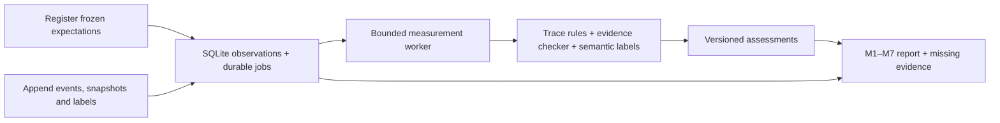

# Local reliability monitor

PromiseGuard now includes a standalone **offline monitor of supplied observations**.
It stores frozen manifests, events, evidence revisions, labels, measurement jobs,
and assessments in SQLite, then reports trace checks and M1–M7 metric facts.
It does not run the proposed PromiseGuard workflow or call an external app/model.

The original [dependency-free checker](../reliability/README.md) is preserved.
The monitor calls that checker for compatible evidence and adds manifest, trace,
ordering, semantic-label, and aggregation checks around it.



This is the implemented local measurement path. An application event producer
and independent provider collector must still supply its real observations.
The design is in [architecture sections 15–18](../../ideation/promiseguard-architecture.md#15-trace-collection-and-reliability-monitoring-pipeline);
the [commit backlog](../../ideation/implementation-plan/04-commit-plan.md) assigns
collection to Q02, durable assessment to Q03, scenario execution to Q04, metrics
and labels to Q05, and optional LangSmith export to Q06. This increment provides
local Q03/Q05 components and checker compatibility; their application integration
and independently collected evidence remain open.

The [detailed reliability implementation plan](../../ideation/implementation-plan/06-agent-reliability-implementation.md)
is the integration backlog. It defines reliability across original AI quality,
actual execution/process correctness, and independently verified provider outcomes.
Reuse this monitor; completing its inputs and runtime controls is required P0 work.

## Install, test, and demonstrate

Run from the repository root with **Node 24** on `PATH`:

```bash
node --version
npm ci
npm run build
npm test
npm run monitor -- demo
npm run monitor -- report
```

The tested runtime is **Node v24.21.0**, downloaded from the official Node
distribution and checked against its published SHA-256 checksum during setup.
The lockfile currently pins Zod **4.6.4**, TypeScript **7.0.2**, and
`@types/node` **24.13.4**. The monitor uses built-in `node:sqlite`; it does not
install `better-sqlite3`, LangGraph, LangChain, LangSmith, Fastify, React, or Vite.
Those remain choices for the proposed application.

`npm test` builds the TypeScript and runs the checker and monitor tests.
`npm run test:monitor` runs the monitor subset; `npm run test:checker` preserves
the separate checker suite. Test commands use `--test-isolation=none` so this
environment executes and reports the individual tests rather than only a
file-level subprocess result. Check the named tests and final counts.

The default database is **`.local/reliability.sqlite`**, under the ignored
`.local/` directory. Override it with `--db FILE`. Run the demo on a local test
database; repeated identical registration/append does not add another evaluation
attempt. If a changed fixture conflicts with an existing attempt, select a new
database or new attempt identity instead of rewriting its history.

The demo's events, provider snapshots, model-proposal references, and labels
are all generated fixtures. Labels marked `reviewerKind: human` illustrate the
input format; **no actual human semantic review, model call, or provider action
occurs**. A synthetic `passed` result demonstrates monitor behavior only.

## Import a manifest and observations

This complete example exports the same synthetic fixture into a **new** folder,
registers the expected contract before appending observations, and measures it:

```bash
npm run monitor -- export-demo --dir .local/monitor-example
npm run monitor -- register --manifest .local/monitor-example/manifest.json --attempt example-001 --run example-run --started-at 2026-09-13T17:35:00.000Z --db .local/example.sqlite
npm run monitor -- append --attempt example-001 --input .local/monitor-example/observations.json --db .local/example.sqlite
npm run monitor -- measure --db .local/example.sqlite
npm run monitor -- report --db .local/example.sqlite
npm run monitor -- trace --attempt example-001 --db .local/example.sqlite
```

`export-demo` refuses to overwrite its output files. The timestamp above is the
fixture's frozen start, also printed by the export command. For real imported
observations, use their actual start/event times; omitting `--started-at` records
the current time. Re-registering an attempt requires the same run, manifest, and
start time. Use `npm run monitor -- --help` for the available commands.

- **`register`:** validate and freeze an attempt's manifest; atomically create its
  initial measurement job. One `evaluationAttemptId` covers its normal resumes
  and retries, while `runId` identifies the associated business run.
- **`append`:** add a validated batch containing `events`, optional `evidence`,
  `labels`, and optional `traceComplete`. Changed data creates a new observation
  watermark and queues measurement; identical data is idempotent.
- **`measure`:** run a bounded worker tick, including the local sweeper. It
  processes at most 100 due jobs by default, then exits. There is no daemon or
  automatic background scheduler; call it again for later observations/retries.
- **`report`:** print grouped JSON, including registered attempts awaiting current
  measurement. Pending work is visible and cannot gain a passing numerator.
- **`trace`:** print the stored ordered events and trace-completeness declaration.
  It does not retrieve a remote trace or a provider record.
- **`demo`:** register, append, measure, and report the bundled synthetic fixture.
- **`export-demo`:** write synthetic `manifest.json` and `observations.json`; it
  does not seed or reset any external app.

Exit `2` means invalid input or a command/storage failure, reported with a fixed
error code. `measure` exits `1` when worker processing fails or current measurement
jobs have exhausted their retry budget; `demo` also exits
`1` if its synthetic assessment does not pass. A successful `measure` or `report`
command does **not** mean every assessment passed: inspect `groups[].observations`
and the metric denominators. JSON input files are limited to 2 MiB.

## Code and persistence boundaries

- [`src/shared/reliability.ts`](../../src/shared/reliability.ts): Zod manifest,
  event, batch, and label schemas; versions, typed facts, canonical hashes.
- [`monitor-store.ts`](../../src/server/storage/monitor-store.ts): local SQLite
  tables, immutable registration, append validation, evidence revisions, leased
  measurement jobs, and saved assessments.
- [`assess.ts`](../../src/server/monitoring/assess.ts): deterministic checks over
  supplied events, the frozen manifest, supplied snapshots, and semantic labels;
  compatibility export to the original checker.
- [`metrics.ts`](../../src/server/evaluations/metrics.ts): deduplication, cohort
  isolation, raw metric contributions, critical counters, and censored durations.
- [`worker.ts`](../../src/server/monitoring/worker.ts): bounded job processing,
  stale/missing-assessment handling, and report assembly.
- [`cli.ts`](../../src/server/monitoring/cli.ts) and
  [`demo.ts`](../../src/server/monitoring/demo.ts): command entry point and
  synthetic example generation. Tests live in [`tests/monitoring/`](../../tests/monitoring/).

The store atomically commits each local observation append, its watermark, and
its measurement job. Registration and initial enqueue are atomic; saving an
assessment and completing its job are atomic. Events and labels cannot be
replaced under an existing ID. A sealed trace rejects new events; later labels
and evidence revisions remain possible without erasing earlier versions.

These transactions cover **monitor data only**. No application effect ledger,
provider dispatch transaction, incident-execution lock, LangGraph checkpoint,
or application-state/outbox transaction is implemented here. A monitor can
detect a supplied unauthorized write; it cannot prevent one in a provider.

Jobs use a 30-second default lease with ownership tokens, a maximum of three
claims, and bounded retry delays. New watermarks supersede queued older work;
stale workers cannot complete a newly leased job. The sweeper can requeue
missing assessments and aged pending/unverified assessments. Expired or failed
measurement is not evidence of successful business execution.

Worker output distinguishes `failed` processing attempts in this invocation from
`exhausted` current-watermark attempts that cannot be retried automatically.
An exhausted job remains visible across restarts: reports mark its measurement
`unverified` with `measurement_job_failed`, keep its M1/M7 denominators, and do
not relabel its supplied product status as a business failure. Later `measure`
commands still exit `1` while any current job is exhausted, even when no job ran.
Genuinely new observations create a new watermark and job; failed older jobs stay
historical and do not count toward current exhaustion. Exact input replay does
not reset the retry budget.

## Observation contract

Register expectations before execution. The manifest fixes cohort/mode,
application/fixture/policy/prompt/model versions, expected checkpoint, eligible
effects, protected records, required model roles, recovery class, and budgets.
The `promiseguard_s1` contract requires the task, note, draft, comment, and thread
with their required fields. Every `completed` expectation must use that full
artifact contract; a Slack-only allowlist cannot pass by changing its family ID.
Family 1 also requires all three model roles. Other families freeze the roles
required for their checkpoint, such as replay. Baseline family IDs span 1–18,
but accepting those IDs does not implement or execute the full scenario suite.

Events have stable IDs, contiguous sequence numbers, nondecreasing timestamps,
and runtime-attempt references. Tool dispatches require two distinct identities:

- `providerAttemptId` identifies one dispatched attempt and its result.
- `logicalCallId` identifies the logical call across retries. Give a separate
  reconciliation lookup or final verification read its own logical ID, even
  when both read the same effect. This makes M2 first-attempt counts meaningful.

Slack writes use `actor: coordinator` and an explicit `coordinationPhase` of
`review` or `summary`. A review message can precede approval. A summary asserts
verified artifacts and must follow their verification; full-run completion also
requires the Slack summary's readback. Other protected writes require the
declared approved plan/hash, unexpired approval, fresh source observation, and
matching approved request hash. Unknown writes stay unresolved until compatible
reconciliation evidence is supplied; an empty lookup is not proof of nonapplication.

`effect.verified` distinguishes `purpose: review` from final `purpose: effect`.
An independently observed review message cannot satisfy the final-summary check.

These are checks on **declared observations**. An `authorized: true` approval
event and a source evidence reference do not authenticate a Slack user or prove
that a source was fetched. Runtime enforcement and independent collection remain
separate required work.

Semantic scoring requires human labels for grounding, completeness, decision,
and handoff. Missing or uncertain labels do not pass. `firstProposalAssessment`
and M7 retain each required role's first proposal result. `semanticAssessment`
scores the outputs selected when the execution plan was frozen, contributing
to the final contract verdict and M1. A valid retry before plan freeze can
therefore produce M1 success while its original defective proposal still fails
M7. A later proposal cannot silently replace an output in an already frozen plan.

Ordinary retries retain the evaluation attempt identity. Separately predeclared
correction/repair stages use their own checkpoint contracts and retain the
original stage's result, as required by the canonical scenario plan. The monitor
does not inspect a model's reasoning or independently decide whether source text
supports a label. Auditor role quality is distinct from independently measured
defect-detection recall.

## Reading the results honestly

Reports keep cohort, evidence mode, evaluator version, and every manifest version
separate. Duplicate observations for an evaluation attempt use the newest
watermark, then observation time; retries/jobs do not create new denominators.
Modes are `synthetic_fixture`, `model_with_fake_providers`, and
`imported_provider_snapshot`. An imported-mode label is **not authenticated live
provenance**. Do not combine these groups into a product success percentage.

- **M1:** contract-passing execution-eligible attempts / eligible attempts;
  non-execution contract correctness is separate.
- **M2:** successful / dispatched tool attempts, with first-attempt counts and
  observed `app:read` / `app:write` groups.
- **M3:** confirmed / required predicates, plus verified / successful mutation
  acknowledgements. Missing evidence stays in the required denominator.
- **M4:** successful / eligible recoveries, separating read retry and accepted
  write recovery. Credit requires a recorded failure or unresolved write before
  recovery starts, followed by the same logical read succeeding or that exact
  uncertain write being adopted and verified within budget. Declaring a recovery
  class is insufficient. M4 diagnostics do not rewrite an independently passing
  M1 artifact outcome. Correct escalation is not automatic recovery success.
- **M5:** excess / applied creations, with affected attempt and business-run IDs.
- **M6:** raw wall/wait/active durations and censoring, with explicitly uncensored
  median/max. Unmeasured/exhausted jobs remain censored. These are supplied run
  observations, not monitor execution latency.
- **M7:** passing / required first proposals for analyst, drafter, and auditor
  separately. Report corrections and label limitations with the evidence.

Rates are fractions; zero denominators are `null`. Product status, trace coverage,
trace/outcome/semantic and first-proposal assessments, gaps, and pending/failed samples remain
visible alongside rates. Critical counters include declared forbidden operations,
approval bypasses, recipient violations, unsupported grounding findings, false
completion, unsafe-block recall, and valid cases wrongly blocked.
Unsafe-block recall credits a declared block only after trace and outcome checks
pass; the status string alone cannot demonstrate a correct block.
The `unsupportedClaims` field counts distinct first proposals with negative human
grounding labels, a proxy rather than individual unsupported factual claims;
consult the report's counter units before interpreting the totals.

**Current false-completion limit:** `monitor-v1` `falseCompletion` counts success
before the declared verification chain, or with unresolved writes. Outcome checks
can reject a wrong recipient or missing draft while this legacy counter remains
zero. Interpret it as the preserved premature-claim measure, not proof that all
completion claims were true. It also does not establish independent temporal
provider evidence. See the [implementation audit](../../ideation/reliability-implementation-audit.md)
and the versioned integration plan below.

No provider collector, Gmail MIME parser, live account integration, runtime
agents, operator UI, HTTP API, LangSmith export, or full 18-family workflow
harness exists. Imported snapshots and completeness/actor/label declarations are
trusted inputs. Keep raw imported evidence private: ignored local files and
restricted database permissions do not sanitize data for sharing. Export only
reviewed summaries. See [Global Scale](../../ideation/implementation-plan/Global%20Scale.md)
for remaining capability gates and the final validation receipt.

## Planned application integration and evaluator v2

Nothing in this section is an implemented command or a new validation result.
Preserve checker-v1, `monitor-v1` reports, the [verification receipt](verification.md),
and its [input hashes](validation.sha256). Evolve the observations under schema v2
and use `monitor-v2` for the changed claim/verification semantics. Retain separate
cohorts and compatibility tests; do not silently reinterpret existing reports.

1. **F02/A01/I01/B04/B06/B07 — real producers:** emit stage/span/parent identity,
   original public model-output references and every actual model attempt, validation,
   tool dispatch/result, transport/provider outcome, retry/backoff owner and budget,
   causal readback, and stable success-claim identity/time/predicate scope. Persist
   attempt intent before dispatch. Unknown writes and missing results remain visible.
2. **B01/Q03 — atomic durability:** commit each business state transition,
   canonical event, and measurement enqueue through one transaction-aware
   application store on the same connection. Reuse the existing leased worker and
   rules against that store. The standalone CLI remains a separate operating mode;
   the integrated target has no second monitor database or post-commit append bridge.
   Include waiting, blocked, failed, partial, completed and stalled
   work; crash/replay tests must preserve original denominators and missing outcomes.
3. **Q01/Q02 — independent evidence:** freeze source facts, semantic invariants,
   required predicates and scope before execution. For generated text, a typed
   `ApprovedContentRef` resolves only to B03's exact bytes in the immutable approved
   plan frozen before dispatch. B07/Q02 obtain expected bytes from that receipt,
   never observed provider output. The independent semantic oracle remains unchanged;
   approval is not proof of quality. Future IDs use distinct `EffectIdRef` bindings.
   Q02 independently fetches scoped S0/S1, complete pagination, parsed Gmail MIME,
   links/associations, duplicates, protected records and relevant no-send history.
   Capture collector identity, scope/time/normalization, raw provider references,
   and gaps. B07's inline verification gates execution but is not Q02's observation
   oracle. Preserve existing evidence modes; collector provenance, not an imported
   mode label, supports an integrated/live claim. M3 acknowledgement verification
   requires actual provider fields corroborating each mutation, not only
   `effect.verified.matches: true`.
4. **Q04/Q05 — evaluation and labels:** freeze the full suite census, run the real
   graph with fake providers and declared live cases, and join all planned entries
   to actual attempts. Preserve failures and not-run cases. Store original public
   outputs, source facts, reviewer/rubric/time, claim-specific reasons, and correction
   history. Actual independent human review must be distinguishable from generated
   fixtures and model review. Missing labels/evidence remain unverified; empty
   denominators display N/A. First-output quality and final-plan quality stay separate.
   Finish mandatory preflight/S0 setup before registration. `setup_failed` census
   entries do not enter M1/M7 attempted denominators; bind `suiteEntryId` S0 receipt
   hashes immediately before graph dispatch and retain every later failure as an
   attempt. R01's minimal trusted review input uses F02/B01 schemas/storage before
   Q05's full review/report workflow merges.
5. **Q03/Q05 — temporal completion claims:** emit `claimId`, `emittedAt`, channel,
   revision, required predicate scope, and causal verification references for every
   success claim. Evaluate state at emission using independent evidence within the
   frozen observation window. Classify each claim `confirmed`, `contradicted`, or
   `unverified`; later drift is a separate finding. Report `prematureSuccessClaims`
   and `outcomeContradictedCompletionClaims` separately, then count their unique
   claim-ID union as `monitor-v2` `falseCompletion`, with affected runs separately.
   A claim violating both counts once; a later repair does not erase it. Incomplete
   timing/provenance means unverified, preventing a zero-violation all-clear claim.
   Artifact-producing whole-run completion requires final Slack readback. A
   `completed_no_affected_commitments` claim instead uses `no_affected` scope with
   absent `planRef`, complete source/selection evidence, zero eligible commitments,
   and no protected effects; it needs no plan, approval, or Slack artifact.
6. **U03/R01/R02 — demonstrated result:** expose product status, trace coverage,
   outcome/semantic/first-proposal assessments, evidence and critical counters,
   actual M1–M7, gaps and versions. Freeze real S1/S2 and safety/approval/tamper
   evidence with provider links and reviewed limitations. Q06 LangSmith export is
   optional diagnostics and cannot substitute for local evidence or release proof.

V2 acceptance includes a claimed completion with a wrong recipient or missing
artifact at emission, a premature claim repaired later, both violations on one
claim, later human drift after a correct claim, unavailable temporal evidence,
an acknowledged mutation lacking provider corroboration, missing labels, crashed
event/job handoff, and repeated assessment without duplicate claim or run counts.
